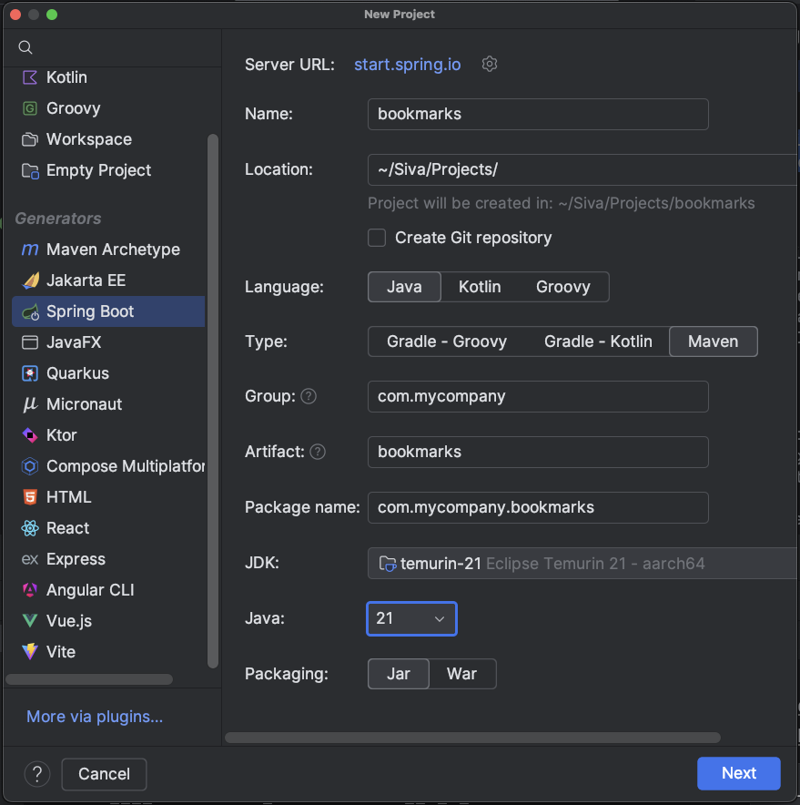
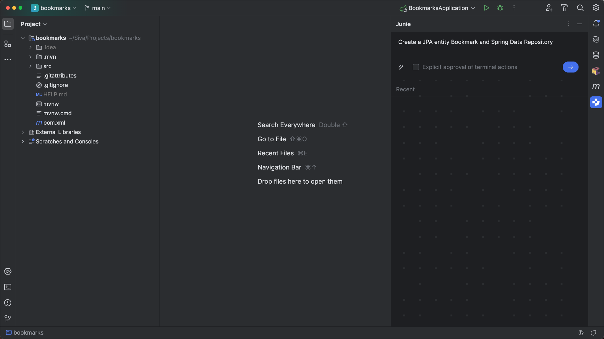
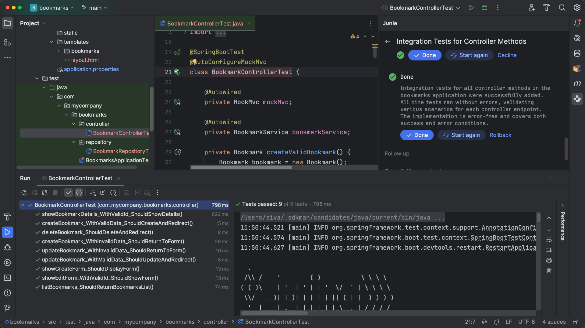

## Exploring Junie with IntelliJ IDEA

Welcome to Junie, the coding agent by JetBrains!

We're here to help you hand off your tasks and let Junie handle routine or more complex tasks for you—check out this guide to get started.

This playbook includes examples and step-by-step tutorials for new Junie users to explore it in action, for IntelliJ IDEA.

Please note that since Junie is powered by AI, the results of the examples are not deterministic. This means that screenshots and expected results may be different from various trials. However, the results should be functionally similar. To make adjustments, you can use follow-up prompts which provide more specifics of what result you want.

### Install

1. Install [JetBrains Junie from the marketplace](https://plugins.jetbrains.com/plugin/26104-jetbrains-junie), and restart the IDE if required.
2. Open the plugin from the right sidebar.

3. Shift-shift | Manage Licences | Click your name at the bottom left corner and then click **Manage Account**, and ensure that the Junie license is displayed in your account.
4. Start using Junie by entering a task and running it.

### Optional Step: Junie Onboarding

You can use the `.junie/guidelines.md` file in the root directory to personalize Junie and make it truly effective for your team:

**You can create it automatically** by running a command like this as the first step in a new project:

1. Analyze the project structure and tech stack, and create a `.junie/guidelines.md` file with concise, well-structured information to help new developers. Include guidance on organizing the structure, running tests, executing scripts, and following best practices. Keep the content short, clear, and practical.
2. This will trigger Junie to explore the project for 30-90 seconds, executing commands like 'ls' and **generate this file**. **Review the results carefully**. Good instructions make Junie more effective, while unclear or incomplete guidelines can lead to low-quality outcomes.
3. **Alternatively, you can create this file manually from scratch** and copy any existing guides you have into it.

The `.junie/guidelines.md` file can contain instructions in any format. For example:

- `Specify that tests should always be added to a specific folder or use a particular framework.`
- `Inform Junie about existing guidelines in your repository (e.g., by pointing to the correct file path), and it will read and apply them.`

If you notice Junie doing something suboptimal, add a hint or clarification in the guidelines file. These instructions will be added to Junie’s context, helping it make better decisions and work more effectively within your project.
If the `.junie/guidelines.md` file already exists in your project (e.g., created by teammates), Junie will automatically use it.

### Play Safe

Junie is an agent that can run code, execute terminal commands, and work with the file system. This means Junie could, in theory, install something you don’t want, delete files (with no rollback option), or execute unexpected code on your system.

To keep things safe:

- Don’t give risky prompts like: do something with my personal important files in this directory which I have in one copy and no backups
- Don’t run Junie unattended

We have a setting that determines whether Junie requires explicit approval for unsafe commands. **By default, approval is required, and it’s safer to keep this enabled**.

### Let's Have Some Fun

Some simple, universal tasks you can start with:

`Write/update a README.md about the project`

——————

`Analyze the repository, read important files and build an architectural dependency map between the modules, generate an ASCII diagram, and add it to the README.md.`

——————

`Analyze the last 10 commits, read relevant files and understand how it impacted user scenarios, generate very short and concise summary and an ASCII diagram (make it interesting, engaging, using emoji and art), and create a file changelog.txt`

——————

`Provide a code coverage report in a text file. If coverage is less than 80%, add tests to achieve the coverage goal.`

## Example One - Quick Start for Spring Boot Web Applications

In this example we will create a simple web application using Java and Spring Boot to manage bookmarks. We will ask Junie to create the Bookmark JPA model and Spring Data JPA Repository. Then we will ask Junie to implement CRUD operations for Bookmarks with Thymeleaf as a view template engine and Boostrap CSS. Finally, we will ask Junie to write integration tests for all the controller methods.

### Step 1: Create a Spring Boot application

From IntelliJ IDEA Ultimate, create a new Spring Boot project with the following options selected:

- **Language**: Java
- **Type**: Maven
- **Java**: 21
- **Packaging**: Jar

Click **Next** and under Dependencies select **Web** > **Spring Web** and click **Create**.

(**Optional step**: Commit files with git; git can be used for rolling back if you don’t like the changes that Junie does.)

After installing the Junie plugin, there should be an icon on the right-hand side to open the window to give prompts to Junie.

### Step 2: Create a Bookmark Entity and Repository

We would like to create a bookmark JPA entity and a Spring Data JPA repository for the bookmark entity.

Let’s ask Junie to help us with this task.

Try this prompt: `Create a JPA entity called Bookmark and a corresponding Spring Data Repository_`

**Tip**: As we mentioned, for security reasons, the default is to approve any terminal action for Junie explicitly. However, there are many terminal actions in this example, so you can choose to uncheck it if you want to.

Junie will add the necessary dependencies (spring-boot-starter-data-jpa, H2 in-memory database driver) in the pom.xml, create a Bookmark JPA entity and Spring Data JPA Repository BookmarkRepository. Review the generated code, and if it looks good to you, click **Done**.

### Step 3: Implement CRUD operations for Bookmarks with Thymeleaf UI

Next, we would like to implement basic CRUD (Create, Read, Update, Delete) functionalities for bookmarks with Thymeleaf view templates.

Let’s ask Junie to implement this functionality.

Try this prompt: `Implement CRUD operations for Bookmarks with Thymeleaf and Bootstrap CSS`

Once Junie is done, you can start the application and [access the URL](http://localhost:8080/bookmarks).

You should be able to view, add, edit and delete bookmarks.

### Step 4: Add integration tests

Finally, let’s ask Junie to write integration test cases for our app.

Try this prompt: `Add integration tests for all controller methods.`

Once Junie is Done, it will automatically run all the tests.

### Step 5: Using guidelines to fine-tune code generation

You can define your coding conventions and best practices in a `.junie/guidelines.md` file located at the root of your project.
Junie will automatically follow these guidelines when generating code.

Refer to the [junie-guidelines](https://github.com/JetBrains/junie-guidelines) repository for a collection of
recommended guidelines across various technologies.

By consolidating your project's coding standards in the `.junie/guidelines.md` file,
you enable Junie to consistently apply them without needing to include the same instructions in every prompt.
