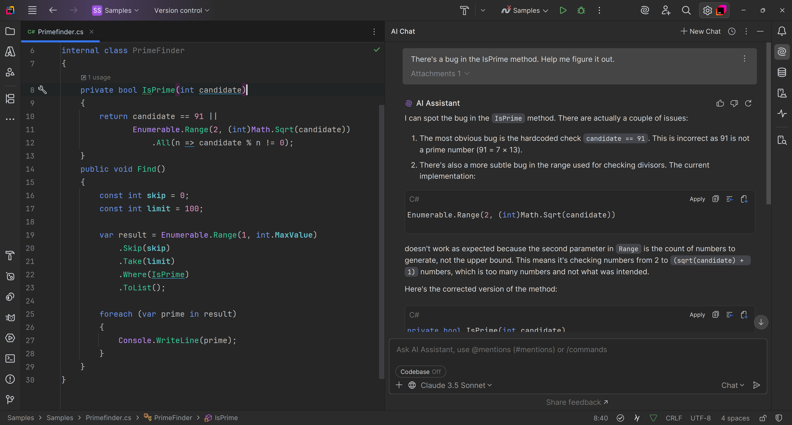

When working with AI development tools like JetBrains' AI Assistant, developers should understand the following aspects of prompting to effectively use the tool's capabilities:

## Prompting Basics

A prompt is a structured input provided to the AI to guide its behavior or generate specific outputs. Prompts can be as simple as a question or as detailed as a block of code with explicit instructions.

To create prompts that get good results, write clear and specific prompts so the AI can respond accurately without ambiguity. Avoid overly complicated or vague inputs.
Break down complex requests into smaller, manageable prompts if necessary.

Here are a few pointers for making great prompts:

- Contextual Awareness: Include relevant context (e.g., function names, expected output format) in the prompt when possible to help the AI understand your requirements. JetBrains AI is highly context-aware and knows what's happening in your project.
- Iterative Refinement: Start with a basic prompt and refine it based on the AI’s responses. This iterative approach helps in fine-tuning the results.
  Test variations of prompts to explore how different expressions or levels of detail affect the output.
- Leveraging Natural Language: Many LLMs understand natural language. Use conversational phrases to make requests, like: "Explain the purpose of this function in simple terms." Mix technical terminology with plain language to improve understanding.
- Collaborate with the AI: Because LLMs are natural language processing algorithms, you can "talk" to the LLM like you can another developer.

## Prompts and code

When working with AI development tools for code-related tasks, prompts play a vital role in communicating your needs effectively. For example, you can ask the AI for explanations by providing prompts like, "What does this code do?" which helps you better understand unfamiliar code or clarify complex segments. Similarly, you can request suggestions by prompting, "How can this function be optimized?" to receive insights on improving performance, clarity, or other aspects of your code.
Another common use of AI tools involves generating code snippets.

A typical example of such a prompt might be, "Write an example of a REST API endpoint in C#," which allows the AI to produce a functional snippet tailored to your specific request. Additionally, AI tools can assist with debugging code by asking, "Why does this code produce an error?" This type of prompt can help identify possible issues and provide guidance on fixing bugs effectively. Tailoring these prompts to your needs ensures the AI provides focused and valuable assistance during development.
Perhaps you are trying to debug some code that doesn't throw an error, but it just doesn't work correctly. You can ask AI to help find the bug with the prompt "There's a bug in the `IsPrime` method. Help me figure it out.", like so:

Experiment with the tool's features, such as context-aware suggestions, coding style adherence, or testing assistance.
Familiarize yourself with specific functionalities designed for code review, bug prediction, or autocompletion.

Pro tip: Insert comments in your code to act as inline guidance for the AI Assistant. For example, "// Suggest optimization for performance in this loop to instruct the AI on what you need."

## Use instructive and open-ended prompts

When interacting with AI development tools, understanding the distinction between instructive and open-ended prompts can help you tailor your queries more effectively. Instructive prompts are direct and specify a particular action for the AI to perform. For example, you might ask, "Refactor this method for readability," which conveys a clear instruction for the AI to improve the method's structure and clarity.
On the other hand, open-ended prompts are broader and invite the AI to provide suggestions or ideas without being tied to a specific action. An example of an open-ended prompt could be, "What are some test cases for this function?" This approach encourages the AI to explore possibilities and generate creative or diverse ideas, which can be particularly useful for brainstorming or enhancing your code. By using instructive and open-ended questions strategically, you can better direct the AI's assistance to suit your needs.

## Know the limitations

AI models may produce incorrect or incomplete outputs. Always validate and test the suggestions provided by the AI Assistant.
It's best to use AI assistants as collaborative tools, not a replacement for critical thinking or domain expertise.
JetBrains AI Assistant allows customization to match your coding style guides or preferences, so you can set preferences for documentation standards, language-specific guidelines, and performance or readability priorities.

## Conclusion

Treat the tool as a collaborator rather than just a generator. Engage in back-and-forth tuning and provide feedback.
By gaining expertise in effective prompting, developers can maximize the potential of powerful AI development tools like JetBrains' AI Assistant, improving productivity, code quality, and overall development workflows.
