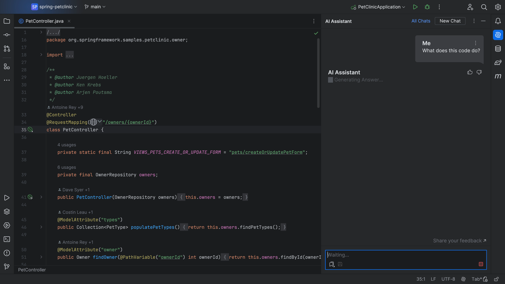
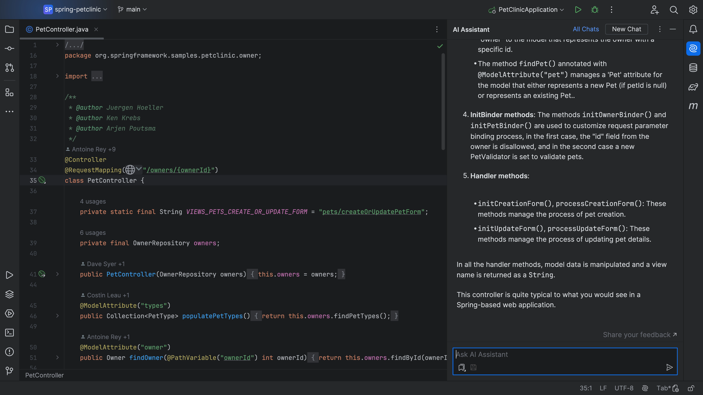

## The Problem

Who’s up for reading and understanding some code you’ve never seen before while simultaneously being under pressure to write new code for a shiny upcoming product feature? Anyone? I guess you could just stare at it for a bit, or you could run it and see what it does... but that doesn't always help.

## The Solution

Whether the code is new to you, or you need a refresher, [JetBrains AI Assistant](https://www.jetbrains.com/ai/) can help you to understand it faster.

Choose the code you need to get to grips with, open the AI tool window and just ask - “What does this code do?”:

JetBrains AI Assistant will then gather rich contextual information about your project and use it to get you the best possible answer it can:

Alternatively, perhaps you’re learning a new language and need a bit of guidance. Again, you can just select the code you need to get to grips with - or place your caret at the method and ask “What does this code do?” <pause>:

JetBrains AI Assistant will give you a response:

This works for any code such as Java, Python, C Sharp, Go, SQL, Regex and more. Try it out! JetBrains AI Assistant uses context from your project such as its structure, which files you have open, your language and version, and your VCS history to construct your query to get you the best result it can - in this case - what on earth does this code do!

So next time you’re faced with new code, or you’re learning a new language, don’t sit there and struggle, ask JetBrains AI Assistant - “What does this code do?”
