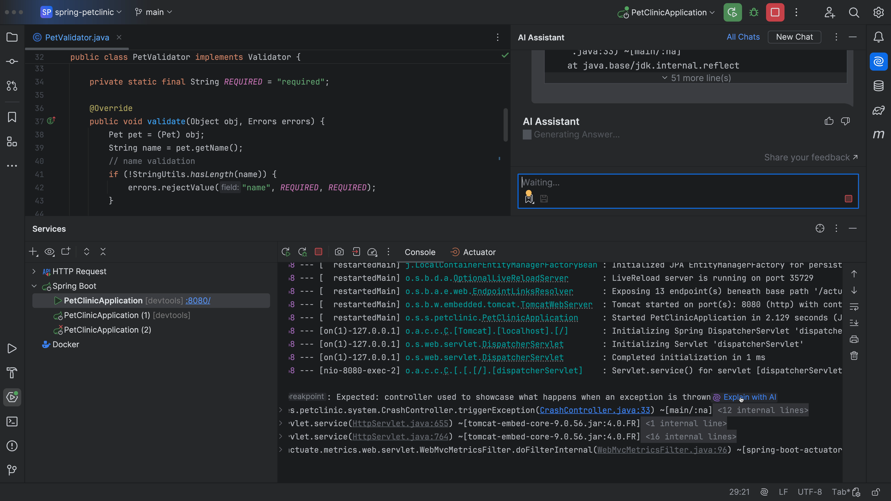
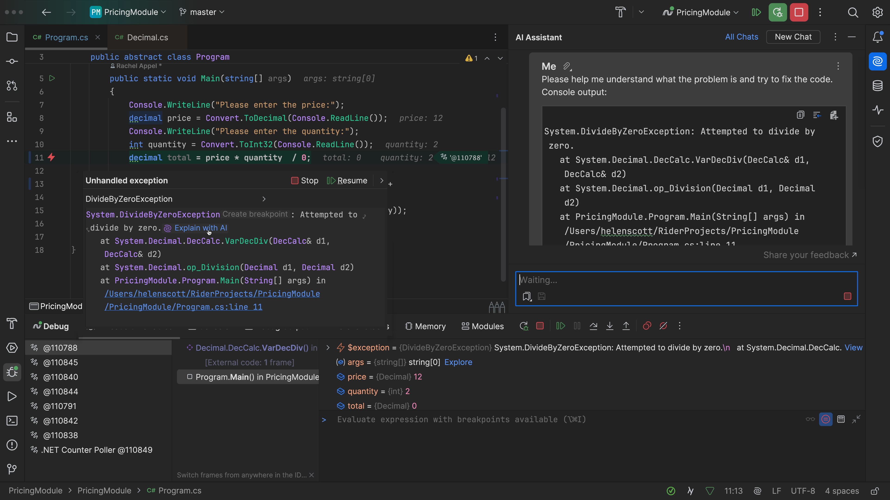
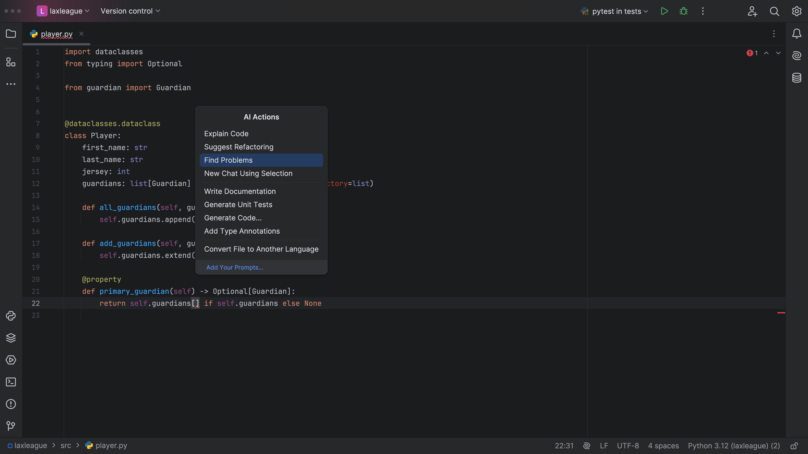

## The Problem

Your code has errors! Maybe it's an exception, maybe the editor has underlined some code in red, or maybe it's just not working. You can use JetBrains AI Assistant to get help with errors in a number of different ways.

## The Solution

When you get an exception in your code, you can click `Explain with AI` to get JetBrains AI Assistant to explain the exception to give us some guidelines on how you can better deal with it:

This works in any language, like this one in C#! Let’s run our code with the debugger, and now we can click Explain with AI:

If there's a problem in your editor, you can also use the old favourite <kbd>⌥⏎</kbd> (macOS) / <kbd>Alt+Enter</kbd> (Windows/Linux) then select **AI Actions > Find Problems**, choose your scope and away you go:

You can use JetBrains AI Assistant for help with a specific piece of code too:

In addition, if your tests are failing, you can always just ask JetBrains AI Assistant to help you out, and you’ll get a detailed explanation to help you to understand the error highlighting in your JetBrains editor:

So don't sit there and struggle. Use JetBrains AI Assistant for help with figuring out the issue when things go wrong!
