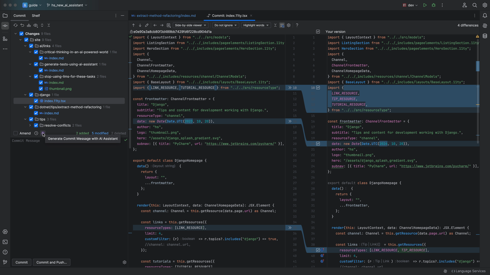
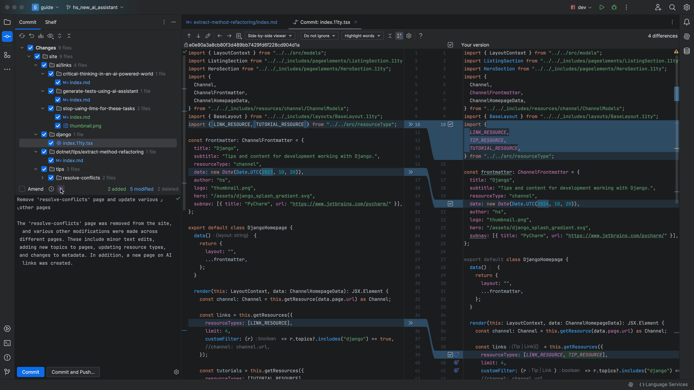
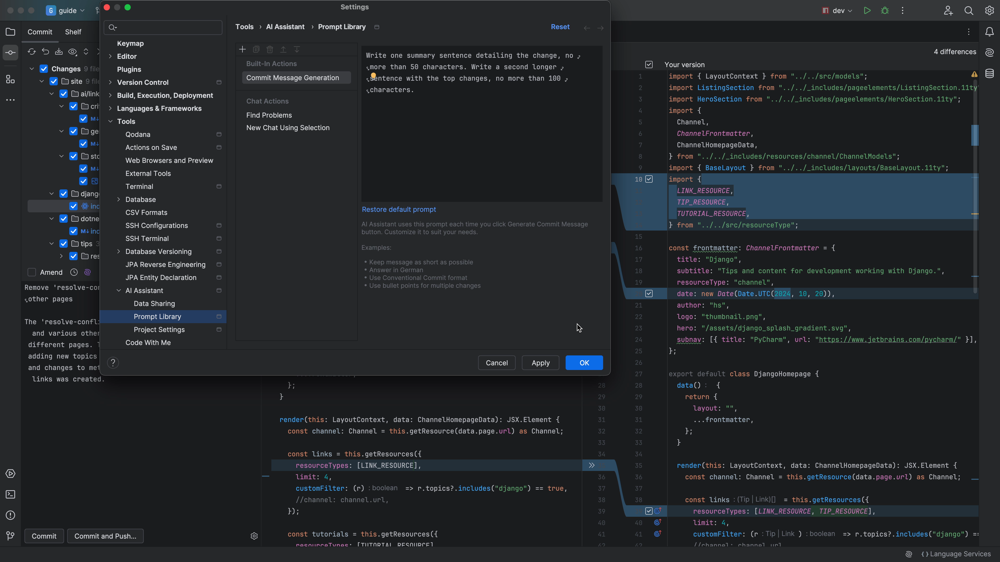
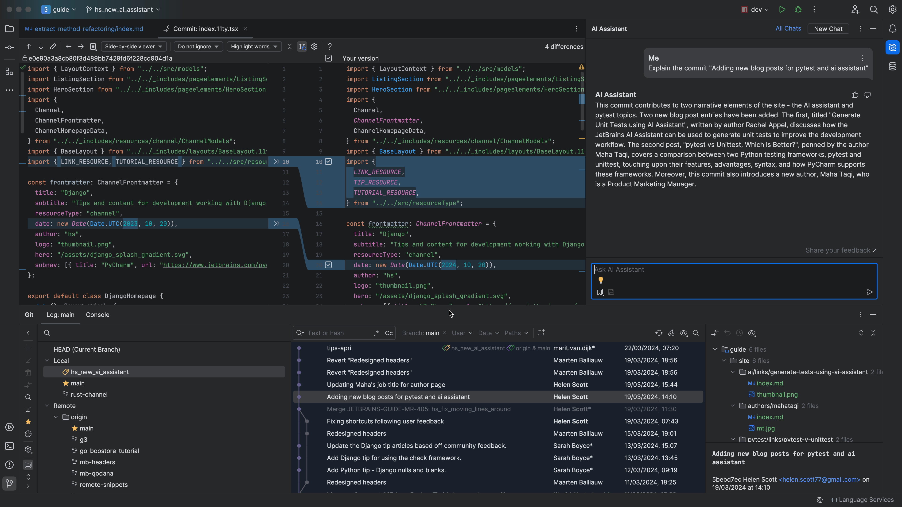
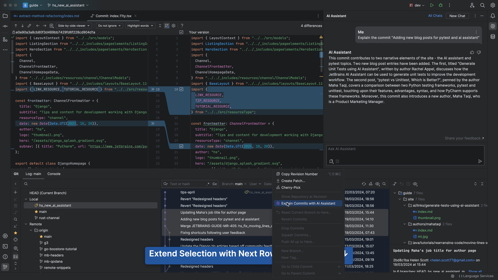
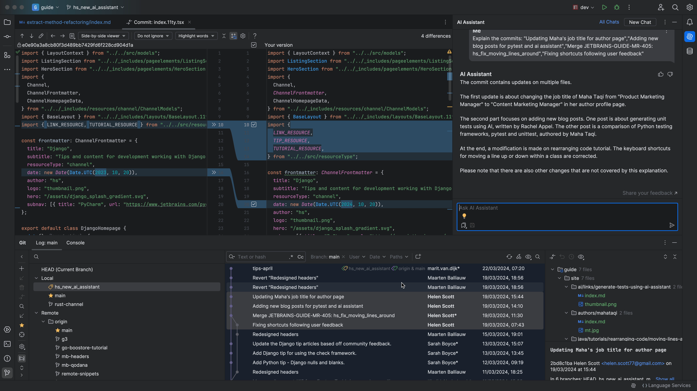

## The Problem

You’ve been working on this branch for hours and the time has come to check it into version control! Except... You can’t remember what you had for lunch, and you certainly can’t remember all your changes!

You could go through each file and refresh your memory, and to remind yourself of the big picture, but it doesn’t really help you to craft a good commit message that summarises _everything_.

## The Solution

Let’s see how JetBrains AI Assistant can help us here. Open the Commit tool window <kbd>⌘0</kbd> (macOS) / <kbd>Alt+0</kbd> (Windows/Linux) - Show Commit tool window and click the AI Assistant icon:

AI Assistant will generate a commit message for you:

You can tailor the prompt, for example, to create a more succinct commit message if you prefer:

AI Assistant will now give you a shorter commit message according to the prompt:

What about the other way around? Understanding someone else’s commits. You can open the Version Control tool window with <kbd>⌘9</kbd> (macOS) / <kbd>Alt+9</kbd> (Windows/Linux) and find the commit that makes no sense then right-click and ask JetBrains AI Assistant to explain it:

JetBrains AI Assistant will give you a summary of the commit:

Of course, most of us don’t do one monster commit, we are sensible and do lots of small commit. In this case we can select all the sequential commits that we're interested in and then again, ask JetBrains AI Assistant to explain them:

This time we get an answer that covers all the commits:

So next time you want a bit of help writing your commit message or understanding someone else’s commits, look for the JetBrains AI Assistant icon and just ask!
