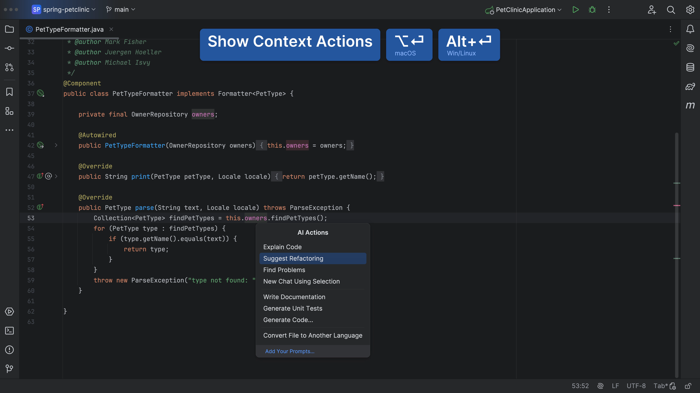
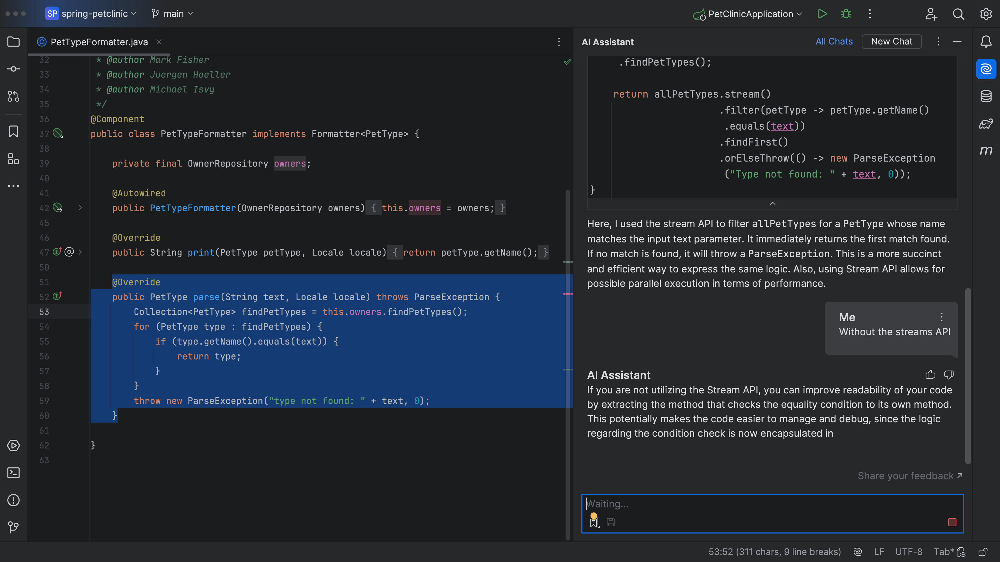
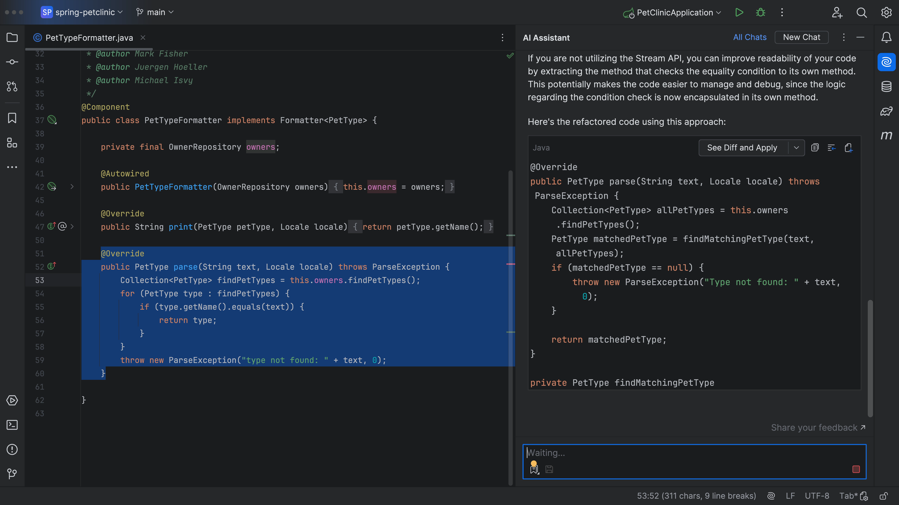
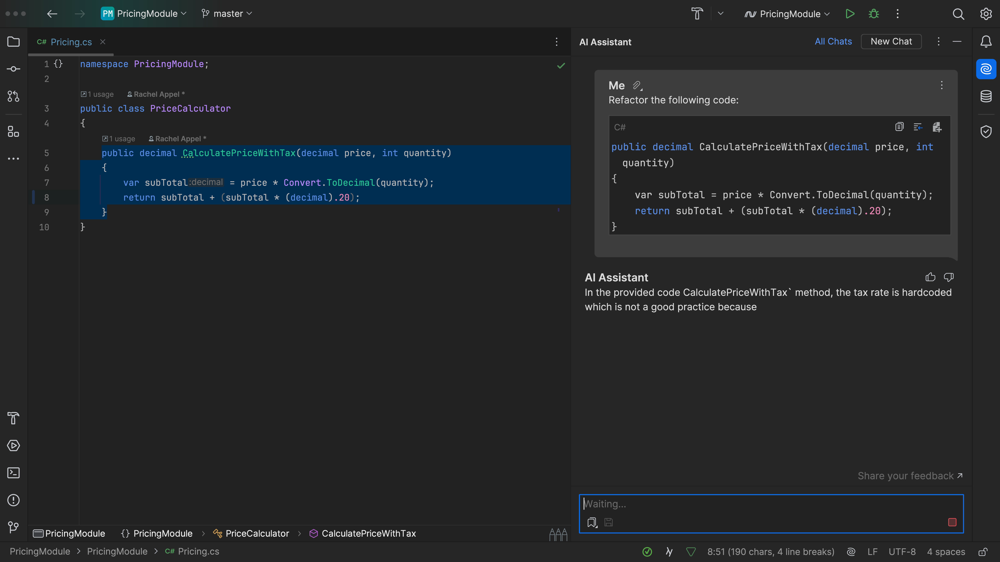
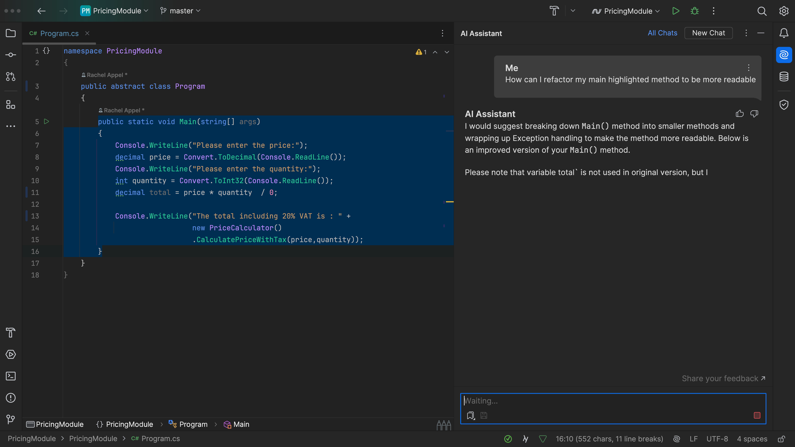

## The Problem

Did you know that [JetBrains AI Assistant](https://www.jetbrains.com/ai/) can refactor code for you? You know, just in case you want to change the semantics?

## The Solution

You can invoke Context Actions <kbd>⌥⏎</kbd> (macOS) / <kbd>Alt+Enter</kbd> (Windows/Linux) and then select **AI Actions > Suggest Refactoring**. JetBrains AI Assistant will then offer some suggestions, and code snippets, on how you could refactor your code.

And if you don’t like the suggestion. You can keep or discard aspects of it and iterate until you get something you’re happy with. Perhaps we don’t want to use Java Streams. JetBrains AI Assistant will iterate on the previous suggestion, and give you some new ideas for refactoring your code!

If you like the suggestion, you can press **See Diff and Apply** and then **Accept All**.

It works with any code, like this code. Once again, invoke Context Actions <kbd>⌥⏎</kbd> (macOS) / <kbd>Alt+Enter</kbd> (Windows/Linux) and then select **AI Actions > Refactoring**:

You can also just ask JetBrains AI Assistant to help you with some refactoring:

JetBrains AI Assistant refactoring, because sometimes we want to change things!
