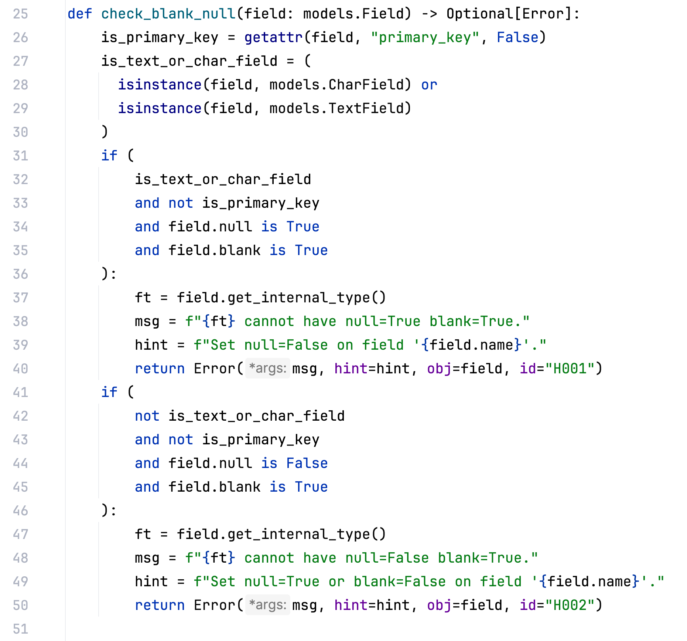
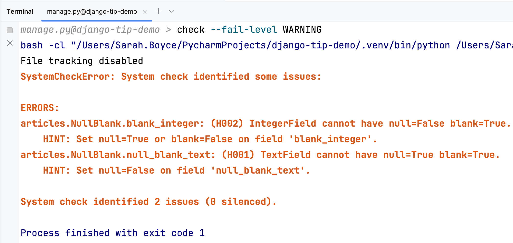

We all know we should "Automate the Boring Stuff™", but how often are you manually checking PRs against your internal style guide?

Django has a powerful inbuilt check framework which you're using every day... without even realising it.

## Writing your own check

Once you've done the hard work of agreeing a coding standard with your team, next comes the fun bit... implementing the check.

In this example, I want an error to be raised if:

- a `TextField` or a `CharField` has `blank=True` `null=True`.
- any other field has set `blank=True` `null=False`.

To learn about why these are error states, see [Demystifying nulls and blanks in Django](https://www.jetbrains.com/guide/python/tips/django-blank-null/).

To do this, I wrote a function to validate a field's properties and return an error, with a message and hint, when these are my error states.

I create and register my check `run_model_field_checks` which loops through all my model fields and collects a list of errors.

For this check to be picked up it, it must be in (or imported into) a file that’s loaded when your application is loaded.
For example, in the `AppConfig.ready()` method.

## Run the check

Checks are run by some management commands such as `makemigrations` and `migrate`.

You can also run checks directly with:

### `$ ./manage.py check`

It's also a good idea to add this to your CI and to set the fail level:

### `$ ./manage.py check --fail-level=WARNING`

## Other check ideas

Here are a few more ideas:

- Raise a warning if a Field has no `verbose_name`.
- Raise an error if a `verbose_name` does not use `gettext` (if your project uses translations).
- Raise an error if the length of a choice option is greater than your `max_length`.
