Let’s start running the Docker application through PyCharm.

Open the `Dockerfile` and click on the _Run_ icon → `New Run Configuration`

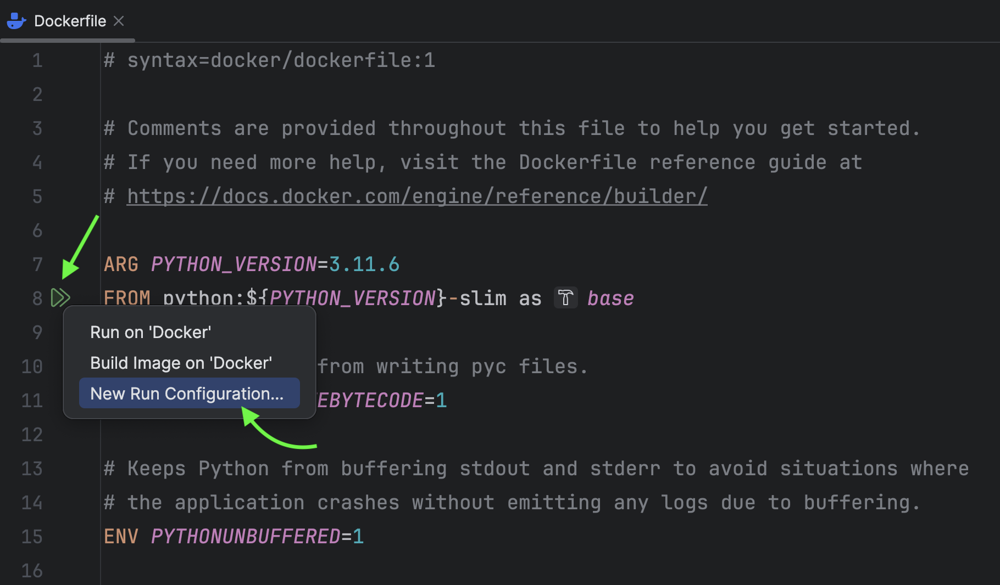

Under **Modify options**, click **Enable BuildKit**. According to the official [documentation](https://docs.docker.com/build/buildkit/), BuildKit serves as an upgraded backend designed to supersede the traditional builder. As the default builder in Docker Desktop and Docker Engine starting from version 23.0, BuildKit introduces new features and enhances the performance of your builds.

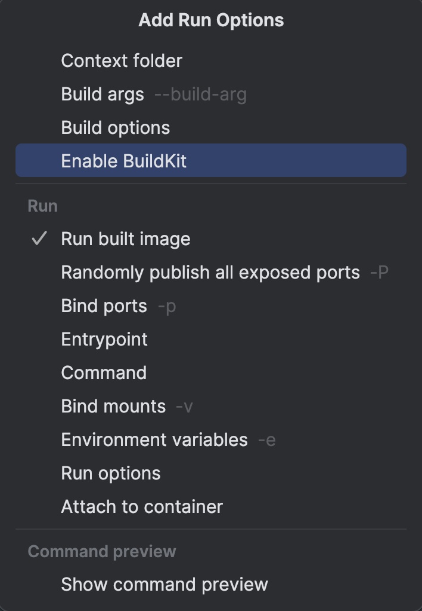

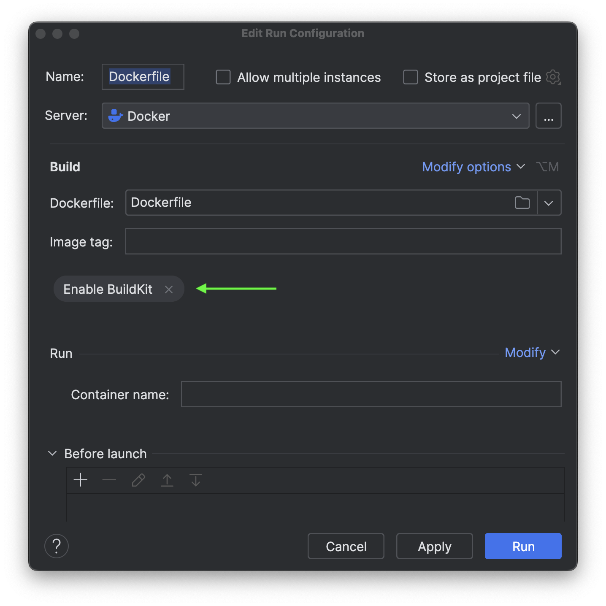

Next, we should set up port binding. This function enables Docker to map a port on your machine to a corresponding port inside the container.

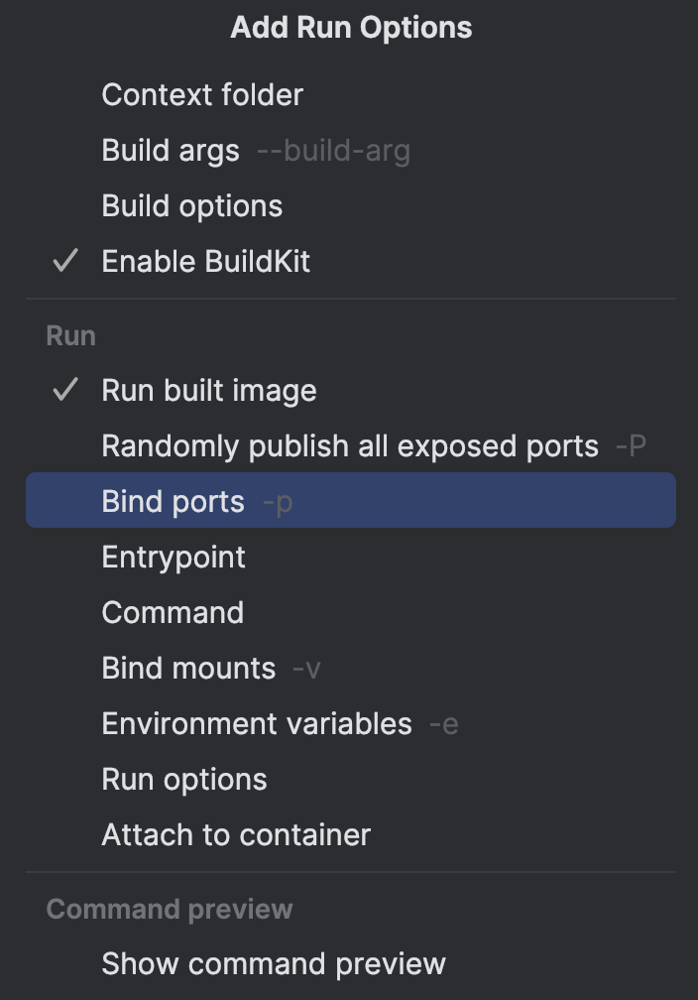

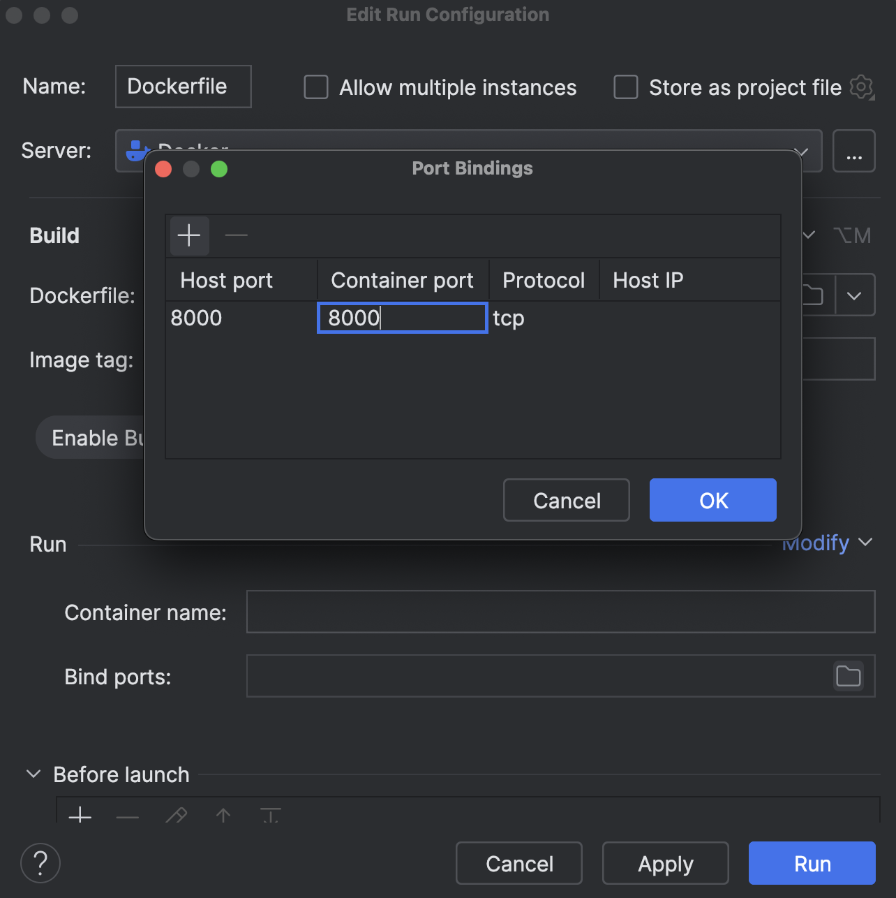

We will bind the container port and host port to 8000.

Once you are done with the configuration, go ahead and apply the changes and click **Run**.

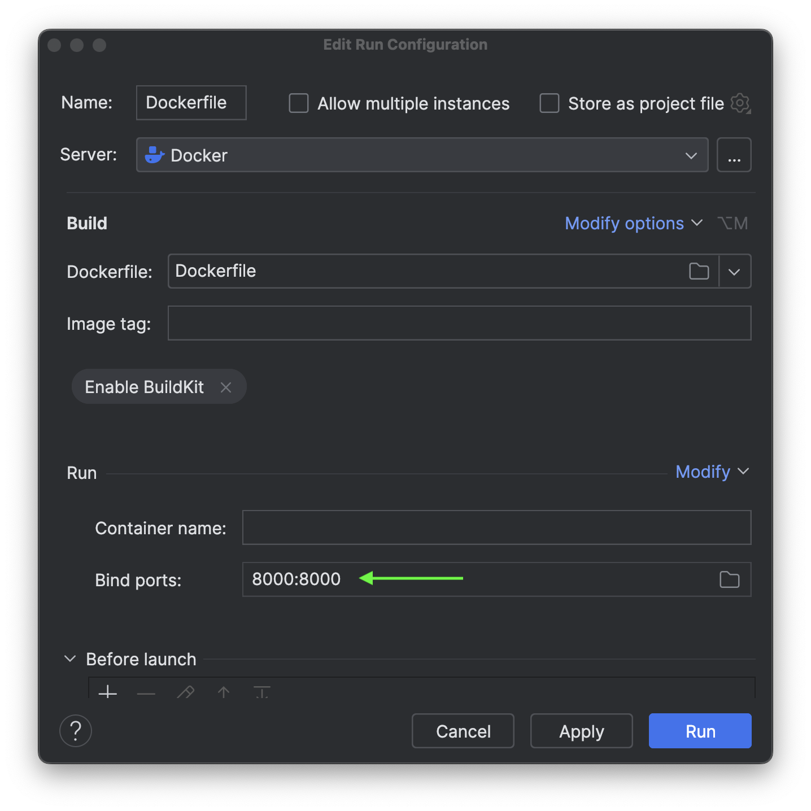

It will take a few seconds to start the application.

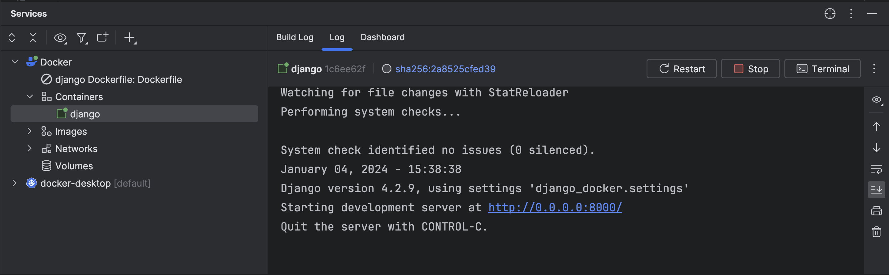

Once the application is up and running, you can easily manage it through PyCharm.

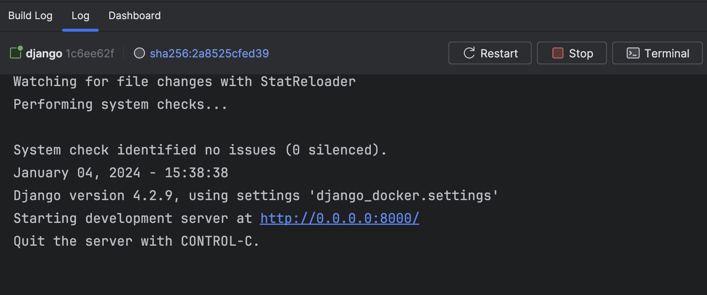

Let’s check in the browser, by visiting [localhost:8000](http://localhost:8000)

Woo Hoo! The app is running.

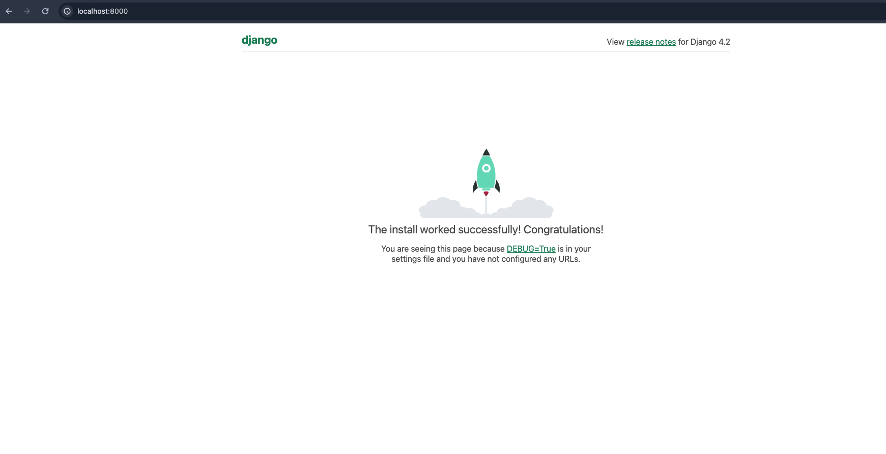

You can now easily view live logs inside the container.

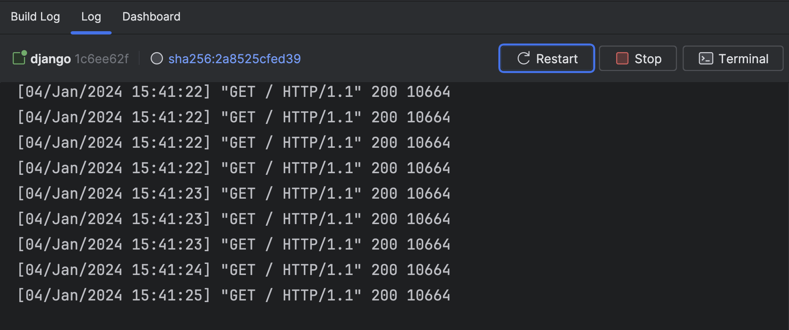

The same goes for the `compose.yaml`.

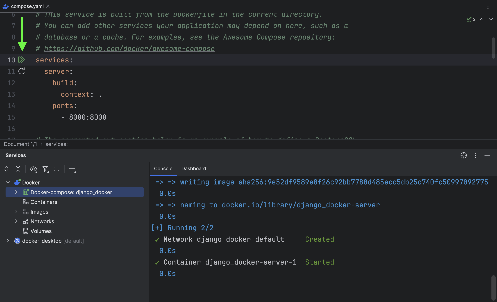
