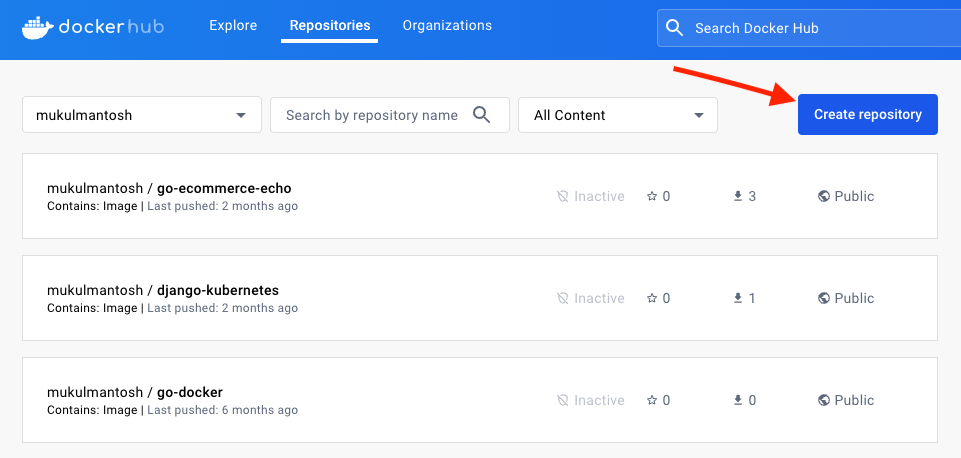
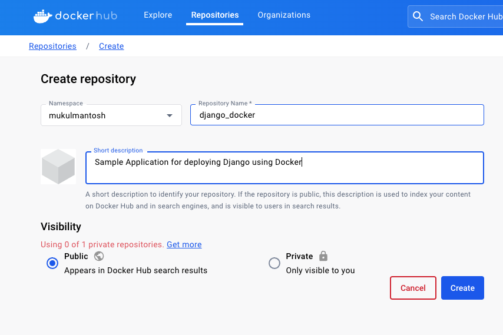
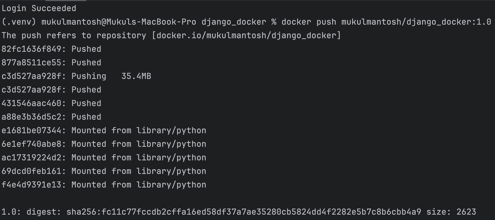
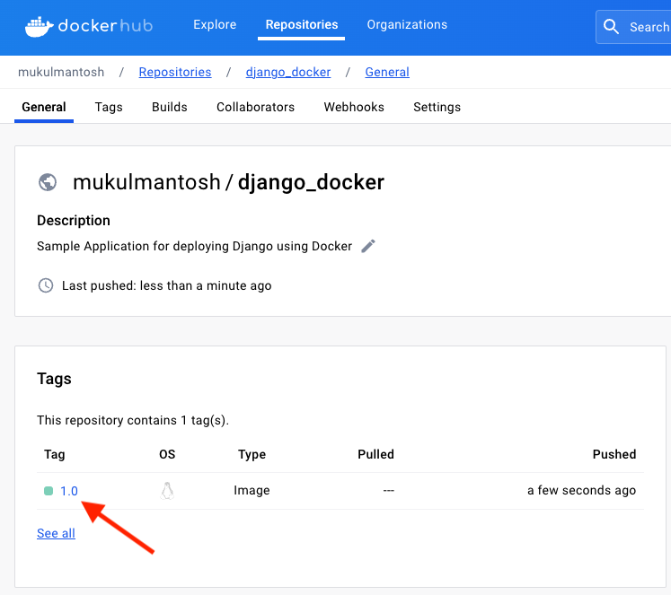

## DockerHub

After confirming that your application is functioning as anticipated, proceed to push the image to [DockerHub](https://hub.docker.com/).


If you already have an account, then you need to log in or create a new account.

Next, click **Create Repository**.



Please enter a repository name and description, and select the visibility option (Free/Private) based on your needs. I will opt for the free option.

Once done, click **Create**.



To upload the image to the registry, we must execute the following command.

> **Note:** The username will be modified since you'll be deploying the image from your own account.

```bash
docker push mukulmantosh/django_docker:tagname
docker push <USER>/<REPO_NAME>:tagname
```


You need to build the image before pushing it to the registry.

Run the following command:

```bash
docker build -t <REPLACE_USER>/django_docker:1.0 .
```


The provided Docker command builds a Docker image with the tag `"mukulmantosh/django_docker:1.0"` using the current directory as the build context.

Breaking it down:

- `docker build`: This is the Docker command used to build Docker images.
- `-t mukulmantosh/django_docker:1.0`: This is the option to specify a tag for the image. In this case, the tag is `"mukulmantosh/django_docker"` with a version or label of "1.0". The format "repository_name/image_name:tag" is commonly used to identify Docker images.
- `.`: This period (dot) at the end of the command signifies the build context. It tells Docker to use the current directory (where the command is run) as the build context, which includes all the files and directories in that location for building the image.

So, when you run this command, Docker will build an image with the specified tag (`"mukulmantosh/django_docker:1.0"`) using the files and configurations found in the current directory.

After successfully building the image, you can proceed with pushing it. However, before doing so, you must log in to Docker by executing the following command:

```bash
docker login
```


Once authenticated, you can push the image.

```bash
docker push <REPLACE_USER>/django_docker:1.0
```



After completing the process, you can view the outcome on DockerHub for the newly pushed image.



## Conclusion

In short, integrating Docker into a Django application brings big benefits like better deployment. This tutorial explored Docker's advantages and how to use it with Django. Docker helps manage dependencies, keeps things consistent across setups, and boosts deployment strategies. Remember, to make the most of Docker, understand its basics and adapt it to your Django project's needs. As you keep using Docker, it'll become a vital tool in your development process, making your work smoother and more professional.

Good luck with Dockerizing your projects! ✌️
