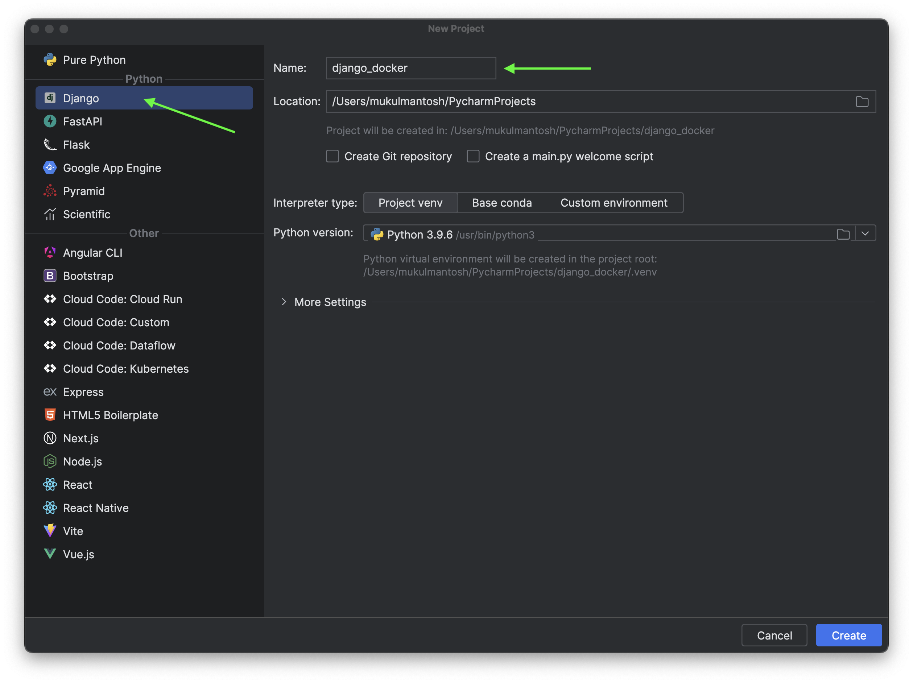
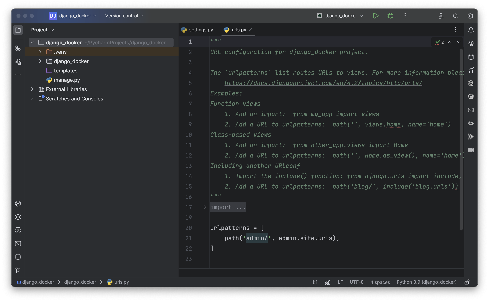
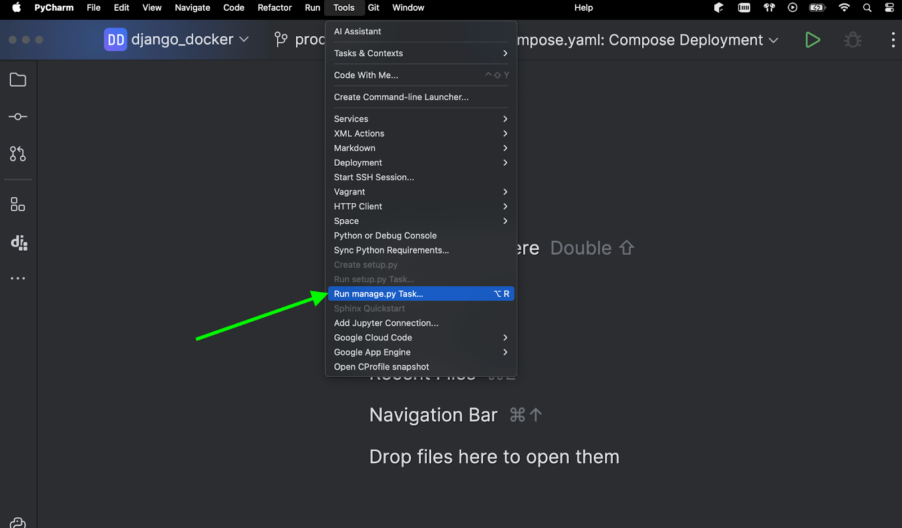
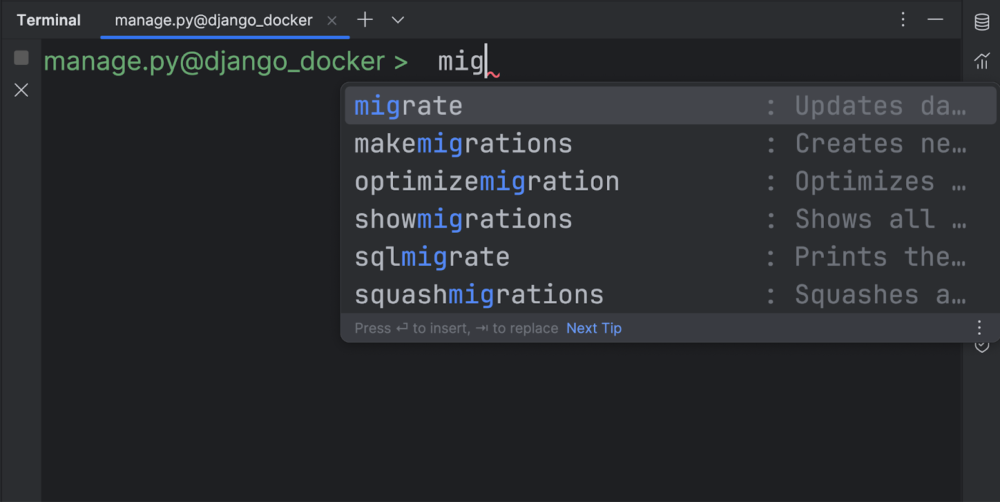
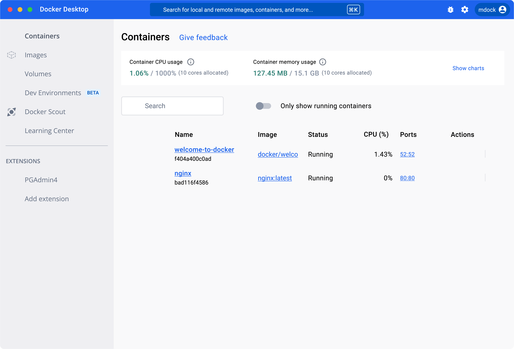
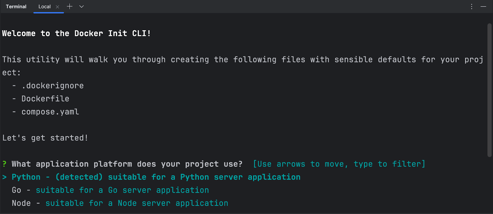
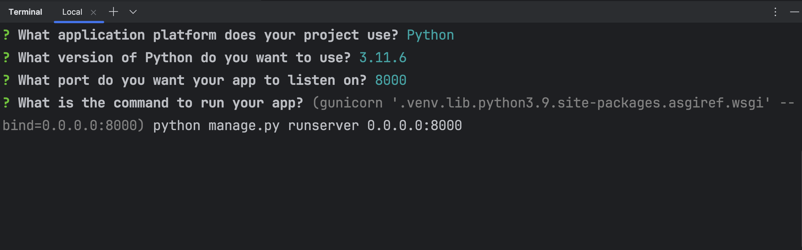
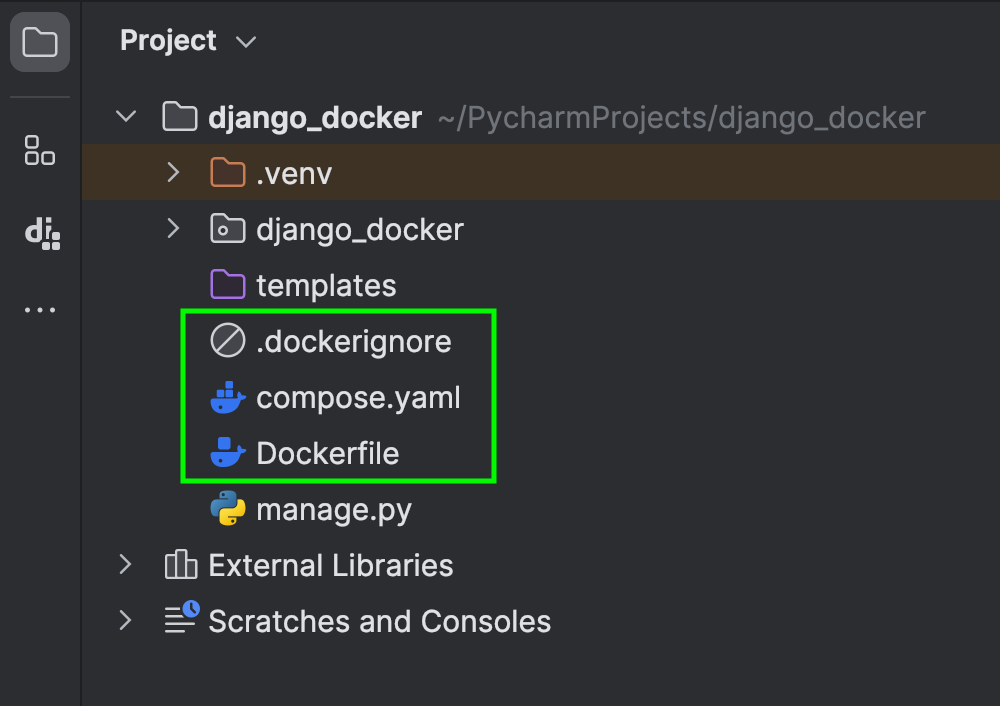
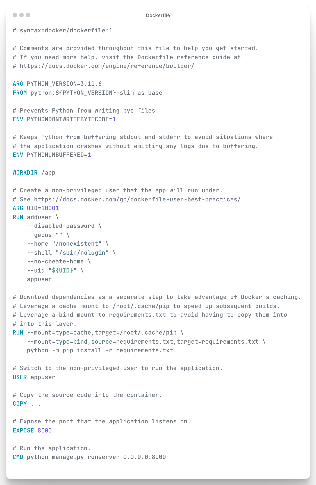
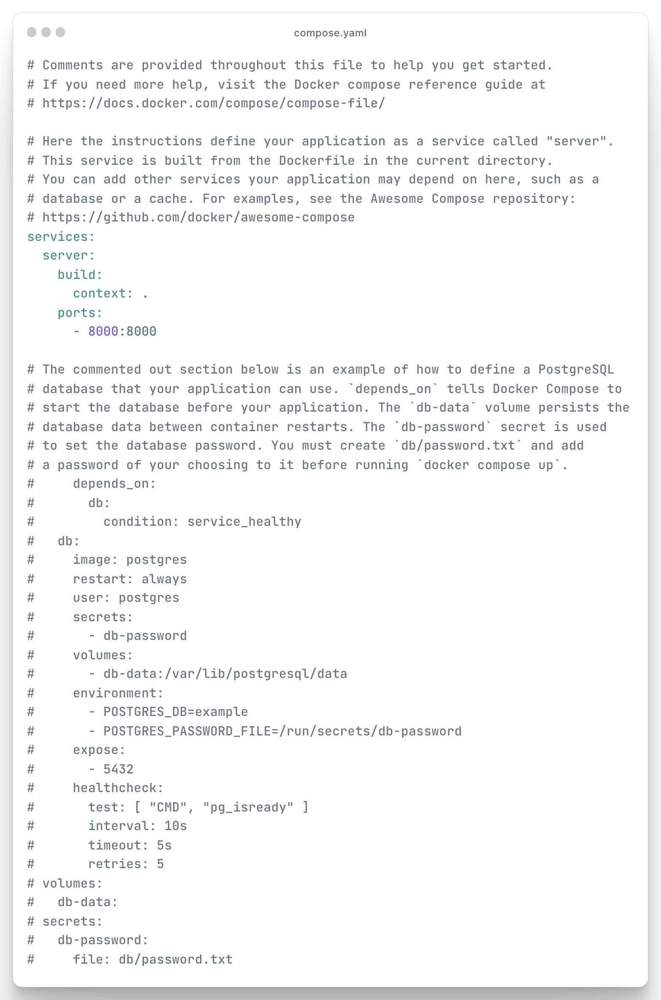

## Creating a Django App

For this tutorial, we are going to create a basic bare-bones Django Application.

> **Note**: You can find the entire source code in [GitHub](https://github.com/mukulmantosh/dockerizing_django).

Let’s begin by creating a new Django Application in PyCharm.

Select "Django" and then give your project a name. I'll be using "**django_docker**" as the name, but feel free to choose this or come up with your own unique name.

Once done, click **Create**.



Appreciation goes to PyCharm for facilitating a smooth transition in project creation, eliminating the need to use the CLI and remember various commands.



Before proceeding, ensure that you export the Python dependencies into a `requirements.txt` file using this command:

```bash
pip freeze > requirements.txt
```

Additionally, execute the command below to create a `db.sqlite3` file, which we will later transfer into the container.

```bash
python manage.py migrate
```

Do it through PyCharm, it’s easy!





> **Note**: db.sqlite3 won’t be part of the production setup. Make sure to exclude it in the `.dockerignore` file.

In this tutorial, [Docker Desktop](https://www.docker.com/products/docker-desktop/) on Mac is the primary platform used. However, Docker Desktop is also available for Linux and Windows.



It's important to use the most recent version of Docker Desktop; for reference, I am using version 4.25.2

## Docker

### docker init

We are going to leverage the [docker init](https://docs.docker.com/reference/cli/docker/init/) plugin which will generate necessary starter files, gone are the days when you used to write them manually.

Starting from Docker Desktop version 4.18, the Docker Init plugin is available, which includes the `docker init` CLI command. By running `docker init` in your project directory, you'll be guided through the process of creating the following files, each with practical default settings tailored for your project:

- `.dockerignore`
- `Dockerfile`
- `compose.yaml`

Run the following command in the terminal.

**docker init**



Notice that the tool has automatically identified Python in the project. However, it also supports templates for other programming languages and frameworks, including Go, Node, PHP, Rust, .NET, and more.

Next, provide the necessary information

- Python version : `3.11.6`
- Running port : `8000`
- Command to run : `python manage.py runserver 0.0.0.0:8000`



Once done, press enter, and it’s going to generate the necessary files for you.




The `Dockerfile` and `compose.yaml` will appear significantly more streamlined than if they were typed manually. However, for beginners, it's advisable to simplify these files as they contain more information than necessary for initial stages.

### Dockerfile



### compose.yaml


