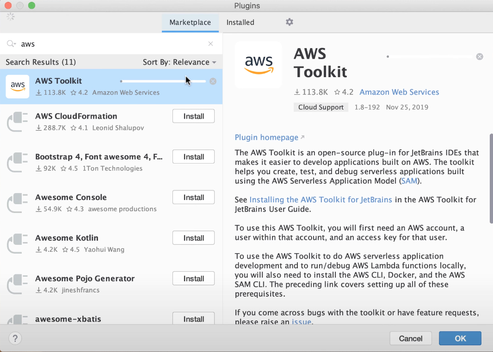

The AWS team provides a powerful and maintained Rider plugin for working with AWS.
This video provides a walkthrough. Though it is from a few years ago, the concepts
remain similar. Let's summarize what it covers.

## Install plugin and dependencies

To get started, first install [the AWS Toolkit Plugin](https://plugins.jetbrains.com/plugin/11349-aws-toolkit):

The plugin presumes you have the necessary tools installed on your computer. First, the [AWS and SAM CLI](https://docs.aws.amazon.com/cli/) packages.
And of course, a compatible installation of .NET Core.

Finally, Docker is used in the plugin's toolchain (and in AWS), so make sure you have a local install.

## Working with AWS Lambda

- Project template for new projects
  - Contains a test project that shows how to do testing in the IDE
  - Example CloudFormation YAML file
- Status bar widget for credentials and connection information
- Gutter icon to run/debug a lambda resource
  - Also creates a run configuration
    - Specify inputs to the lambda
- Running then uses AWS tooling to build the application and create Docker image.
- Same is true for debugging
- Deployment by right-click on template.yaml and choose Deploy serverless application
- Then use AWS Explorer to work with your CloudFormation stacks and deployed lambdas.
-

## Cloud Debugging

- Debug a .NET application in non-production environments
- Setup, such as a role
- Once configured, provides a new service, clone of original
- Make a new run/debug configuration
- Once debugging, it syncs local project with the remote debug target
- All the usual debugging features work, even though it is "in the cloud"
-
