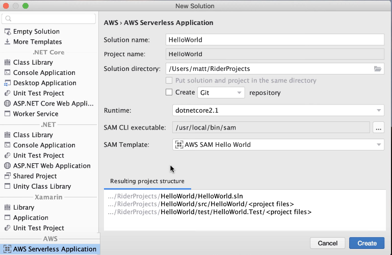
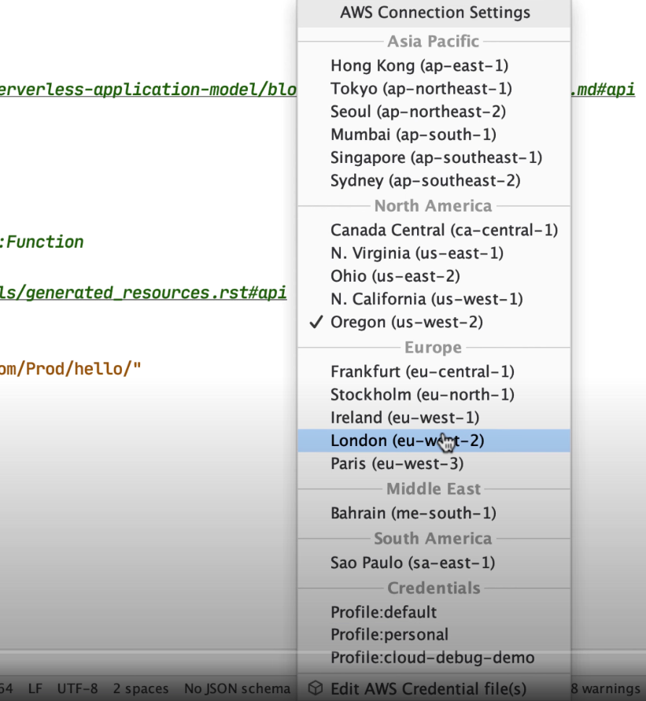
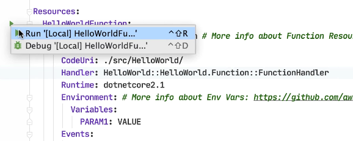
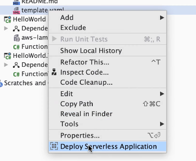
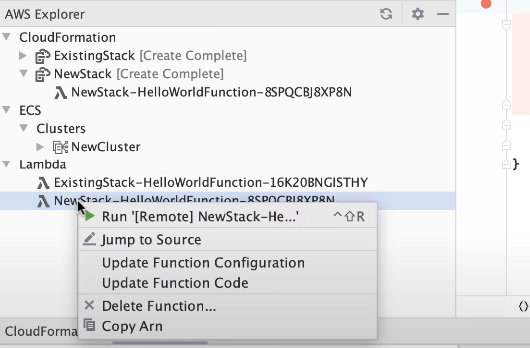
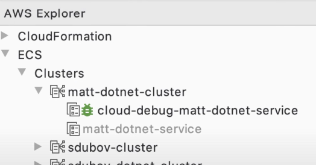
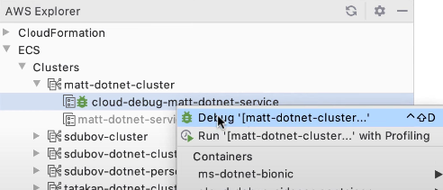

The AWS team provides a powerful and maintained Rider plugin for working with AWS.
This video provides a walkthrough. Though it is from a few years ago, the concepts
remain similar. Let's summarize what it covers.

## Install plugin and dependencies

To get started, first install [the AWS Toolkit Plugin](https://plugins.jetbrains.com/plugin/11349-aws-toolkit):

The plugin presumes you have the necessary tools installed on your computer. First,
the [AWS and SAM CLI](https://docs.aws.amazon.com/cli/) packages.
And of course, a compatible installation of .NET Core.

Finally, Docker is used in the plugin's toolchain (and in AWS), so make sure you have a local install.

## Working with AWS Lambda

Rider project templates make it easy to get started in certain technologies. The AWS Toolkit
plugin provides a project template for `AWS Serverless Application`:

This template gives you a great starting point: a README, test project for doing in-IDE testing, example CloudFormation
YAML file, and more.

The plugin also adds a status bar widget where you can supply credentials and connection information:

When it's time to run a lambda resource, gutter icons make it easy for running or debugging. This
creates a run configuration where you can specify inputs to the lambda. Running (or debugging) then uses AWS tooling
to build the application and create Docker image.

Deployments are simple: right-click on `template.yaml` and choose Deploy serverless application:

Once deployed, use `AWS Explorer` to work with your CloudFormation stacks and deployed lambdas.

## Cloud Debugging

AWS Toolkit supports debugging _in the cloud_ for non-production environments.

Choose a role that AWS will use to set up cloud debugging. Once the service is configured, you will spot a new service
in the AWS Explorer:

When you debug the service, a new run/debug configuration will be created. This syncs local project with the remote
debug target.

## Conclusion

This video covered getting started with the [AWS Toolkit plugin](https://plugins.jetbrains.com/plugin/11349-aws-toolkit)
and credential/connection management, working with lambdas, and cloud debugging. Check out
the [JetBrains AWS page](https://www.jetbrains.com/devops/amazon-aws/) for more information.
