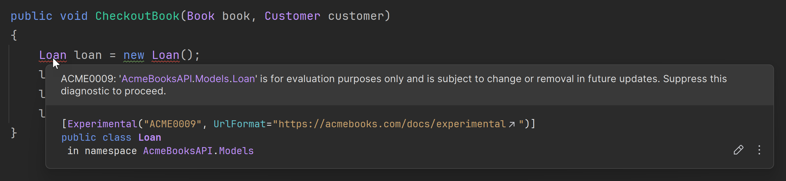
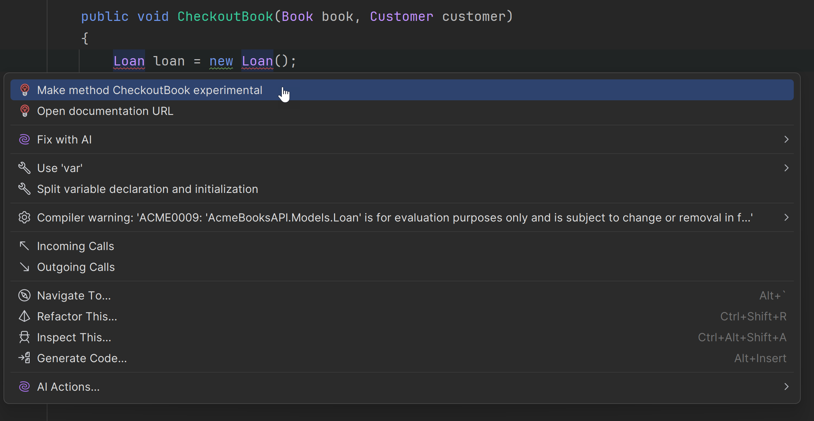

## The Experimental attribute

In C#, the `Experimental` attribute is a marker introduced to convey that a particular block of code, such as a type or type member is meant to be experimental, at least for now.
This attribute is part of the `System.Diagnostics` namespace and is primarily intended to indicate that the associated functionality is still being developed, tested, or evaluated, and may undergo breaking changes or be removed entirely in future releases.
Annotating code with this attribute prevents other developers from inadvertently using code that shouldn't make it to production - at least not yet.
Developers can use it as a warning to avoid relying on the long-term stability of the marked element, especially in production-level code. When applied, the `Experimental` attribute provides an optional feature message parameter to communicate additional context about the experimental state of the API.
Using the `Experimental` attribute causes an error, and therefore tools like Rider and ReSharper display a compiler error.

Let's see how it works. The following code sample is for a bookstore experimenting with loaning books as well as selling them.
The developer in charge of this feature has marked the `Loan` class with the `Experimental` attribute. The `Experimental` attribute requires a diagnostic identifier and optionally, a URL detailing any further information.

```csharp
using System.Diagnostics.CodeAnalysis;

[Experimental(diagnosticId:"ACME0009", UrlFormat = "https://acmebooks.com/docs/experimental")]
public class Loan
{
    public Customer Customer { get; set; }
    public Book Book { get; set; }
    public DateTime DateOut { get; set; }
    public DateTime? DateReturned { get; set; }
}
```

If another developer tries to use the `Loan` class, as shown in the following code sample, a compiler error occurs.

```csharp
public class BookLoanService
{
    public void CheckoutBook(Book book, Customer customer)
    {
        Loan loan = new Loan();
        loan.Book = book;
        loan.Customer = customer;
        loan.DateOut = DateTime.Now;
    }
}
```

The calling code causes the following error message. By hovering over the error status indicator (the red squiggly line), you can view detailed information in Rider about the error.



It's the same error information that you see if you try to compile the program.

```csharp
LoanBook.cs(10, 9): [ACME0009] 'AcmeBooksAPI.Models.Loan' is for evaluation purposes only and is subject to change or removal in future updates.
Suppress this diagnostic to proceed. (https://acmebooks.com/docs/experimental)
```

## YOLO! To production anyway

If you still want to use the code marked as experimental and suppress the error message, there are two ways you can do so:

1. Mark the calling code with an Experimental attribute.

```csharp
[Experimental("ACME0009")]
public void CheckoutBook(Book book, Customer customer)
{
		Loan loan = new Loan();
		// more code
}
```

2. Use a `#pragma warning disable` command to disable the error, and later, a `#pragma warning restore` command to restore it. Don't forget to include the diagnostic id defined in the `Experimental` attribute.

```csharp
#pragma warning disable ACME0009
Loan loan = new Loan();
// more code
#pragma warning restore ACME0009
```

In Rider, both of these options are available through an intention action (Windows <kbd>Alt+Enter</kbd> or macOS <kbd>⌥Option↩Enter</kbd>). Additionally, you can navigate to the documentation to find out more.



## Conclusion

The `Experimental` attribute in C# is used to mark APIs, types, or members as experimental, indicating they are in a testing phase and may change or be removed in the future. It warns developers not to rely on the long-term stability of the annotated code, particularly in production. This attribute promotes transparency and encourages feedback while signaling the potential instability of early-stage features.
