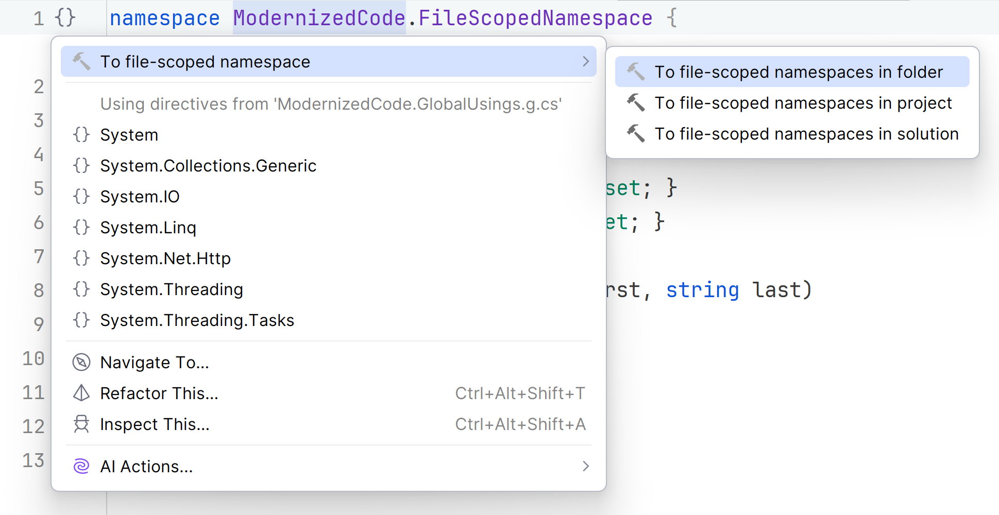
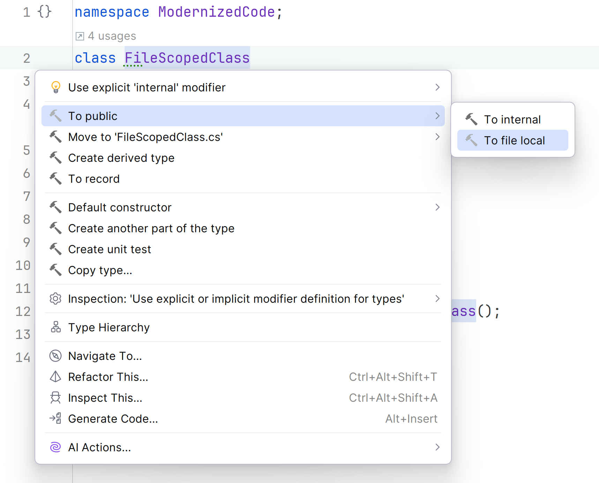

Top-level namespaces and objects in C# help organize your code, reduce bugs, and make code more clear and therefore easier to read and maintain.

## File-scoped namespaces

Since C# 10, you can use file-scoped namespaces so remove unnecessary wrapper code around classes, and trim the `namespace` declarations down to one line.
This shortened syntax brings the entire file into the namespace. Other namespaces that are explicitly declared in the file will be compiled as a nested namespace.
The syntax for a file-scoped namespace is the keyword `namespace` followed by the name of the namespace and a semicolon `;`.

## Refactor code to use file-scoped namespaces

Click the light bulb 💡 or press <kbd>Alt + Enter</kbd> and choose **To file-scoped namespace**. Select where you'd like to apply this refactoring: the folder level, project, or solution.



This action removes the curly braces from the namespace declarations and terminates the top-level declaration with a `;`. Code goes from this:

```csharp
namespace FileScopedNamespace
{
    public class Customer
    {
        // properties and methods
    }
}
```

to this:

```csharp
namespace FileScopedNamespace;

public class Customer
{
    // properties and methods
}
```

It might be just one level of indentation and set of brackets, but it does leave the code looking just a little more streamlined. Caveat: Only one file-scoped namespace per file.

## File-scoped types

Traditionally, the following [access modifiers](https://learn.microsoft.com/en-us/dotnet/csharp/programming-guide/classes-and-structs/access-modifiers) were available for classes:

`Public`, `Private`, `Internal`, `Protected`, `Protected Internal`, and `Private Protected`.
These modifiers allowed or restricted scope of the types in many ways, but there was never a scope to cover types at only the file level.
In C# 10, the `file` modifier was added, giving you the ability to limit types in this manner.

## Refactor code to use file-scoped types

Change the current access modifier of any type to `file`. This can be done manually, or In Rider, you can click the light bulb 💡 or press <kbd>Alt + Enter</kbd>. Choose **To public** to reveal more options. Select **To file local**.
The access modifiers shown in the menus may vary a bit based on the context of the surrounding code.



Code before refactoring:

```csharp
public class FileScopedClass
{
    // code
}
```

Code after refactoring:

```csharp
file class FileScopedClass
{
    // code
}
```

File-scoped namespaces and types allow you to reduce both code and fine tune the scope of objects - a good coding practice.
