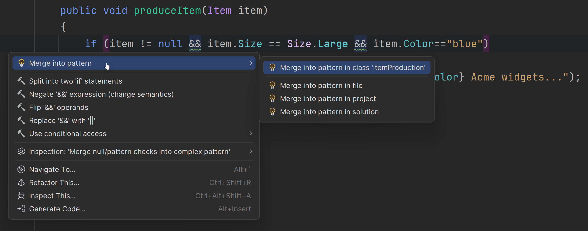

## Pattern matching in properties

With pattern matching, one thing you can test is whether an object has a certain property and whether that property holds a certain value.
Pattern matching enables developers to compare without having to do the mental context switching that happens when reading compound expressions.
This makes it an excellent and powerful language feature. It reduces the need for complex logic and typecasts resulting in smaller and more efficient code.

## Refactor properties to use pattern matching

The following sample code contains an expression that evaluates these three conditions: whether the item is null, the item's size, and the item's color. While it does the job, the readability in this scenario just isn't great for a lot of developers, especially newer ones. It's not just a lot of code crowded into one line, but a lot of code cryptically crowded into one line. That kind of code is where bugs sneak in, and readability and maintainability sneak out.

```csharp
public void produceItem(Item item)
{
    if (item != null && item.Size == Size.Large && item.Color=="blue")
    {
        Console.WriteLine($"Now producing {item.Size} {item.Color} Acme widgets...");
    }
}
```

So let's refactor the code to use pattern matching with the properties that are compared in the `if` statement. Press <kbd>⌥⏎</kbd> (macOS) / <kbd>Alt+Enter</kbd> in the condition you want to refactor and choose **Merge into pattern**. You can apply the refactoring anywhere in the project from the class level to the entire solution.



Here are the results of the **Merge into pattern** refactoring:

```csharp
if (item is { Size: Size.Large, Color: "blue" })
{
    Console.WriteLine($"Now producing {item.Size} {item.Color} Acme widgets...");
}

```

The refactored code looks quite nice. It's compact and more like natural language making the code easier, even enjoyable, to read.
