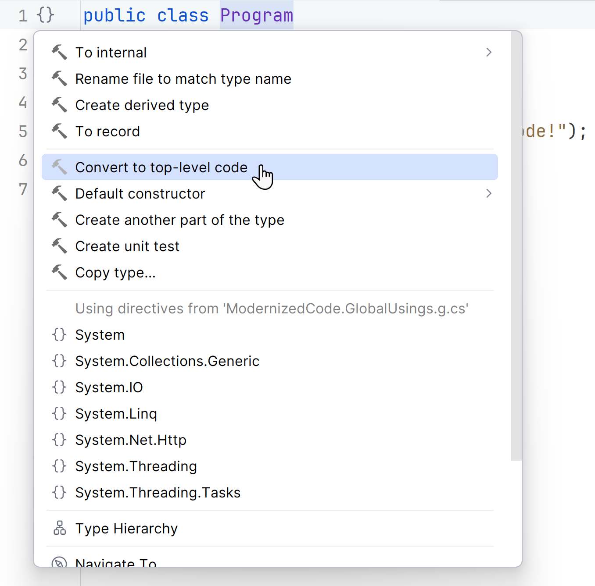

Top-level statements can take your code to the... top level.

## Top-level statements

Top-level statements were introduced in C# 9 as a syntax feature that allows you to reduce code by removing the `Main` method and its associated class. While the compiler needs this information to build the program, the programmer doesn't need to see any of it in most cases. The programmer only needs to see the working code.
This means you can place executable code at the top of the file starting right on line 1. Hence, "top-level" statements.

A few caveats about top-level statements:

- You can only use top-level statements _in one file_ in a project. Most likely, `Program.cs`, as most developers expect to see an entry point in a file with this name.
- Any code blocks such as type definitions or methods after the individual lines of code are not considered top-level.
- Top-level statements are excellent for simplifying smaller applications. They might not work well in large or complex apps that need the extra structure.

Top-level statements are great for Minimal APIs.

## Refactoring to use top-level statements

If you'd like to convert your program to use top-level statements, click the light bulb 💡 or press <kbd>Alt + Enter</kbd> anywhere on the same line as `Main` or the class declaration (including brackets).
Choose **Convert to top-level code**



A basic "Hello World" program that's been refactored to use top-level statements goes from this:

```csharp
using System;

public class Program
{
    public static void Main(string[] args)
    {
        Console.WriteLine("Hello modern code!");
    }
}
```

to this:

```csharp
Console.WriteLine("Hello modern code!");
```

That's quite a difference. Your eyes focus on the executable code immediately.
As you can see, a `Main` function isn't always necessary, or very readable, from a developer's perspective. The good news is that you can ditch the traditional entry point code for a lot of your future C# work.
