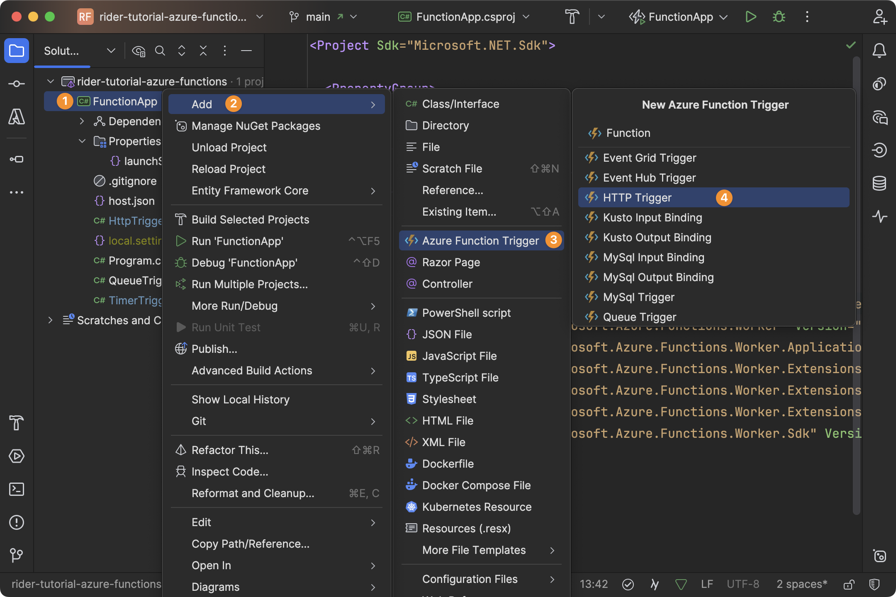
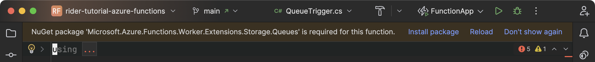
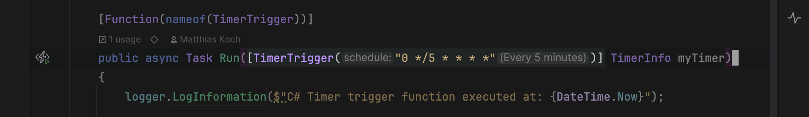

After your Azure functions project was created, we can dive into the more interesting bits. Many of the [available triggers and bindings](https://learn.microsoft.com/en-us/azure/azure-functions/functions-triggers-bindings?tabs=isolated-process,node-v4,python-v2&pivots=programming-language-csharp#supported-bindings) can be added through [file templates](https://www.jetbrains.com/help/rider/Creating_a_File_Template.html) from the project context menu:



> **Tip:** You can [customize file templates](https://www.jetbrains.com/help/rider/Templates__Creating_and_Editing_Templates__Editing_a_Template.html) according to your team's preferences and [share them through settings files](https://www.jetbrains.com/help/rider/Sharing_project_settings.html).

In the following sections we will discuss three well-known functions triggers – namely HTTP, timer, and queue triggers – which will act as examples to illustrate different features of the Azure Toolkit in the remainder of this tutorial.

> **Tip:** Certain function types require additional NuGet packages. Make sure to watch out for Rider’s notification bar to confirm installations:
>
> 
>
> If you grab code from somewhere else and there are unresolved references (red code), you can [find and install NuGet packages](https://www.jetbrains.com/help/rider/Using_NuGet.html#finding) using _Alt-Enter | Find this type on NuGet_. If there are multiple packages as a result, prefer `Microsoft.Azure.Functions.Worker.*` packages, as those are built for the isolated-worker model.

> **Tip:** For all classes that define Azure functions, you can add the `UsedImplicitly` attribute from the [`JetBrains.Annotations` NuGet package](https://www.nuget.org/packages/JetBrains.Annotations) (also available as [source-only package](https://www.nuget.org/packages/JetBrains.Annotations.Sources)) to support the “unused code” analysis:
>
> ```csharp
> [UsedImplicitly(ImplicitUseKindFlags.InstantiatedNoFixedConstructorSignature)]
> public class MyTrigger(           // Known to be automatically instantiated
> 		IUsedService usedService,
> 		IUnusedService unusedService) // Warning: Marked as unused
> {
> }
> ```

## HTTP Triggers

_Require: `Microsoft.Azure.Functions.Worker.Extensions.Http.AspNetCore`_

In its most simple form, an HTTP trigger could react to any anonymous GET or POST request. However, you can also customize it to use [authorization levels with access tokens](https://learn.microsoft.com/en-us/azure/azure-functions/functions-bindings-http-webhook-trigger?tabs=python-v2,isolated-process,nodejs-v4,functionsv2&pivots=programming-language-csharp#http-auth), or add [route parameters](https://learn.microsoft.com/en-us/azure/azure-functions/functions-bindings-http-webhook-trigger?tabs=python-v2,isolated-process,nodejs-v4,functionsv2&pivots=programming-language-csharp#using-route-parameters) with [route constraints](https://learn.microsoft.com/en-us/aspnet/core/fundamentals/routing?view=aspnetcore-9.0#route-constraints) that are resolved from the URI.



```csharp
public class HttpTrigger(ILogger<HttpTrigger> logger)
{
    [Function(nameof(HttpTrigger))]
    public IActionResult Run(
        [HttpTrigger(AuthorizationLevel.Anonymous, methods: ["get", "post"],
            Route = $"{nameof(HttpTrigger)}/{{action:alpha?}}")]
        HttpRequest req,
        string? action)
    {
        logger.LogInformation("C# HTTP trigger function processed a request.");
        logger.LogWarning("This is a warning");

        if (action == "fail")
            throw new Exception("Something went wrong");

        return new OkObjectResult("Welcome to Azure Functions folks!");
    }
}
```



In our example above, we allow both GET and POST requests to our function. Since the route parameter `action` is optional, the function can be invoked via `api/HttpTrigger` and `api/HttpTrigger/<anything>`. The parameter is then used to conditionally throw an exception. We are also taking log messages with different severities, which we will later investigate in the log files.

## Timer Triggers

_Require: `Microsoft.Azure.Functions.Worker.Extensions.Timer`_

Timer triggers run code on a fixed schedule using a [CRON expression](https://en.wikipedia.org/wiki/Cron). They’re used for recurring tasks like cleanup or polling, without requiring external input.

```csharp
public class TimerTrigger(QueueServiceClient queueServiceClient, ILogger<TimerTrigger> logger)
{
    private readonly QueueClient queueClient = queueServiceClient.GetQueueClient(nameof(QueueTrigger).ToLowerInvariant());

    [Function(nameof(TimerTrigger))]
    public async Task Run([TimerTrigger("0 */5 * * * *")] TimerInfo myTimer)
    {
        logger.LogInformation($"C# Timer trigger function executed at: {DateTime.Now}");

        if (myTimer.ScheduleStatus is null)
            return;

        await queueClient.CreateIfNotExistsAsync();
        await queueClient.SendMessageAsync(myTimer.ScheduleStatus.Last.ToString(CultureInfo.InvariantCulture));

        logger.LogInformation($"Next timer schedule at: {myTimer.ScheduleStatus.Next}");
    }
}

// Program.cs - Dependency Injection Setup
builder.Services.AddSingleton(_ =>
{
    var connectionString = builder.Configuration["AzureWebJobsStorage"];
    return new QueueServiceClient(connectionString);
});
```

> **Tip:** Trying to understand an existing timer trigger can be challenging without resorting to websites like [crontab.guru](http://crontab.guru). The Azure Toolkit helps you to decode CRON expressions using the [`CronExpressionDescriptor` project](https://github.com/bradymholt/cron-expression-descriptor) and [inlay hints](https://www.jetbrains.com/help/rider/Inline_Parameter_Name_Hints.html):
>
> 

In our example above, we are regularly sending a message to the `QueueTrigger` queue. This helps to illustrate our last trigger type – queue triggers.

## Queue Triggers

_Require: `Microsoft.Azure.Functions.Worker.Extensions.Storage.Queues`_

Queue triggers execute when a new message is added to a specified Azure Storage queue. They are used for background processing and decoupled workflows. The function receives the message payload as input when triggered.

```csharp
public class QueueTrigger(ILogger<QueueTrigger> logger)
{
    [Function(nameof(QueueTrigger))]
    public void Run([QueueTrigger(nameof(QueueTrigger))] string message)
    {
        logger.LogInformation($"C# Queue trigger function processed: {message}");
    }
}
```

This type of functions is a good candidate for [further customizations](https://learn.microsoft.com/en-us/azure/azure-functions/functions-bindings-storage-queue?tabs=isolated-process,extensionv5,extensionv3&pivots=programming-language-csharp#host-json) in your `host.json` file. For instance, you can configure the maximum polling interval and message encoding like so:

```json
{
	"extensions": {
		"queues": {
			"maxPollingInterval": "00:00:05",
			"messageEncoding": "none"
		}
	}
}
```

> **Tip:** Instead of switching `messageEncoding` to `none`, you can also use JSON serialization when sending data to the `QueueClient` and define the exact type on the queue trigger binding:
>
> ```csharp
> // enqueuing message
> var json = JsonSerializer.Serialize(new Data("Name"));
> await queueClient.SendMessageAsync(Convert.ToBase64String(Encoding.UTF8.GetBytes(json)));
>
> // dequeuing message
> public void Run([QueueTrigger(nameof(QueueTrigger))] Data message) { }
> ```

---

The above samples are good to have for the following tutorial steps!
