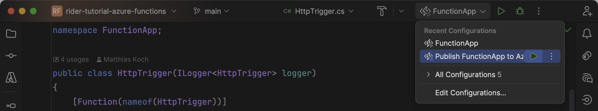

Depending on your preference and involvement with Azure Functions, you can deploy your apps from within your IDE (often called “right-click publish”) or from using the Azure CLI in your CI/CD tool of choice.

> **Hint:** In case you haven't done it already, this is the right time to sign in to your Azure account using the _Azure_ window. Use the _Sign In_ button to choose between several sign-in methods, then select the Azure subscriptions you want to have access to:
>
> 
>
> Note that _Azure CLI_ as a sign-in method supports multi-tenancy.

## Right-Click Publish

The quickest way to deploy your first Azure Functions application is through Azure Toolkit’s _Publish to Azure_ feature based on [run configurations](https://www.jetbrains.com/help/rider/Run_Debug_Configuration.html). If you deployed your app before, you can already pick the instance from the dropdown to overwrite it.


If this is your first deployment, you should click the plus icon within the dropdown and proceed with the desired adjustment. For the first attempt, we would recommend selecting _Windows_ as the operating system to keep things simple.


> **Warning:** We currently choose _Consumption Plan (Y1)_ as the default SKU for the App Service plan. You can refer to [Azure Functions pricing table](https://azure.microsoft.com/en-us/pricing/details/functions/#pricing) for further information.

Once all the details are in place you can run the configuration. Rider will build the project, zip the artifacts, and deploy it to Azure. Congratulations! 👏


If you prefer to deploy your functions application from your local machine, you can continue to use the run configuration that was just created:



For a more _team-ready_ deployment, you can keep on reading the following section.

## CI/CD Deployments

> **Hint:** This section gives a quick look at a platform-agnostic deployment to round up the tutorial. Don’t expect any Azure Toolkit features. 🤓

The following deployment takes advantage of the Azure CLI and [Azure service principals](https://learn.microsoft.com/en-us/entra/identity-platform/app-objects-and-service-principals?tabs=browser#service-principal-object). Make sure that you’ve logged in to your subscription using `az login` and that the Azure CLI is also available on the build agent.

1. Create the Functions instance through the Azure Portal or publish it once from within Rider.
2. [Create a service principle](https://learn.microsoft.com/en-us/cli/azure/ad/sp?view=azure-cli-latest#az-ad-sp-create-for-rbac) from your local terminal:

   ```bash
   az ad sp create-for-rbac \
   	--name "SERVICE_PRINCIPAL_NAME" \
   	--role contributor \
   	--scopes /subscriptions/SUBSCRIPTION_ID/resourceGroups/RESOURCE_GROUP_NAME
   ```

   From the output, you need to capture the `AZURE_CLIENT_ID`, `AZURE_CLIENT_SECRET`, and `AZURE_TENANT_ID`:

   ```bash
   {
     "appId": "00000000-0000-0000-0000-000000000000", // AZURE_CLIENT_ID
     "displayName": "azure-cli-2024-01-01-00-00-00",
     "password": "XXXXXXXXXXXXXXXXXXXXXXXXXXXX",      // AZURE_CLIENT_SECRET
     "tenant": "00000000-0000-0000-0000-000000000000" // AZURE_TENANT_ID
   }
   ```

   > **Tip:** Note that the generated secret (`AZURE_CLIENT_SECRET`) expires by default in 1 year. Set and track expiration explicitly using `--years` or `--end-date`.

3. In your CI workflow, you need to compile and zip your Azure Functions project:

   ```bash
   cd src/FunctionApp
   dotnet publish -c Debug -o publish
   zip -r ../../function.zip ./publish
   ```

4. Finally, you can use the Azure CLI to publish the zipped application:

   ```bash
   az login --service-principal \
       --username "AZURE_CLIENT_ID" \
       --password "AZURE_CLIENT_SECRET" \
       --tenant "AZURE_TENANT_ID"

   az account set --subscription "AZURE_SUBSCRIPTION_ID"

   az functionapp deployment source config-zip \
       --resource-group "RESOURCE_GROUP_NAME" \
       --name "FUNCTION_APP_NAME" \
       --src function.zip
   ```

---

Unless you've created some perfect functions, it's quite likely that your code will fail sooner or later under certain conditions. No worries! This is where troubleshooting apps in the production environment becomes crucial.
