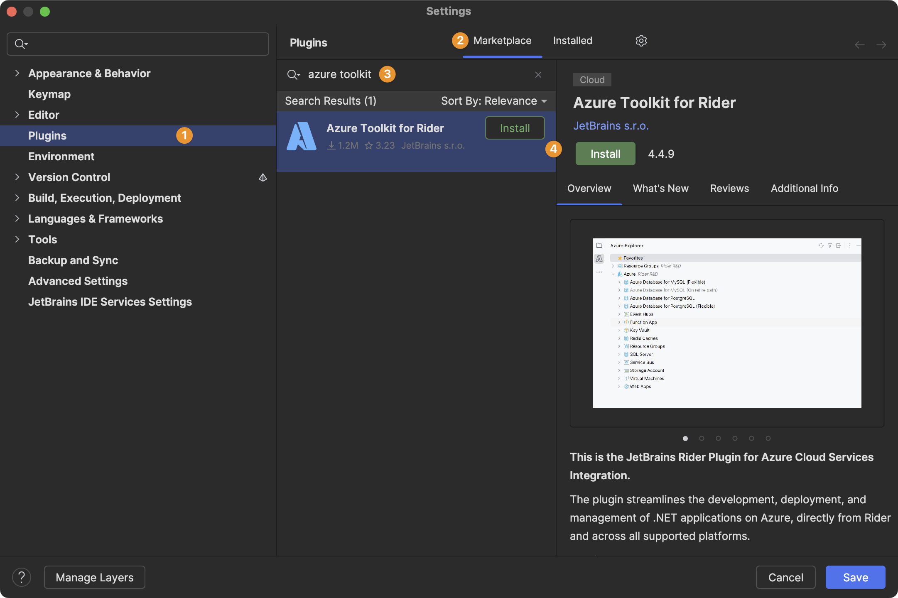
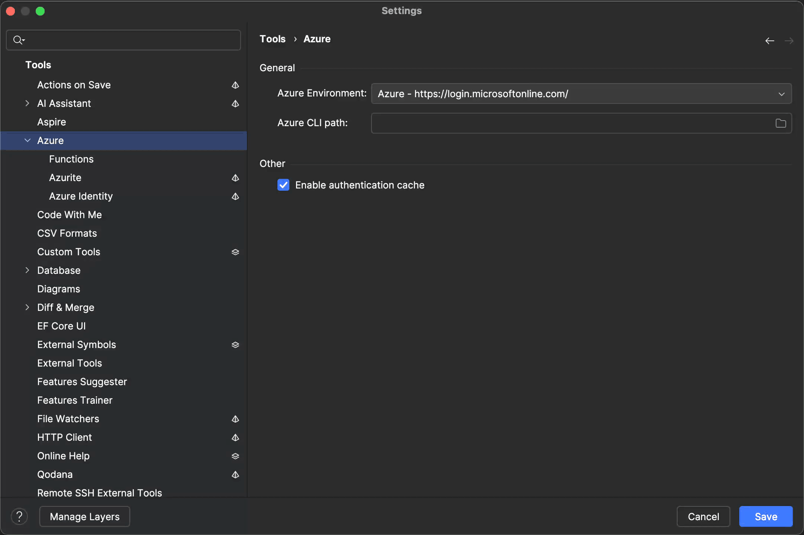

> **Note:** The following tools should be installed manually:
>
> - **[Azurite](https://learn.microsoft.com/en-us/azure/storage/common/storage-use-azurite?tabs=npm,blob-storage#install-azurite)** (required) - A local Azure Storage emulator that provides blob, queue, and table services for development and testing without connecting to Azure
> - **[Azure CLI](https://learn.microsoft.com/en-us/cli/azure/install-azure-cli?view=azure-cli-latest)** (recommended) - Command-line interface for managing Azure resources and automating deployments
> - **[Azure Storage Explorer](https://azure.microsoft.com/en-us/products/storage/storage-explorer)** (optional) - GUI tool for browsing and managing Azure Storage accounts, useful for inspecting queues and blobs during development

You can install the [Azure Toolkit plugin](https://plugins.jetbrains.com/plugin/11220-azure-toolkit-for-rider) under _Settings | Plugins_. Search for Azure Toolkit, click the _Install_ button, and restart your environment:

Once you've restarted your Rider instance, you can continue with the next step.

> **Tip:** The Azure Toolkit plugin adds a new Azure section in your IDE settings:
>
> 
>
> From here you can configure the most important settings regarding Azure development, including:
>
> - Switching to a different Azure environment
> - Change the path to [Azure CLI](https://learn.microsoft.com/en-us/cli/azure/?view=azure-cli-latest)
> - Inspect installed [Azure Functions Core Tools](https://learn.microsoft.com/en-us/azure/azure-functions/functions-run-local?tabs=macos,isolated-process,node-v4,python-v2,http-trigger,container-apps&pivots=programming-language-csharp)
> - Configure Azurite as an emulator for [Azure Storage services](https://learn.microsoft.com/en-us/azure/storage/common/storage-introduction)

With your development environment configured, you're ready to [set up your first Azure Functions project](../setting-up-an-azure-functions-project/) and start building serverless applications.
