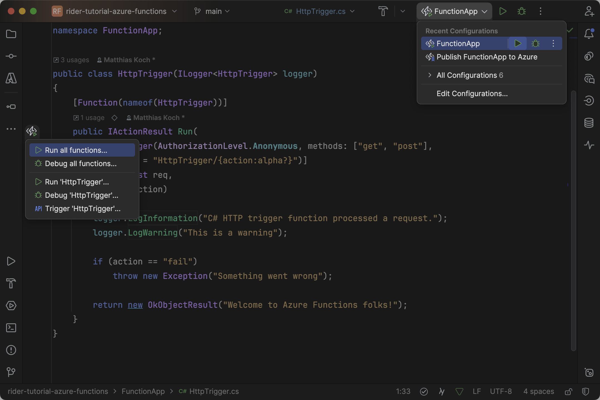
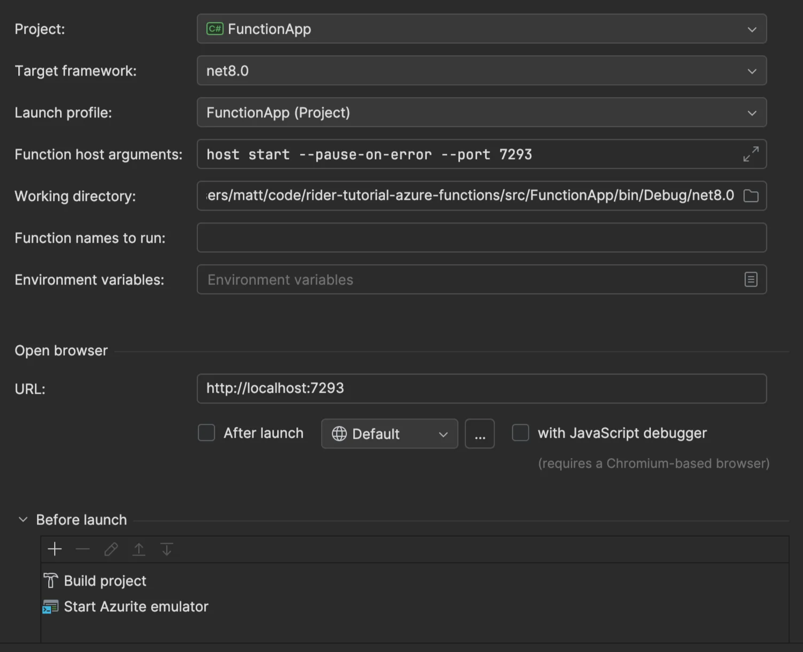
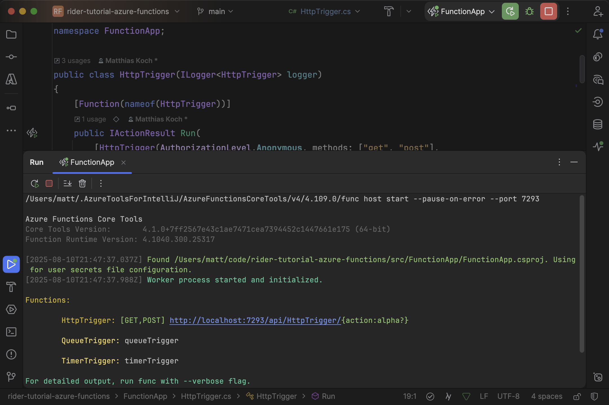
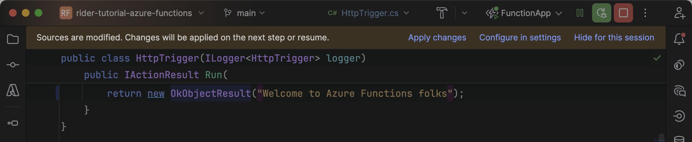
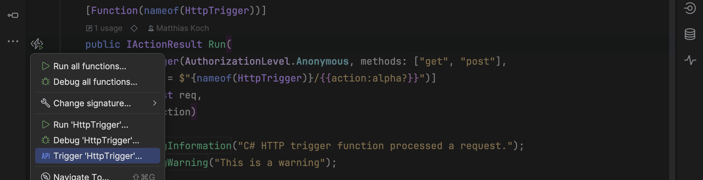
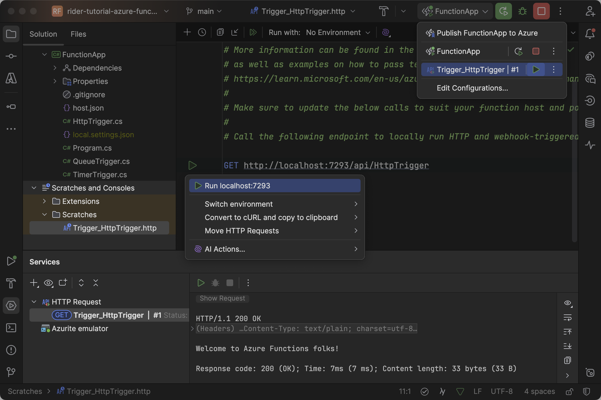
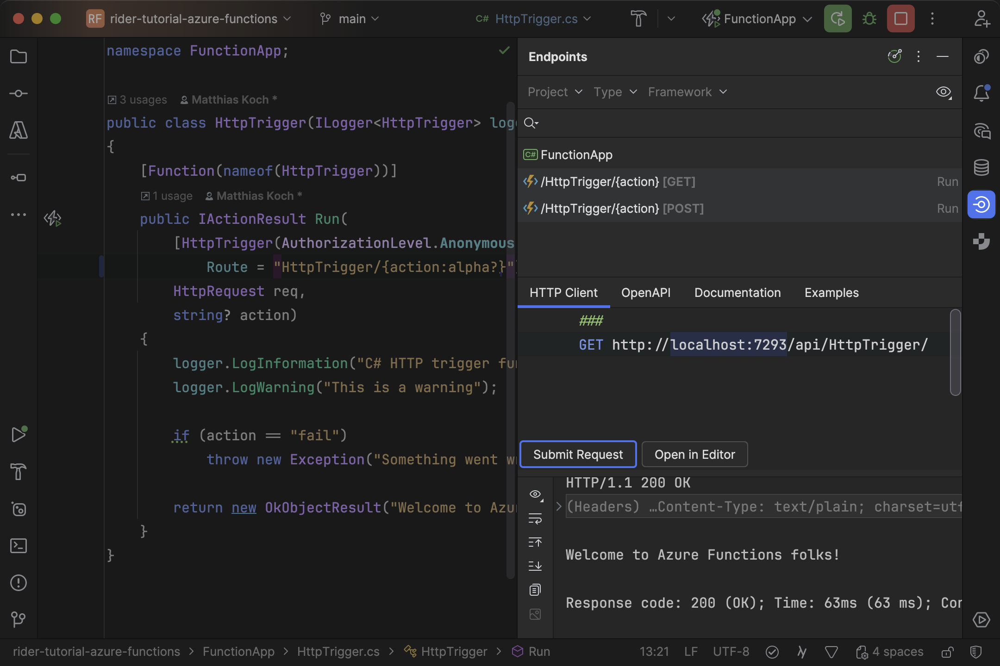

You got your first functions added? Great! With the Azure Toolkit you'll see an icon next to each function in the [editor gutter](https://www.jetbrains.com/help/rider/Editor-gutter.html) to run or debug either all or just the single function. You’ll also see that there is a [run configuration](https://www.jetbrains.com/help/rider/Run_Debug_Configuration.html) available in the [run widget](https://www.jetbrains.com/help/rider/New_UI.html#window_header). The default run configuration is based on the `launchSettings.json` file and executes all functions:



> **Tip:** From the _Edit Configurations_ dialog you can make customizations to the way how your functions are executed. For instance, you can change the port, add environment variables, run additional tasks before the launch, or even open your browser at a specific endpoint:
>
> 

Once you run or debug your functions, the [_Run_ window](https://www.jetbrains.com/help/rider/Run_Tool_Window.html) will open at the bottom. From here you can see how Rider is invoking the Azure Functions Core Tools (including the port) and what functions the runtime discovers in your project. Note that you can _restart_ or _stop_ the current execution from both the run widget and the tool window:



> **Tip:** If you’re running your app in debug mode, you can take advantage of [hot reload](https://www.jetbrains.com/help/rider/Hot_Reload.html). This allows you to make modifications and apply them to the running application without restarting the debug session. Changes are taking effect on the next debugging step or when you resume the execution.
>
> 

## Triggering Functions

Of course, you don’t want to wait for the specific event that triggers a function to actually debug it. The gutter icon on the left is an entry point to invoke any of your functions:



Rider then creates a `.http` [scratch file](https://www.jetbrains.com/help/rider/Scratches.html) (temporary file) for you that acts as a fully-featured [HTTP client](https://www.jetbrains.com/help/rider/Http_client_in__product__code_editor.html) to send requests and inspect their responses. Similar to functions, you can run a request from the editor gutter or run widget. The result of the execution is displayed in the [_Services_ window](https://www.jetbrains.com/help/rider/Services_Tool_Window.html):



> **Warning:** There is a known issue where the port in the generated scratch file is not taken from the `launchSettings.json` file. Make sure to look up the port either from that file or from the _Run_ window output.

Below you can examine some HTTP requests that would fit our previously discussed functions. Through the administrative endpoint, you can even [run non-HTTP-triggered functions](https://learn.microsoft.com/en-us/azure/azure-functions/functions-manually-run-non-http?tabs=azure-portal):

```bash
### HTTP Trigger

@action=fail
GET http://localhost:7071/api/HttpTrigger/{{action}}

### Timer Trigger

POST http://localhost:7071/admin/functions/TimerTrigger
Content-Type: application/json

{}

### Queue Trigger

POST http://localhost:7071/admin/functions/QueueTrigger
Content-Type: application/json

{
  "input": "This is the message"
}
```

> **Tip:** Make sure to dive deeper into Rider’s integrated HTTP client to learn about all its features. Those include, among other things, the ability to:
>
> - [Import Postman collections and environments](https://www.jetbrains.com/help/rider/Http_client_in__product__code_editor.html#import-postman-collections)
> - [Convert to and from cURL requests](https://www.jetbrains.com/help/rider/Http_client_in__product__code_editor.html#converting-curl-requests)
> - [Extract data using JSONPath](https://www.jetbrains.com/help/rider/Http_client_in__product__code_editor.html#JSONPath)
> - [Compare different responses](https://www.jetbrains.com/help/rider/Http_client_in__product__code_editor.html#compare_responses_in_scratch)
> - [Manage cookies](https://www.jetbrains.com/help/rider/Http_client_in__product__code_editor.html#manage_cookies)
> - [Set up SSL/TLS certificates](https://www.jetbrains.com/help/rider/Http_client_in__product__code_editor.html#ssl_certificate)

## Endpoints Window

The Azure Toolkit integrates with the [_Endpoints_ window](https://blog.jetbrains.com/dotnet/2021/07/12/a-better-way-to-discover-apis-with-the-new-endpoints-window/), which you might already know if you’ve worked with ASP.NET Web APIs. HTTP-triggered functions are automatically discovered and you can use the integrated HTTP client as discussed above:



---

Now it's time to deploy your functions and bring them to the global network of Azure.
