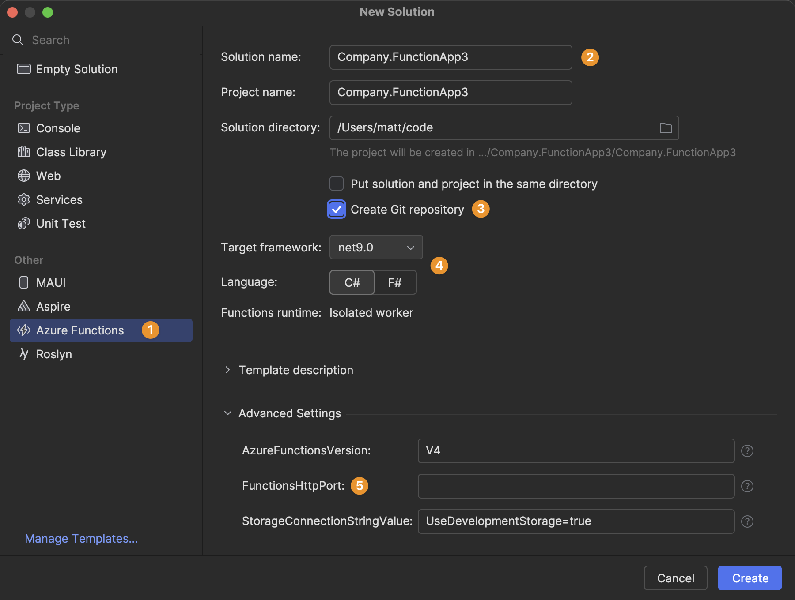
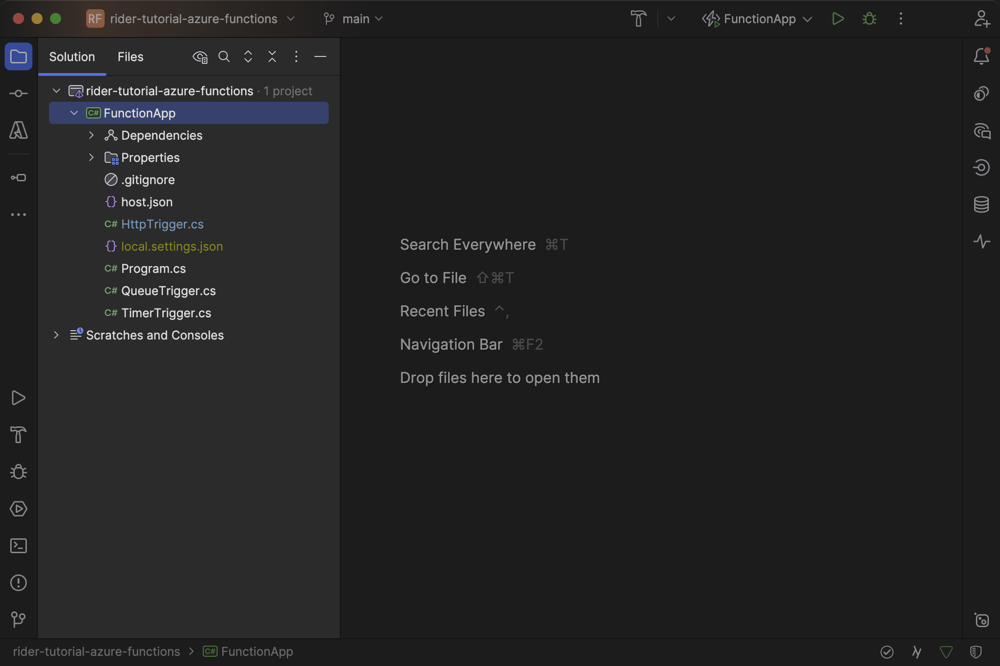
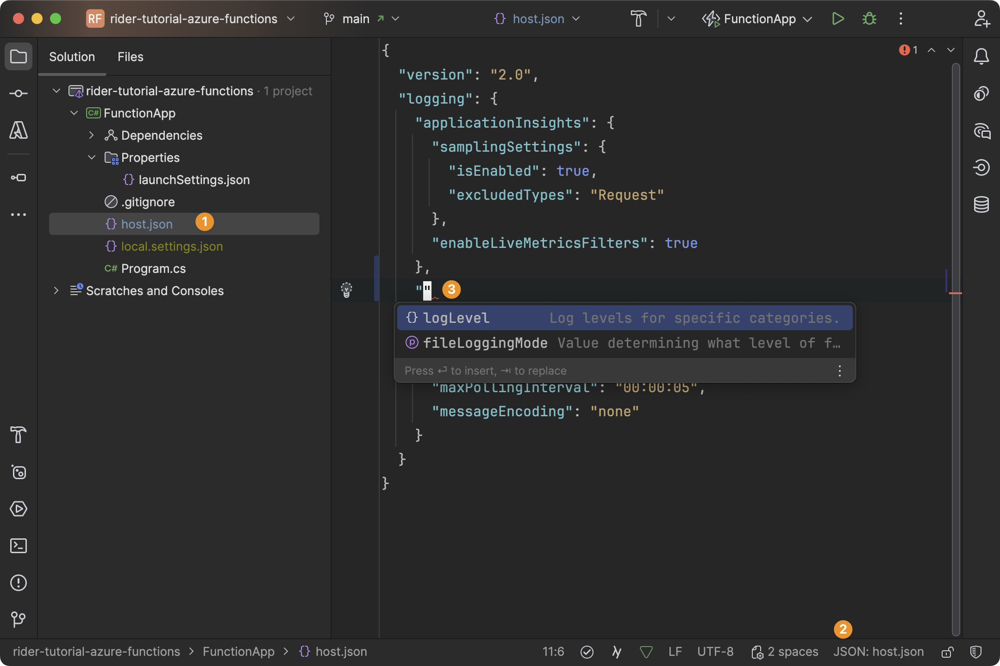

Once the plugin is installed and your environment is ready, you can start a new _Azure Functions_ project. From the _Welcome_ dialog and _File_ menu, you can choose to create a New Solution and pick the [_Azure Functions_ template](https://github.com/Azure/azure-functions-templates) from the left:

> **Warning:** If the template (still) allows you to change the Functions runtime, we strongly recommend you to choose _Isolated worker_. [Support for the in-process model ends in November 2026](https://azure.microsoft.com/en-us/updates?id=retirement-support-for-the-inprocess-model-for-net-apps-in-azure-functions-ends-10-november-2026). If you have an outdated Azure Functions app that runs with the in-process model, you might want to read on the [differences between the two models](https://learn.microsoft.com/en-us/azure/azure-functions/dotnet-isolated-in-process-differences) and [migrate to the (new) isolated worker model](https://learn.microsoft.com/en-us/azure/azure-functions/migrate-dotnet-to-isolated-model?tabs=net8).
>
> Furthermore, in response to a current issue, we recommend setting _FunctionsHttpPort_ to `7071`, because some features discussed later expect this exact port. The value can later be changed under `<project>/Properties/launchSettings.json`.

After confirming the solution and project are generated from the template, your Rider instance should look like the following:

A couple of words about the files that have just been created for you:

- `.csproj file` – declares project metadata, dependencies, and build targets
- `launchSettings.json` – defines local debug settings such as HTTP port
- `host.json` – configures global runtime behaviors for all functions in the project
- `local.settings.json` – holds local development settings including secrets and connection strings (should be ignored for VCS)
- `Program.cs` – bootstraps the function host and configures dependency injection

> **Tip:** Note that Rider has [YAML code completion enabled through JSON schemas](https://www.jetbrains.com/help/rider/YAML.html#json_schema). For example, the `host.json` will automatically find the correct schema, and provide completion for the `logLevel` and `fileLoggingMode` property:
>
> 

The boilerplate is done. From here, you can start [adding functions to your project](../adding-azure-functions-to-the-project/).
