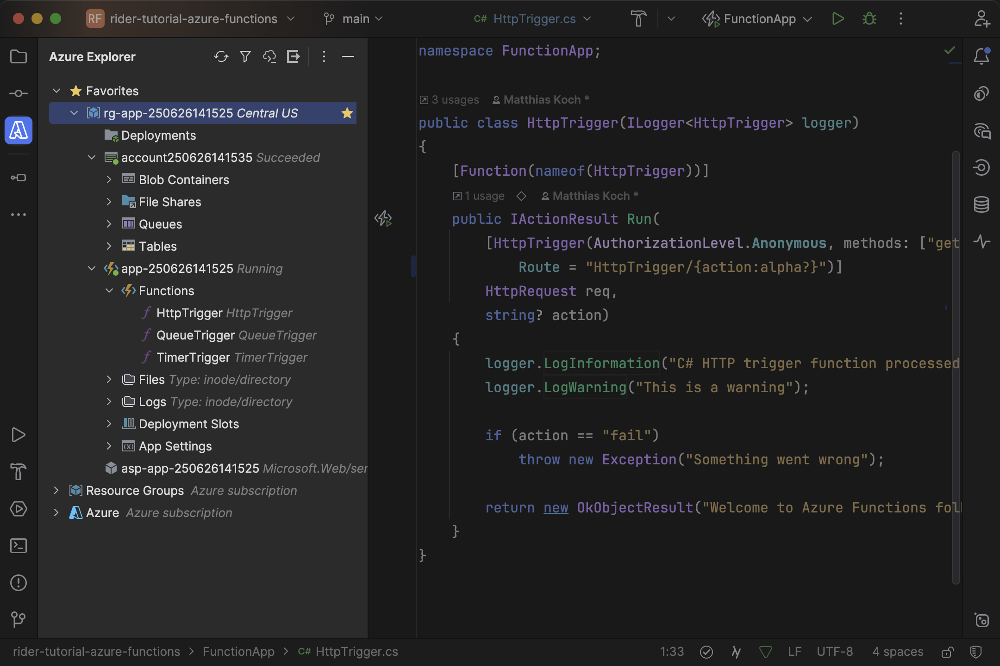
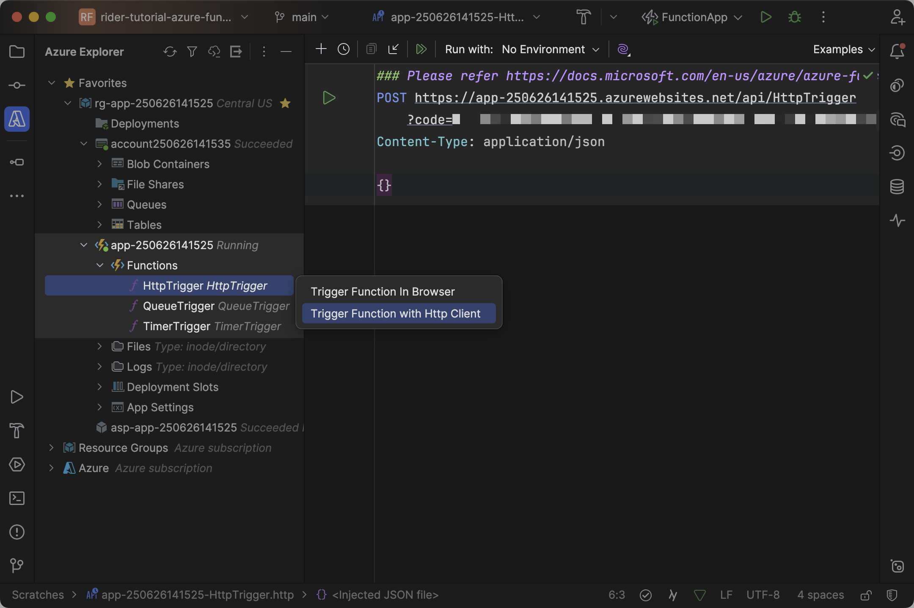
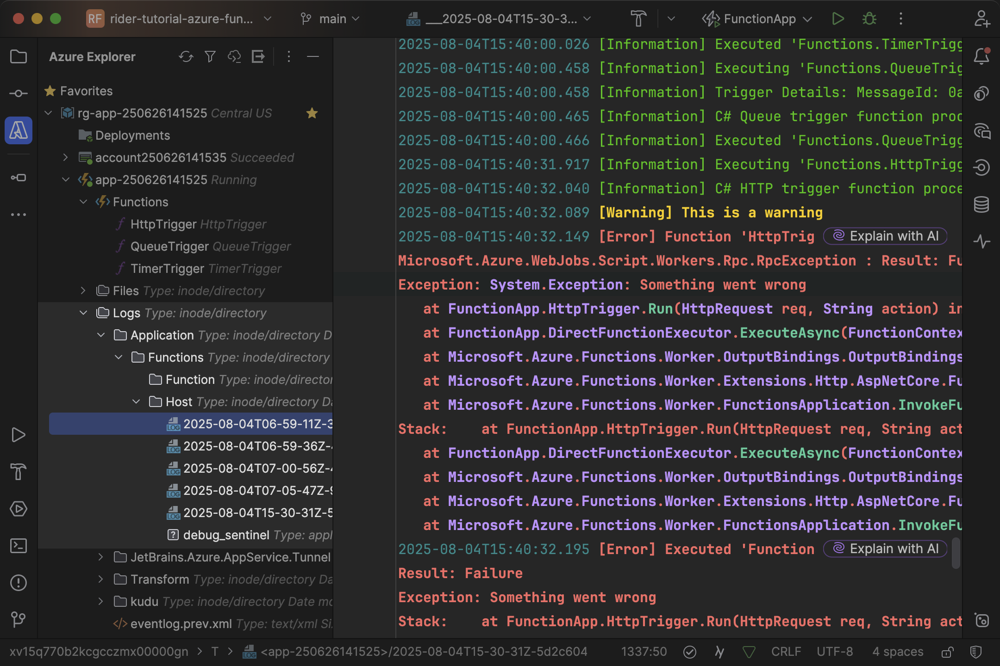
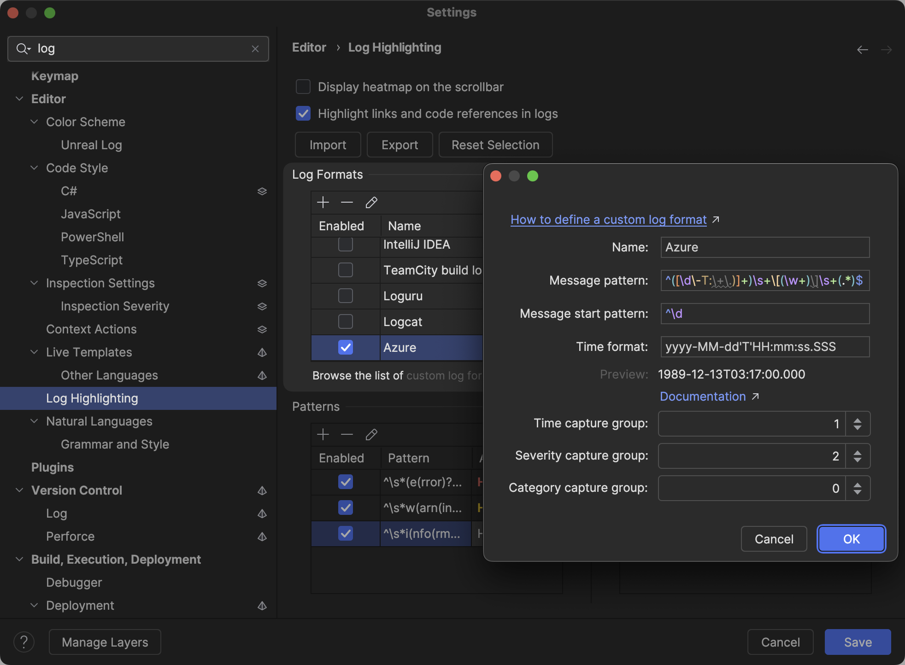
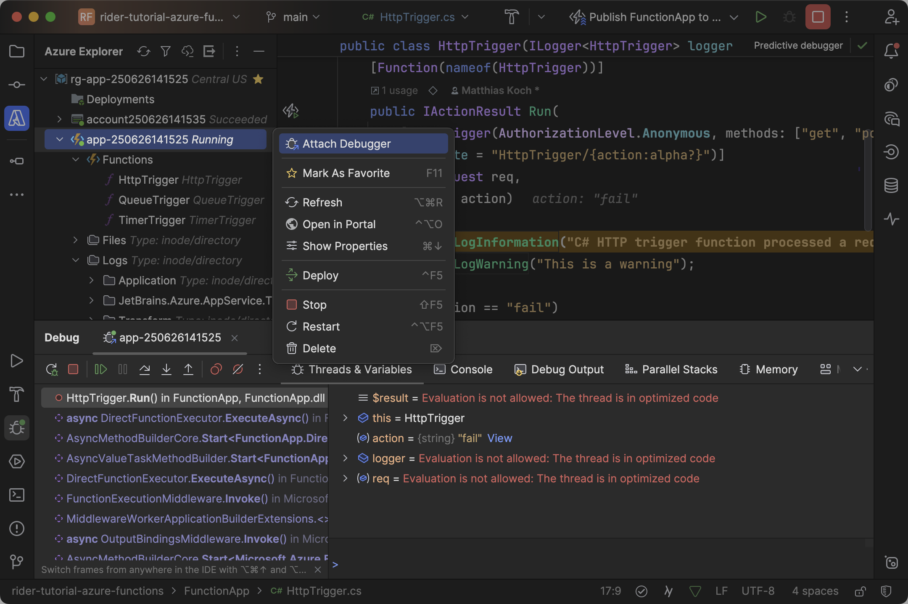

Once your Azure functions are deployed and running, it's almost certain that at some point you need to troubleshoot them in the remote environment. All relevant entities are available in the _Azure_ window:

Note that you can right-click entities – like resource group, web app, storage account – to mark them as favorites for quicker access, or open them in the Azure portal to gain more insights and configure them.

## Triggering Functions and Reading Logs

One of the most simple troubleshooting techniques is to trigger remote functions through the browser or the HTTP client, similarly as discussed in [Running and Debugging Azure Functions](../running-and-debugging-azure-functions/). Note that the Azure Toolkit automatically fetches the function key to include the required authorization:

As you might remember, the `HttpTrigger` is logging several messages with different severities. After a short moment, those log entries are available to fetch. You can even [explore and navigate exception stack traces](https://www.jetbrains.com/help/rider/Navigation_and_Search__Navigating_to_Exception.html):

> **Tip:** For improved log analysis, make sure to install the [_Ideolog_ plugin](https://plugins.jetbrains.com/plugin/9746-ideolog). It enables severity-based color highlighting and supports filtering by multiple criteria. Add the following _log format_ entry for Azure log files:
>
> - Message pattern: `^([\d\-T:\+\.)]+)\s+\[(\w+)\]\s+(.*)$`
> - Message start pattern: `^\d`
> - Time format: `yyyy-MM-dd'T'HH:mm:ss.SSS`
>
> 

Triggering functions and reading logs isn’t the most productive way to troubleshoot your application, but it surely gets the job done.

## Debugging Functions

A more streamlined process to troubleshoot your functions app is to use [remote debugging](https://www.jetbrains.com/help/rider/SSH_Remote_Debugging.html). Right-click the function app from the _Azure_ window and invoke the _Attach Debugger_ action. The Azure Toolkit will first upload and extract all necessary binaries and then allow you to attach to the remote `dotnet` process:

Once connected, you can set breakpoints in your code and debug your Azure Functions just as you would locally. This allows you to:

- Step through code execution in real-time
- Inspect variable values and object states
- Evaluate expressions in the remote context
- Identify the root cause of issues more efficiently than log analysis alone

---

With these troubleshooting techniques, you're well-equipped to identify and resolve issues in your Azure Functions, whether through log analysis or interactive debugging. This completes our comprehensive journey through Azure Functions development with Rider!
