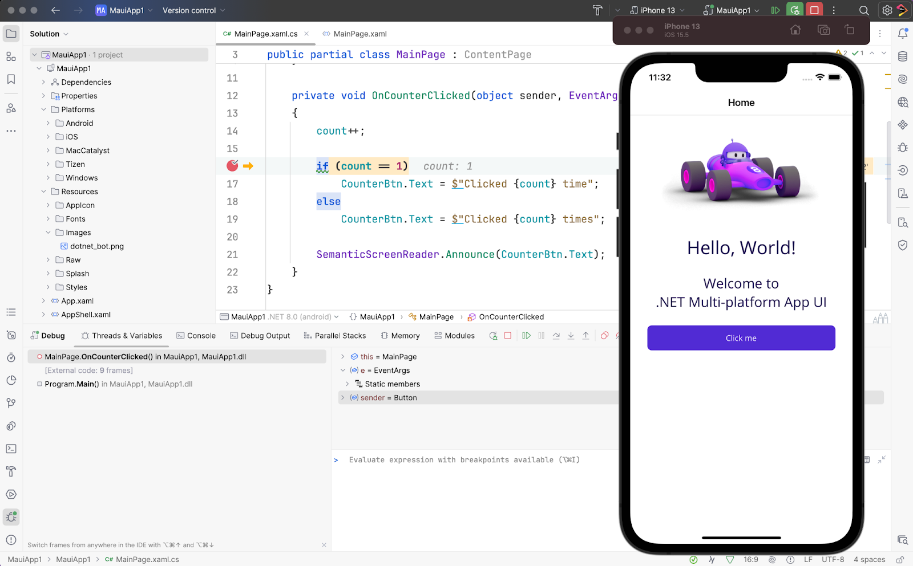
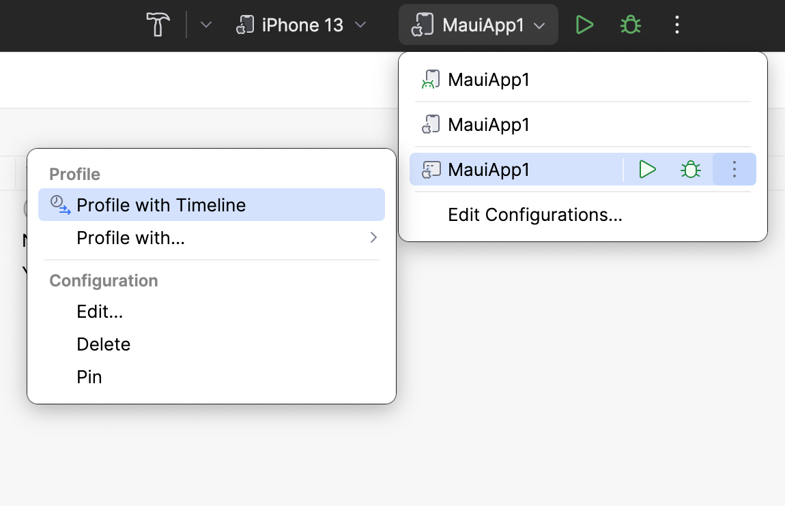
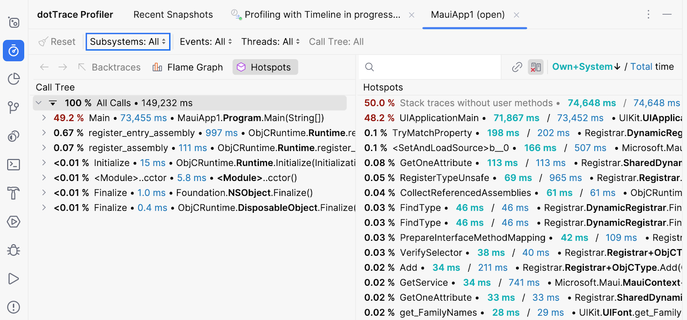
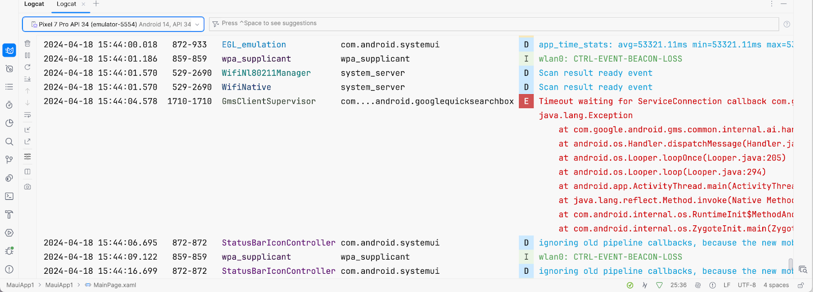

Longtime C# developers will likely be familiar with debugging .NET applications, and MAUI applications are no different. Set breakpoints anywhere in your C# codebase and run your .NET MAUI applications in debug mode. Breakpoints will pause app execution, giving you time to inspect all elements currently in scope using JetBrains Rider’s powerful debugging tool.

During debugging sessions, you can also perform **Hot Reload** updates to your application XAML. Change any XAML in the editor, and see UI changes update in real time. There is no need to rebuild or restart your target devices.

If you’re targeting desktop applications on macOS with macCatalyst or Windows, you can also profile your applications using [dotTrace profiling](https://www.jetbrains.com/profiler/).

A note for macOS macCatalyst developers: To get profiling support, set the **App Sandbox** value to **NO** in the `Entitlements.plist` file. JetBrains Rider’s plist editor makes this easy.

Choose the proper configuration from the **Run Configuration** dropdown with the **Profile** with **Timeline** option. It is in a sub-menu next to the debugging icon.

Once your application is up and running on macOS, you can capture snapshots of your current session. This feature is handy for diagnosing hotspots and identifying resource-intensive parts of your application, helping you optimize its performance.

For Android applications, you may also use **Logcat** to see all device logging occurring on a physical or virtual device. This ability can help you diagnose device-level issues that may indirectly affect your application’s functionality and performance.

When you've debugged your code, you're ready to publish!
