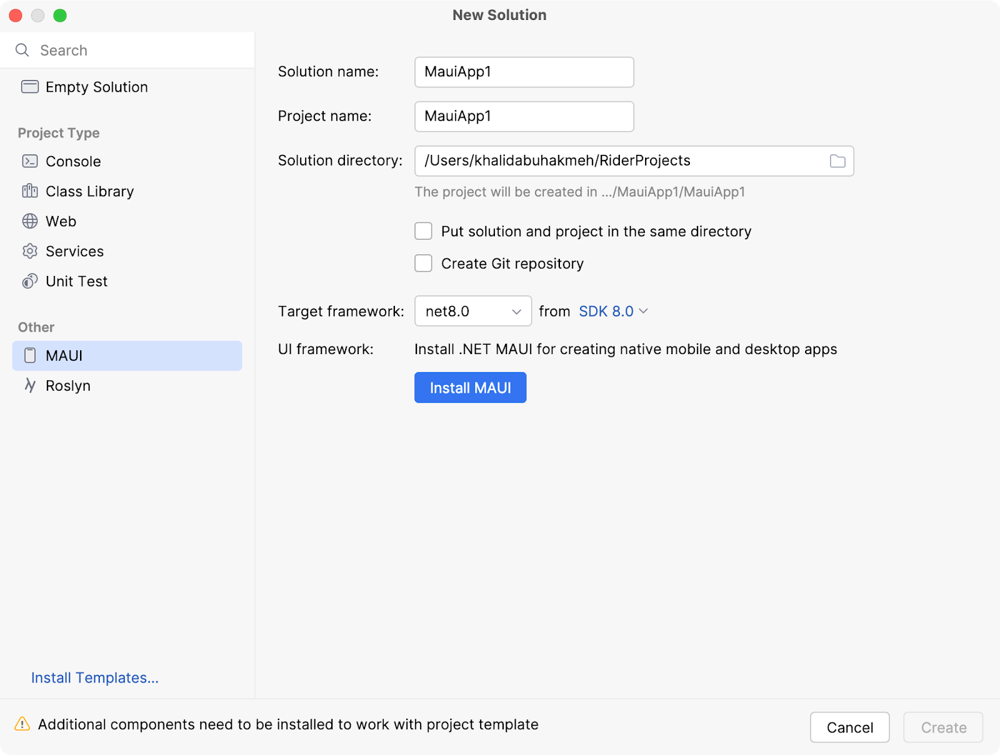
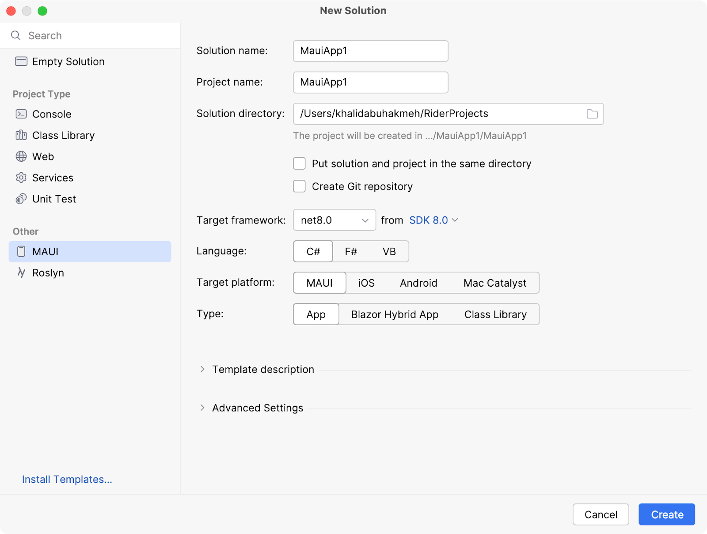
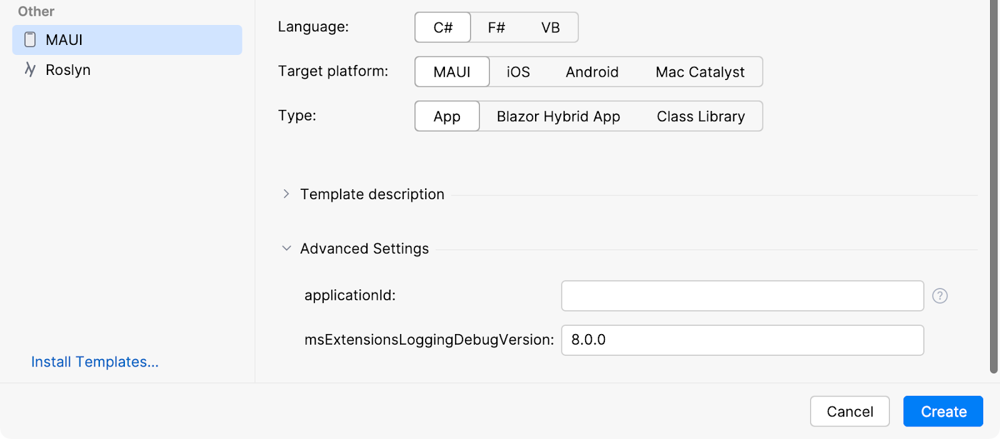
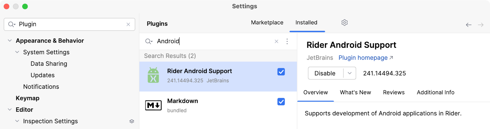
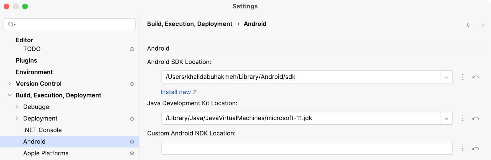
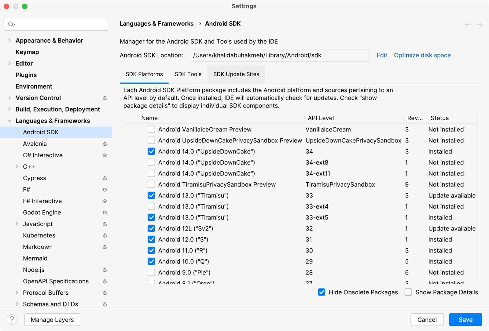
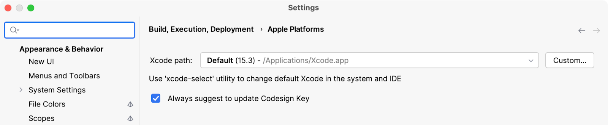

## MAUI Installation

As mentioned in [this blog post](https://blog.jetbrains.com/dotnet/2022/05/25/macos-environment-setup-for-maui-development/), installing MAUI workloads was arduous for folks new to .NET and MAUI development. In short, it involved many command-line commands and terminal sessions. In the latest release of JetBrains Rider, you will now get IDE support when starting a new MAUI project.

If you need the MAUI workloads, you’ll notice a new **Install MAUI** button after picking the **MAUI template** in the **New Solution** dialog.

For folks who love the command line, you can run the following command from any terminal to install the MAUI workloads necessary for MAUI development.

`dotnet workload install maui`

MacOS and Linux users must use the `sudo` command if they’ve installed .NET in a secured directory.

## New MAUI Project

Once you’ve installed the workloads, the **New Solution** dialog will show all the available options.

JetBrains Rider also provides some of the dotnet-cli inputs under the **Advanced Settings** section of the **New Solution** dialog. For instance, you may preemptively set the `applicationId`.

## Android and iOS SDKs

⚠️ Do not skip this section if you’re new to MAUI development. _To target mobile platforms, you must install Android SDKs with a Java Development Kit and Xcode._

You’ll need to install another plugin for Android and ensure the JDK is appropriately set. First, open Rider's **Preferences** window and go to **Plugins**. Next, you’ll search for and install Rider Android Support. Finally, Rider may ask you to restart the IDE.

With the IDE restarted, return to **Preferences** | **Build**, **Execution**, **Deployment** and choose the **Android** subsection. Your Android settings should have SDK Location and Java Development Kit Location values.

Click the **Install** new link under the **Location** textbox to manage your Android SDK installations. Here, you’ll find all the latest available Android SDKs. Be sure to check MAUI documentation to determine which Android SDK versions are supported. You may return to the Android SDK Manager anytime to add, update, or remove SDK installations.

For iOS and macCatalyst targets, you’ll only need to double-check that JetBrains Rider has the latest version of Xcode selected in the **Preferences | Build, Execution, Deployment | Apple Platforms** section.

From Xcode, ensure you’ve installed all the proper SDKs for the Apple Platforms you wish to target.

We’re ready for some MAUI development now!
