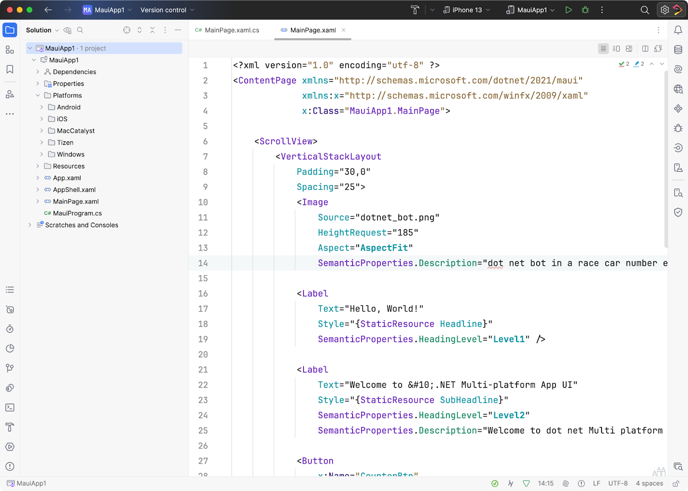
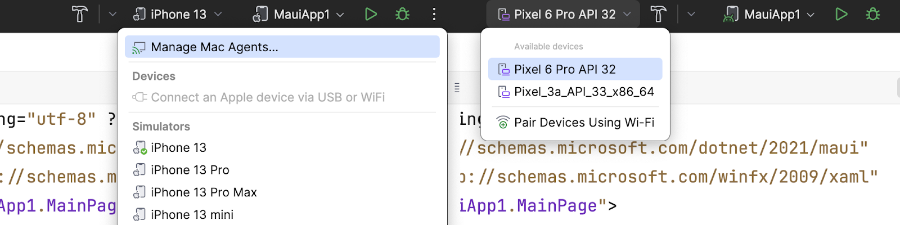
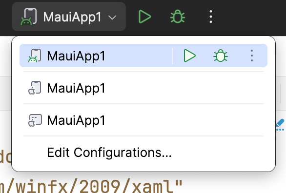
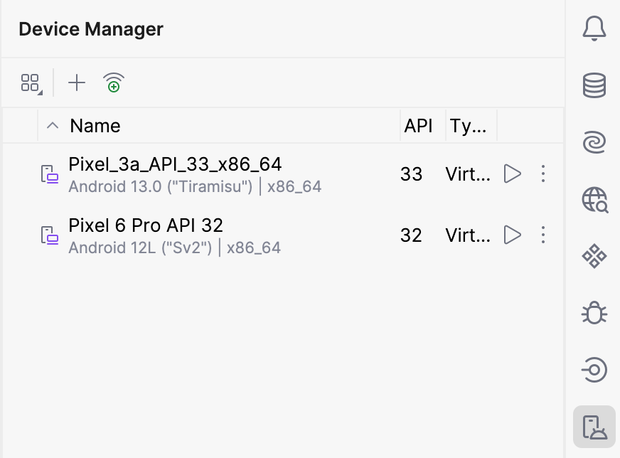
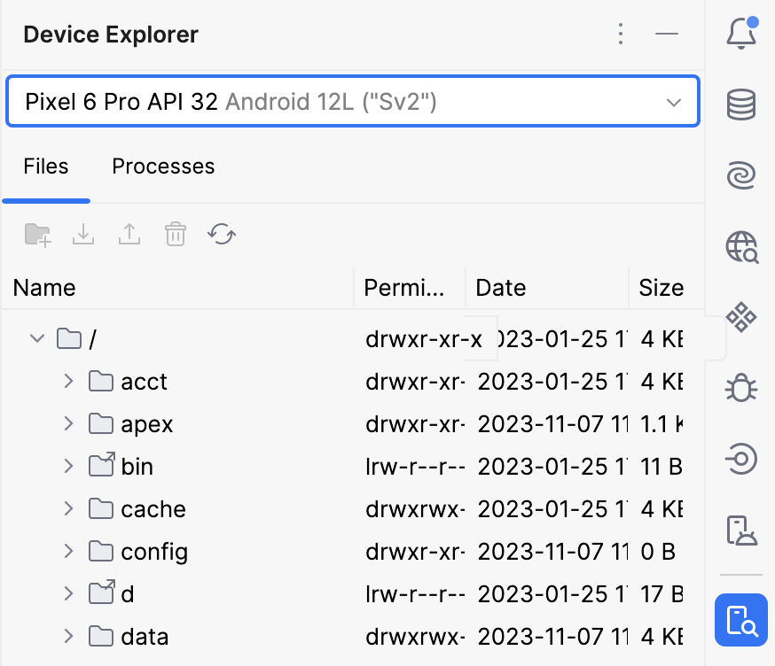
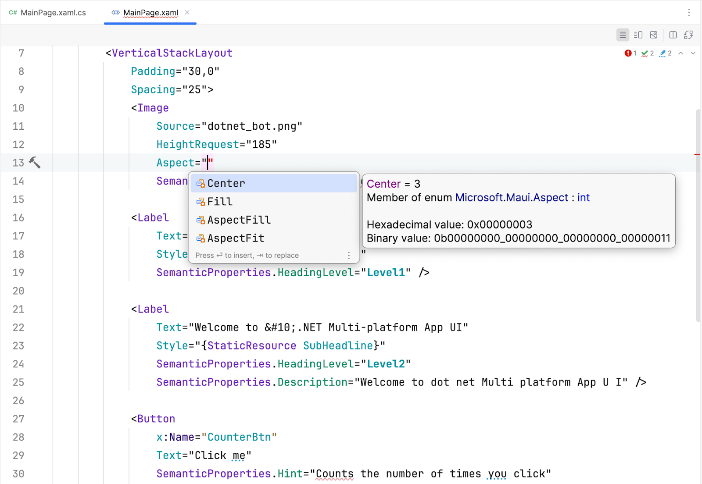
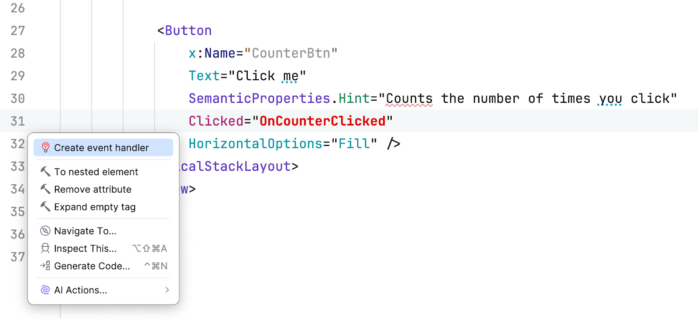
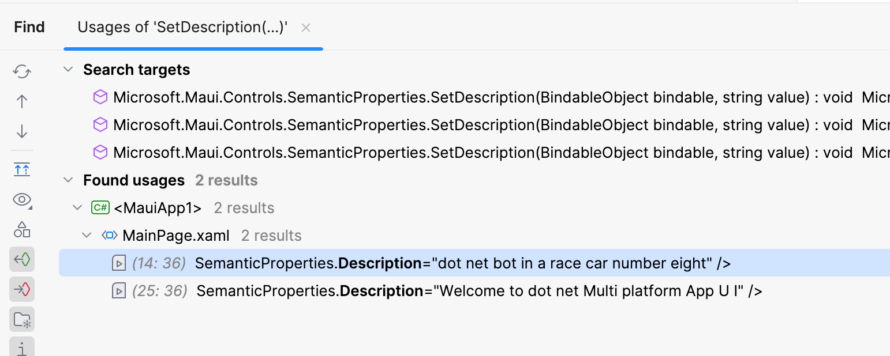

## Explore your code

This section will give you a high-level overview of JetBrains Rider, helpful for folks new to MAUI or the JetBrains IDE. Look at your first MAUI project from the top left and around the IDE. Note that icon positions can change depending on your configuration; some may even be hidden.

The first thing folks should look at is the **Solution Explorer**. This is where all the code files exist, including the platform-specific folders for each target platform.

## Run configurations & devices

You'll notice the run toolbar at the top of the IDE workspace. You can select the target platform emulator, simulator, or physical device here.

Next to the device selector, you’ll find your solution's **Run Configuration** selections. Here, you can run and debug any options typically found in an MAUI solution.

You’ll notice Android tool windows for **Device Manager** and **Device Explorer** on the right-hand side. Respectively, the first allows you to create and manage virtual Android devices.

The second allows you to navigate the folders found on the virtual device when the device is running and see running processes.

## Editing code

Most importantly, the code editor window in the middle of the screen will provide you with a world-class XAML editing experience with code completion, syntax highlighting, error and warning analysis, and more.

For more advanced functionality, check out the code generation of event handlers on UI elements.

In larger applications, the **Find Usages** functionality can also help identify when, where, and how MAUI controls and properties are used throughout the codebase.

There is no such thing as a bug-free app. Therefore, you'll need to debug your apps.
