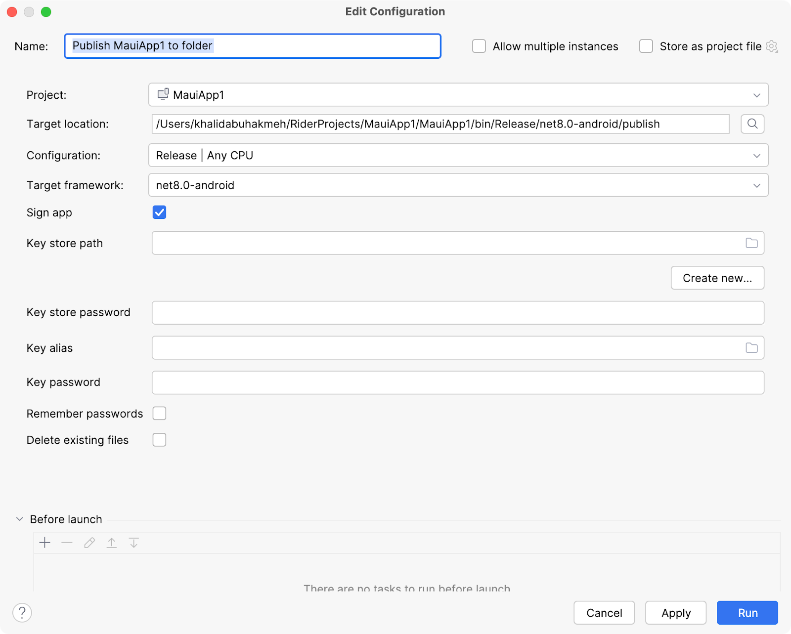

JetBrains Rider can also help deploy your applications. If you plan on publishing to the Apple App Store, you’ll need to provision a profile. Right-clicking the solution and select **Open in Xcode**.

JetBrains Rider will create a new Xcode project, launch the development tool, watch the Xcode project for changes, and sync changes back to JetBrains Rider.

I’ve added new Signing & Capabilities settings and a new target here. Saving these changes alerts Rider to sync the changes back into our MAUI application.

Once you’ve prepared your solution to share with others, right-click the MAUI project and select **Publish**. Then choose the **Local Folder...** option.

You’ll be presented with a run configuration window that allows you to perform essential publishing tasks, such as signing the application using your Apple developer certificate, picking the target platform, the publish location of the final artifact, and the build configuration.

Once you’ve executed the run configuration, you can upload artifacts to the target platform's application store.
