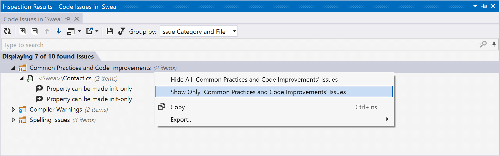
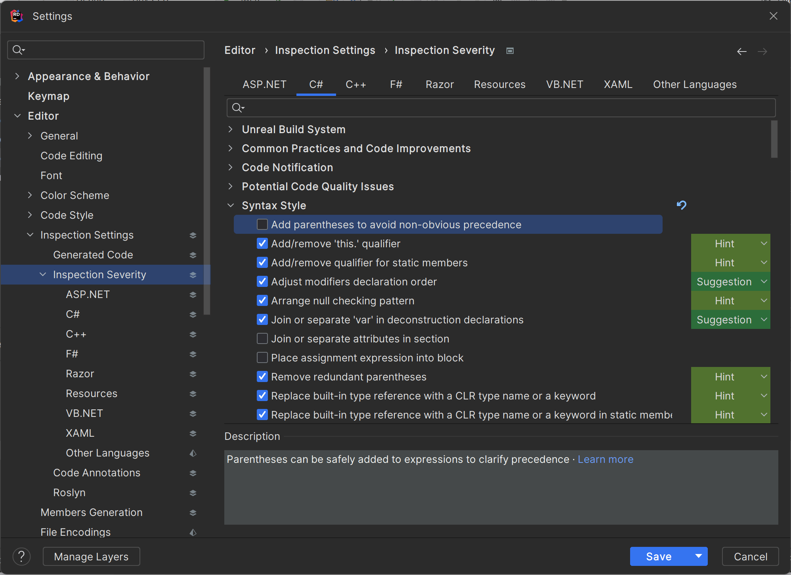
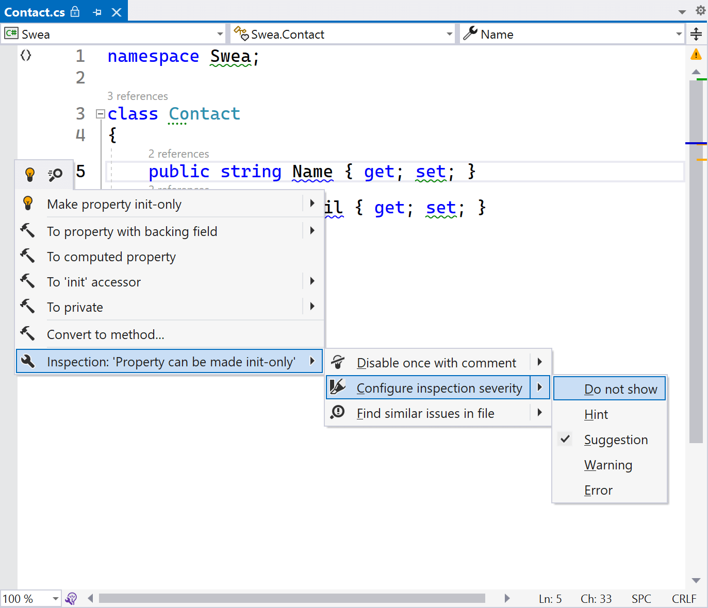
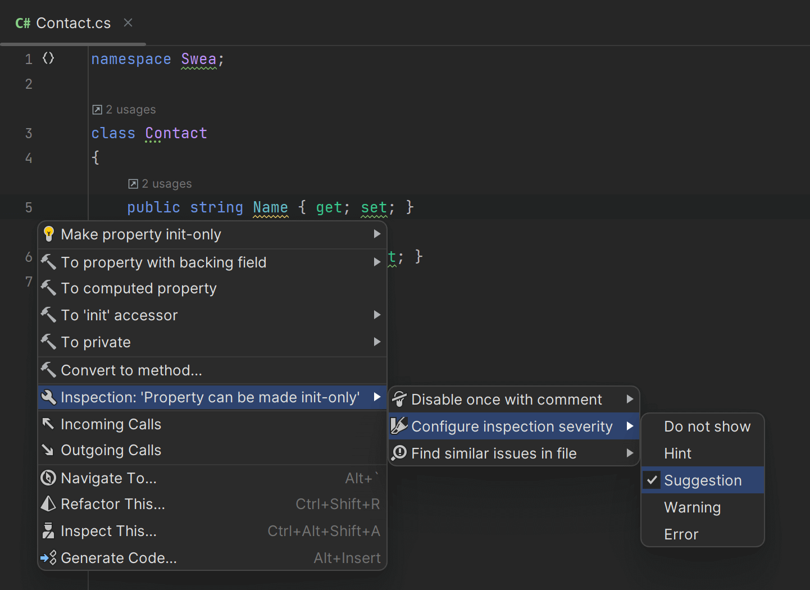

Depending on your project’s code base, opening the Solution-Wide Analysis tool window may be overwhelming. No worries though! You can filter these to show only the results that matter most.

From the toolbar in the **Errors/Warnings in Solution** tool window in ReSharper, or the **Problems** tool window in Rider, you can choose to show or hide warnings. Since errors are more important (they may prevent you from even compiling your application), you can show or hide warnings.

<!---->

## Inspection Results

The default view of Solution-Wide Analysis is focused at quickly finding code to improve. There is a more detailed view available, which also offers more filtering and grouping options. In ReSharper, use the **ReSharper | Inspect | Code Issues in Solution** menu to bring up the **Inspection Results** tool window. In Rider, you can use the **Code | Inspect Code…** menu, pick _Whole Solution_, and then see the same tool window.

> **Tip:** You may wonder, _why is this a separate tool window?_ Good question!
>
> Solution-Wide Analysis is aimed at seeing issues as real-time as possible. If you want more details, there’s a good chance you want to work on a snapshot of the results and keep an overview of the issues you have addressed and still have to address. This is exactly what the **Inspection Results** tool window brings.

The default view of Solution-Wide Analysis is focused at quickly finding code to improve. There is a more detailed view available, which also offers more filtering and grouping options. In ReSharper, use the **ReSharper | Inspect | Code Issues in Solution** menu to bring up the **Inspection Results** tool window. In Rider, you can use the **Code | Inspect Code…** menu, pick _Whole Solution_, and then see the same tool window.

> **Tip:** You may wonder, _why is this a separate tool window?_ Good question!
>
> Solution-Wide Analysis is aimed at seeing issues as real-time as possible. If you want more details, there’s a good chance you want to work on a snapshot of the results and keep an overview of the issues you have addressed and still have to address. This is exactly what the **Inspection Results** tool window brings.

In the **Inspection Results** tool window, the toolbar lets you apply grouping by file, directory, project structure, issue category, issue type, issue severity, and combinations of all these. In ReSharper, you can also use the context menu in the results list to hide certain groups (or show only a specific group).

<!---->

> **Tip:** ReSharper and Rider offer a wide range of code inspections (over 2400 are available), in several groups:
>
> - Language Usage Opportunities – Help improve usage and understanding of the programming language you are using. They are great for learning new C# features! But also other supported languages of course.
> - Redundancies in Code – Help with detecting code that is redundant. For example, detecting empty loops, or detecting expressions that are always `true` or `null`.
> - Common Practices and Code Improvements – Help with improving code, such as merging two `if` statements into one, inverting conditions, and more.
> - Framework-specific inspections – Inspections for frameworks like NUnit, xUnit, ASP.NET, MSBuild, NAnt, JavaScript, Razor, Angular, CSS, Unity, Unreal Engine, …
> - Potential Code Quality Issues – Detects issues that could be problematic. Think about things like detecting unused method parameters, which could mean the method is missing a certain condition.
> - ...and more!
>
> Use these to your advantage to learn about improving your current and future projects.

In the **Inspection Results** tool window, you can delete (<kbd>Del</kbd> on Windows, <kbd>Backspace</kbd> on macOS) issues you are not interested in to help keep track of those that do need your attention.

## Enable/disable Code Inspections

Any inspection in ReSharper and Rider can be enabled/disabled. For example, if you don’t want to be warned about adding/removing the `this.` qualifier, you can disable that inspection. Some inspections are disabled by default and can be enabled. One that I personally find quite useful is _Add parentheses to avoid non-obvious precedence_ to help with understanding precedence in some cases. You can configure inspections in ReSharper’s options under **Code Inspection | Inspection Severity**, or in Rider’s settings under **Editor | Inspection Settings | Inspection Severity**.

<!---->

## Code Inspection Severity

Some code inspections are shown as warnings, others are shown as errors. These are inspection severities, and help you prioritize which inspection results need attention.

There are more inspection severities than warnings and errors:

- Error – Most urgent code issues that need attention. They may break compilation or runtime.
- Warning – Code issues to look into, as they may be important for quality.
- Suggestions – Code issues that could affect overall code quality, and help you improve your code.
- Hints – Code issues that are not important for the overall quality of your code base, but that can help you write better or more concise code.

In the ReSharper and Rider settings, you can configure the severity of all code inspections. If you want to downgrade or upgrade the severity of an inspection, you can do so there. It’s possible to save the configuration to a [team-shared settings layer](https://www.jetbrains.com/help/resharper/Sharing_Configuration_Options.html#saving_overriding) so these settings can be shared together with your project in source control.

When you double-click on a warning or error in the Solution-Wide Analysis tool window, you will jump to the editor where you can look at the source code where an issue was found.

You can quickly configure inspection severity by placing the keyboard caret on the affected code, and then use the <kbd>Alt+Enter</kbd> menu and navigate to the inspection settings.

<!---->

> **Tip:** The <kbd>Alt+Enter</kbd> inspection menu shows a few other interesting options:
>
> - Disable once with comment – Lets you disable a specific occurrence of an inspection, or disable it for the entire class or file
> - [Why is ReSharper/Rider suggesting this?](https://blog.jetbrains.com/dotnet/2023/03/20/why-is-resharper-suggesting-this/) – Available for many inspections, this menu entry links to language documentation or the product help pages to give you more background on why a certain inspection is there.

In the next and final part of this tutorial, we’ll see how you can go about fixing code issues flagged by ReSharper and Rider.

### See Also

- [Configure inspections (ReSharper)](https://www.jetbrains.com/help/resharper/Code_Analysis__Configuring_Warnings.html)
- [Configure inspections (Rider)](https://www.jetbrains.com/help/rider/Code_Analysis__Configuring_Warnings.html)
- [Sharing project settings (Rider)](https://www.jetbrains.com/help/rider/Sharing_project_settings.html)
- [Why is ReSharper/Rider suggesting this?](https://blog.jetbrains.com/dotnet/2023/03/20/why-is-resharper-suggesting-this/)
- [.editorconfig to configure code inspections](https://www.jetbrains.com/help/resharper/Code_Analysis__Configuring_Warnings.html#editorconfig)
