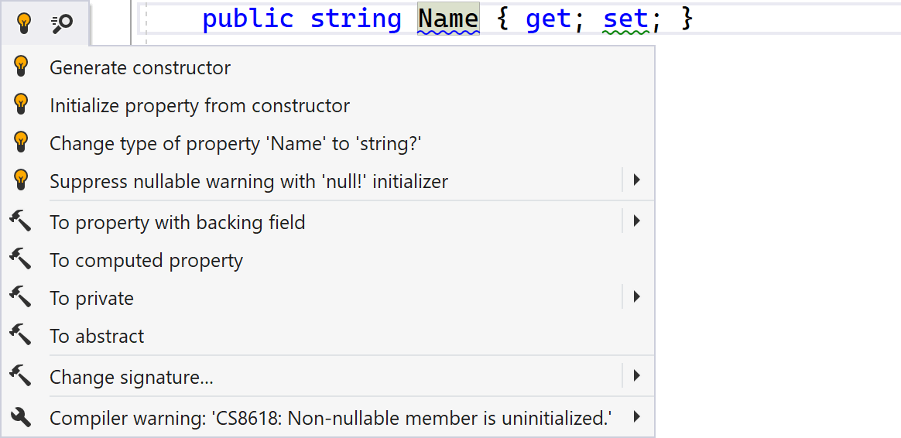
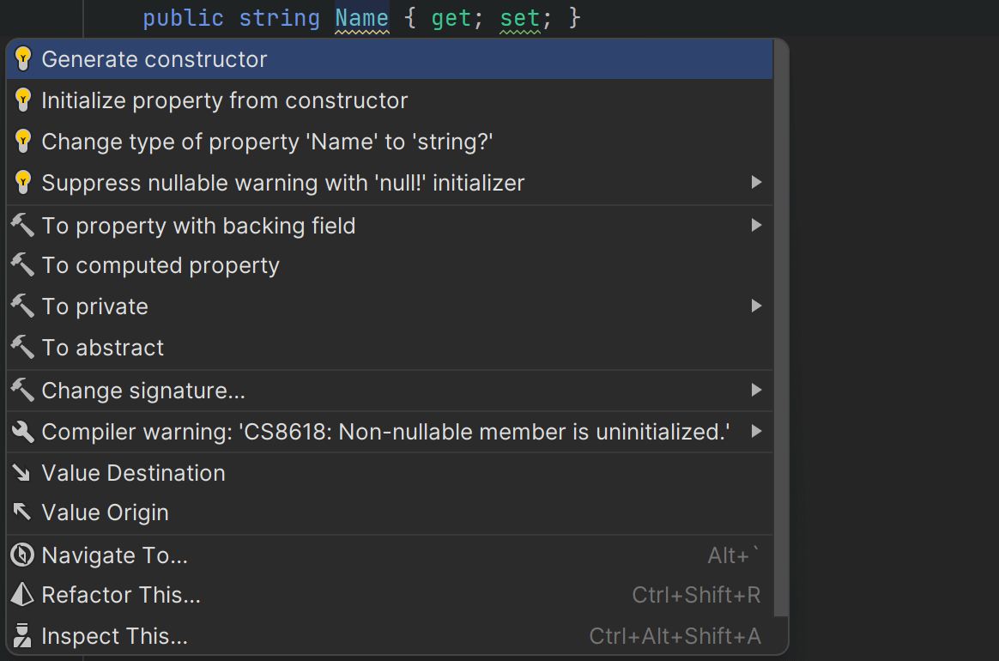
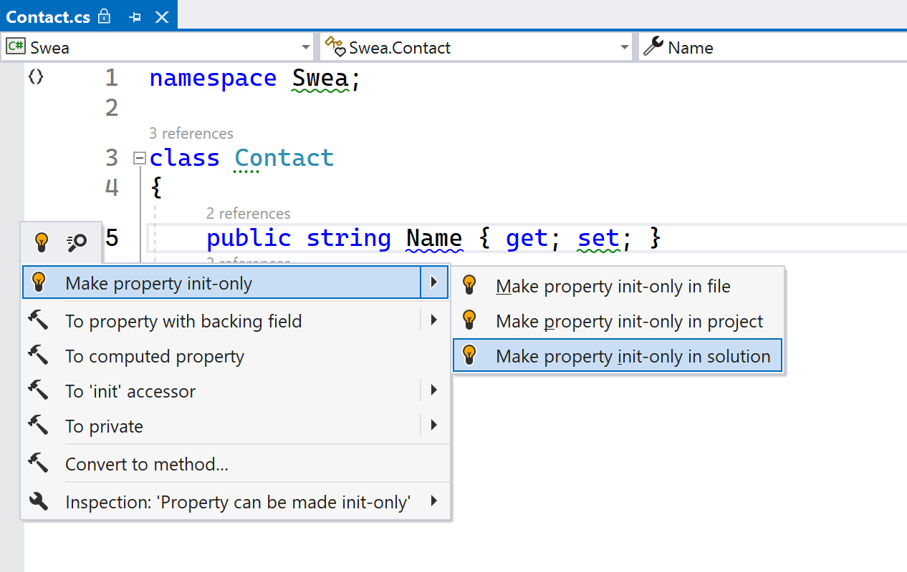
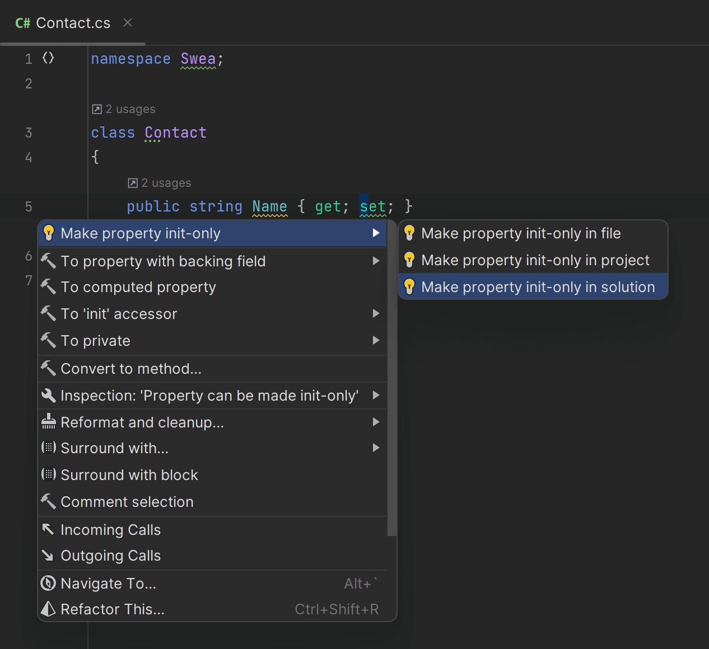

So far in this tutorial, we’ve seen what Solution-Wide Analysis is, and how to explore inspection results. Let’s shift gears, and look into solving some of these issues!

## Inspections and Quick Fixes

In ReSharper and Rider, inspections and quick fixes are two closely related features that can help improve the quality and maintainability of your code.

Inspections are automated code analysis checks that examine your code for potential issues and improvements. Quick fixes are closely related: they are automated suggestions provided by ReSharper and Rider to address the issues identified by the inspections.

Quick fixes are intended to help you quickly correct the detected problem without having to manually modify your code. When an inspection detects a problem in your code, ReSharper and Rider offer one or more quick fixes that you can apply to resolve the issue with a single action.

Not all inspections have corresponding quick fixes, but many do. In addition, a large number of quick fixes can be applied to one particular code issue, or to all similar issues in the current file, project or solution.

## Alt+Enter When You See a Light Bulb

When working with ReSharper or Rider, one keyboard shortcut should become automatic: <kbd>Alt+Enter</kbd>.

The <kbd>Alt+Enter</kbd> menu is the gateway to a lot of ReSharper and Rider functionality, including applying quick fixes for code inspections.

If your keyboard caret is placed on a piece of code, and you see a yellow or red light bulb (💡), you can find out about the inspection and potential resolutions by pressing <kbd>⌥⏎</kbd> (macOS) / <kbd>Alt+Enter</kbd> (VS Windows/Linux), which brings up a menu with quick fixes (at the top), other actions that apply in the current context, and information about the inspection that was triggered.

In the following example, a non-nullable property in C# is not initialized. ReSharper and Rider offer quick fixes to initialize it from a constructor, change it to being nullable, suppress the warning in code, and more:

<!---->

Some quick fixes can be applied not only in the current context, but also in the current file, project or solution. This is useful if you want to fix a certain type of code issue in your entire code base in one go.

<!---->

> **Tip:** Applying quick fixes at the project level or solution level is especially handy with inspections of the _Language Usage Opportunities_ category. These inspections typically trigger when new language features are introduced (e.g. C#11 to C#12), and let you modernize your source code rapidly.

## Conclusion

In this tutorial, we’ve covered Solution-Wide Analysis (SWEA) in ReSharper and Rider, and looked at the relation between inspections and quick fixes.

Solution-Wide Analysis is a nifty code analysis feature that helps developers keep their code in check. It goes beyond single files, giving a big-picture view of code quality in the entire solution.

The default view of Solution-Wide Analysis focuses on quickly identifying places where code can be improved, while the more detailed _Inspection Results_ tool window gives a more detailed view and offers additional filtering and grouping options. The tool window called "Inspection Results" provides an overview of the identified issues and allows users to work on a snapshot of the results, keeping track of addressed and pending issues.

We’ve seen how to enable or disable specific code inspections according to individual preferences. You can configure inspections in the settings, and adjust the severity of inspections to prioritize the issues that require immediate attention. The severity levels include errors, warnings, suggestions, and hints, with errors being the most urgent issues that may break compilation or runtime. Inspection severity can be configured globally or saved to a team-shared settings layer for project-wide consistency.

<kbd>Alt+Enter</kbd> is the gateway to configuring inspection severity, as well as invoking quick fixes to automatically update your code.
