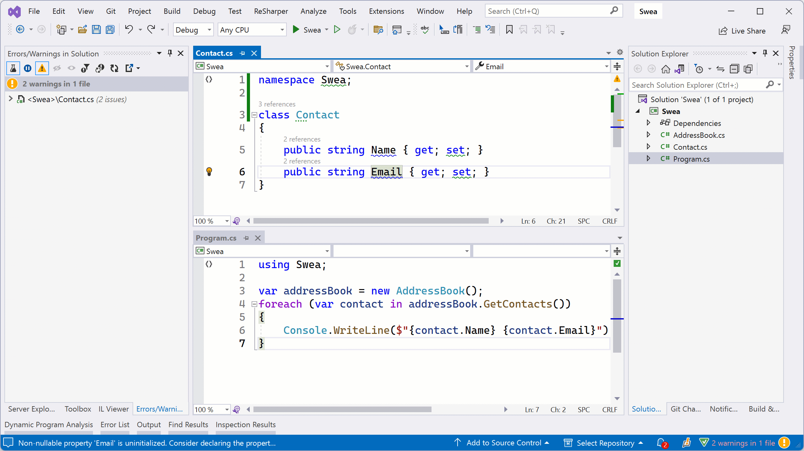
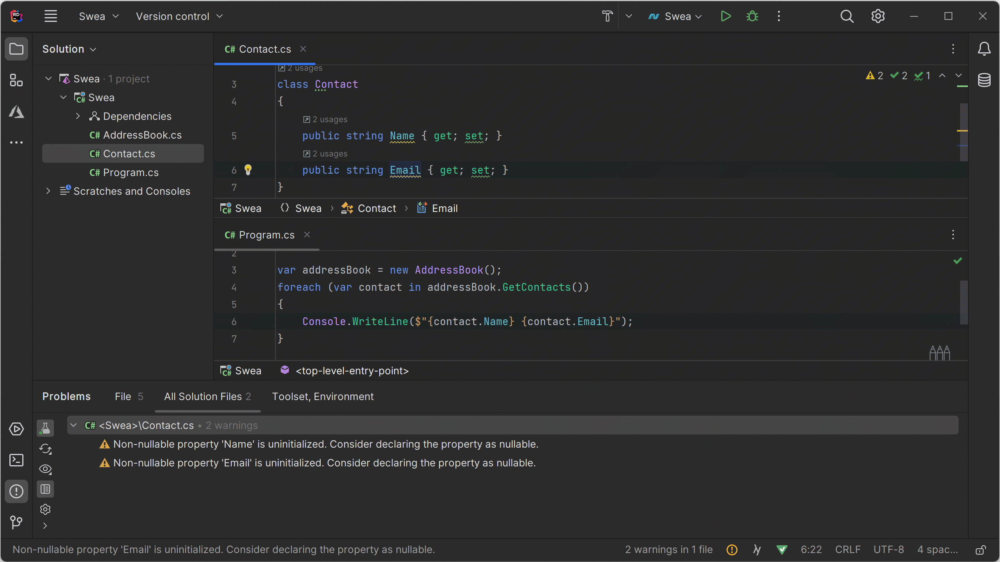

As software developers, we strive to write clean, efficient, and bug-free code. However, as our projects grow larger and more complex, it becomes increasingly challenging to maintain code quality and ensure that our applications are free from potential issues.

Most code inspections ReSharper and Rider rely on the source code of individual files to identify potential problems. While these inspections cover a significant portion, there are also solution-wide inspections that analyze the entire solution to identify specific code issues that can only be detected in that larger context.

Solution-Wide Analysis (SWEA) lets you analyze your entire solution for potential issues, code smells, and performance bottlenecks by using the available information about interdependencies and interactions between different parts of your codebase.

> **Note:** Solution-Wide Analysis is available for most languages supported by ReSharper and Rider. It will find errors and warnings in C#, VB.NET, F#, JavaScript, TypeScript, XAML, HTML, and many more languages.

By default, Solution-Wide Analysis is enabled and operates in the background as you write code, constantly monitoring your changes and updating the analysis results. Compiler errors/warnings and errors/warnings detected by ReSharper and Rider’s own inspections are shown in real-time. This means **you don't have to open each file separately just to make sure your solution is error-free**, or trigger a compilation after each change to see what is going on.

Here’s an example. This project contains a class `Contact` with a property `Email` that is accessed in a different class. When deleting that property, the IDE will not detect any errors in the `Contact` class, as it is valid code. However, SWEA almost immediately detects there will be a compilation error in this application because the `Email` property no longer exists.

<!---->

> **Tip:** You can find Solution-Wide Analysis results in the _Errors/Warnings in Solution_ tool window in ReSharper, or the _Problems_ tool window in Rider. The quickest way to access it is by clicking the green, orange or red icon in the status bar, and then **Show Errors**.
>
> 
>
> The icon color reveals some information about Solution-Wide Analysis results. The icon will be _green_ if no errors/warnings were found, _orange_ if there are warnings in the solution, or _red_ (if errors were discovered).

In the next part of this tutorial, we’ll see how to make sense of the errors and warnings discovered by Solution-Wide Analysis.

### See Also

- [Solution-Wide Analysis web help](https://www.jetbrains.com/help/resharper/Code_Analysis__Solution-Wide_Analysis.html)
- [Solution-Wide Analysis in Rider - blog series](https://blog.jetbrains.com/dotnet/2018/05/21/solution-wide-analysis-rider/)
