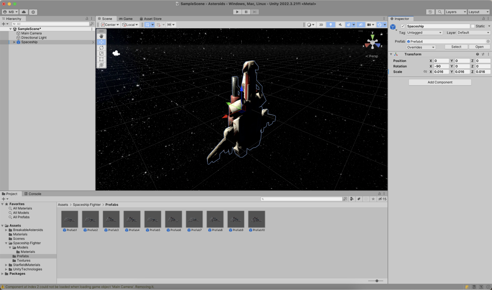
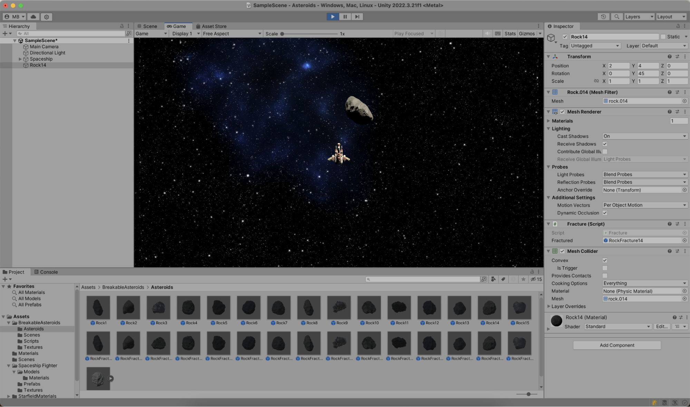

Since you're building an Asteroids-inspired game, let's add some well-known elements to the game scene: a spaceship and an asteroid!
The assets you added to the game contain some great prefabs you can use.

For the spaceship, locate _Prefab4_ in the **Project** tool window. You can search for it or navigate to _Assets > Spaceship Fighter > Prefabs_. When you drag and drop _Prefab4_ onto your scene, you'll see the spaceship is massive in scale! No worries, you can edit the spaceship's position, rotation, and scale:

- Position: `X: 0`, `Y: 0`, `Z: 0` – Moves the spaceship to the center of the scene
- Rotation: `X: -90`, `Y: 0`, `Z: 0` – Will rotate the top of the spaceship towards the main camera
- Scale: `X: 0.016`, `Y: 0.016`, `Z: 0.016` – A size that is more proportional to the game scene

For the asteroid, find _Rock14_ (it's in the _Assets > BreakableAsteroids > Asteroids_ folder) and drag and drop it onto the scene. Also, for the asteroid, change the position, rotation, and scale:

- Position: `X: 2`, `Y: 4`, `Z: 0` – Moves the asteroid slightly out of the center of the scene
- Rotation: `X: 0`, `Y: 45`, `Z: 0` – Rotates the asteroid, making it more visually appealing
- Scale: `X: 1`, `Y: 1`, `Z: 1` – The asteroid is just the right size, so you can keep it

When you switch to the Unity Editor's **Play** mode in the top toolbar, you'll see your game in action!

Not much is happening here yet... In the next step, let's add some interactivity!
