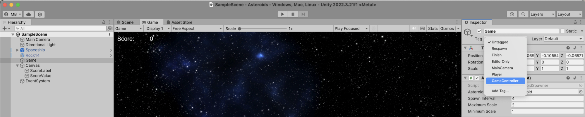
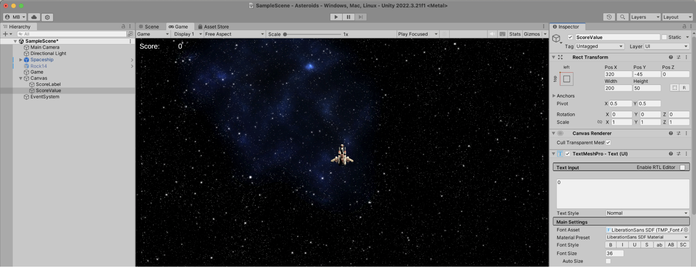
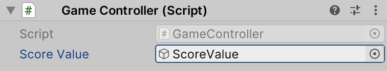
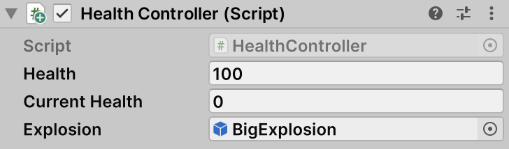
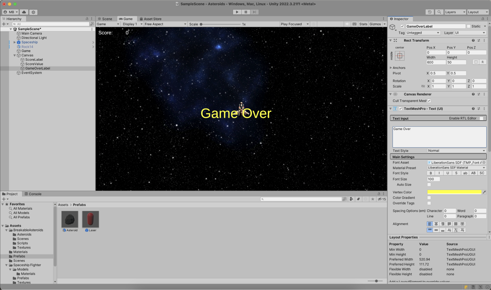
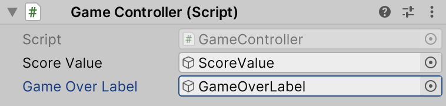

The last thing we will do in this tutorial is keep track of the game score. When an asteroid explodes, the game score should go up.

In the **Hierarchy** tool window, select the empty GameObject that also has the `AsteroidSpawner` component attached. In the **Inspector** tool window, click **Add Component** and add a new script named `GameController`, and open it in JetBrains Rider.

The `GameController` script will reference a UI element to display the current score, and provide a method to increment the score:

```csharp
public class GameController : MonoBehaviour
{
   [SerializeField] private GameObject scoreValue;

   private int score;

   public void IncrementScore()
   {
      score = score + 10;
      scoreValue.GetComponent<TMP_Text>().text = score.ToString();
   }
}
```

In the existing `HealthController`'s `DealDamage` method, add the following snippet at the end of the method:

```csharp
if (!gameObject.CompareTag("Player"))
{
   GameObject.FindWithTag("GameController")?.GetComponent<GameController>()?.IncrementScore();
}
```

In `HealthController` when a GameObject that is not tagged "Player" is exploding, the `GameController`‘s `IncrementScore` method is called, in which the associated UI element is updated. Keep in mind that for this to work, the empty GameObject must be tagged "GameController" in the Unity Editor:



You'll also need to add the UI elements that can be used by `GameController`. In the scene's **Hierarchy** tool window, use the **UI | Text - TextMeshPro** context menu to add two labels. One can be named _ScoreLabel_ and contain the text "Score:", the other can be named _ScoreValue_ with the text value of "0". Positioning both can be done as you wish. I chose to align both **Top / Left** in the **Inspector** tool window, and then configured the X and Y positions to place both UI elements next to each other.



Selecting the empty GameObject, make sure to connect the `GameController`'s _Score Value_ to the UI element that was just created:



Well done! You're almost there. If you go into **Play** mode, you can fire at asteroids and see the score increment when an asteroid is destroyed.

One more thing... Games are more exciting when the player is not invincible, so let's make a couple more changes to work towards a "game over" scenario:

- When asteroids collide with the player, they should deal damage to the player
- The player needs a `HealthController` component to accept damage
- The `GameController` needs a `GameOver` method that shows a UI element which reads "Game Over".
- When the spaceship is destroyed, this `GameOver` method should be called

Let's go through these one by one. In `AsteroidController`, add 2 new fields and 2 Unity event functions that respond to another collider entering the GameObject's collider, and to it no longer colliding. In this method, damage is dealt to any object tagged "Player" that collides with the asteroid.

```csharp
[SerializeField] private float damageCooldown = 0.5f;
private float currentTime;

private void OnCollisionStay(Collision other)
{
    if (!other.gameObject.CompareTag("Player")) return;

    if (currentTime <= 0f)
    {
        other.gameObject.GetComponent<HealthController>()?.DealDamage(damage);
        currentTime = damageCooldown;
    }
    else
    {
        currentTime -= Time.deltaTime;
    }
}

private void OnCollisionExit(Collision other)
{
    if (!other.gameObject.CompareTag("Player")) return;

    currentTime = 0f;
}
```

In the Unity Editor, select the spaceship and click **Add Component** in the **Inspector** tool window. This time, don't add a new component but find the `HealthController` you created earlier. Set a value for health, and add an explosion prefab:



Next, edit the `GameController` and add a new field to reference a "Game Over" element in the UI. Also add a `GameOver` method that makes this element active:

```csharp
[SerializeField] private GameObject gameOverLabel;

public void GameOver()
{
    gameOverLabel.SetActive(true);
}
```

You'll need to add a "Game Over" label to the scene. Use the **UI | Text - TextMeshPro** context menu in the **Hierarchy** tool window to add a new UI element. Set the name to "GameOverLabel", and add the text "Game Over". Additionally, you can give it another color.



Make sure to set reference this label in the empty GameObject's `GameController` component:



As a final step, edit `PlayerController` and implement the `OnDestroy` event function to call the `GameController`'s `GameOver()` method:

```csharp
private void OnDestroy()
{
   GameObject.FindWithTag("GameController")?.GetComponent<GameController>()?.GameOver();
}
```

That's it! If you switch to **Play** mode, you can fly your spaceship around, shoot at asteroids (and be hit by them), see your score go up. After being hit by an asteroid several times, you may see the game over label pop up. Well done!

In the next step, let's look at the finished result, and wrap up this tutorial.
