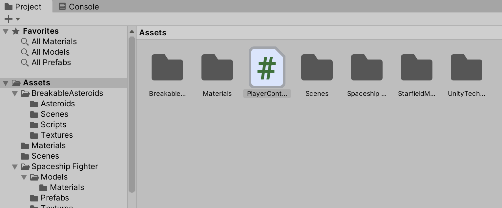
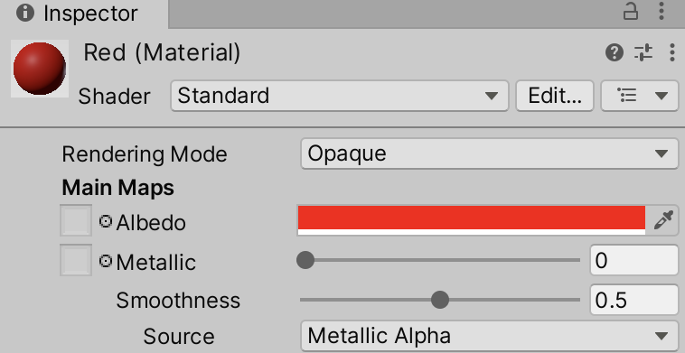
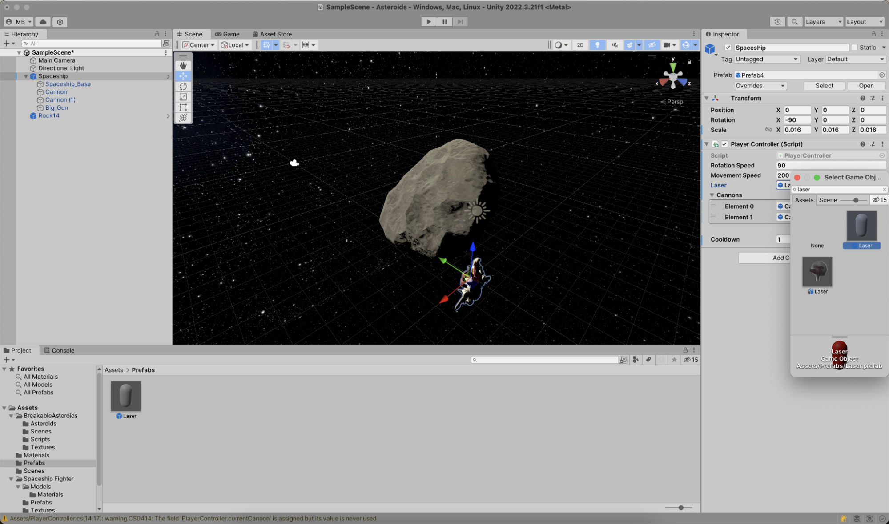
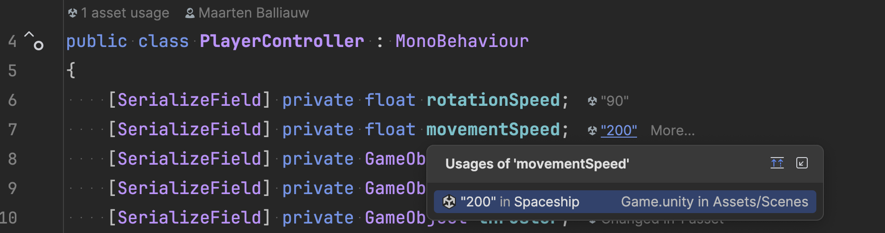
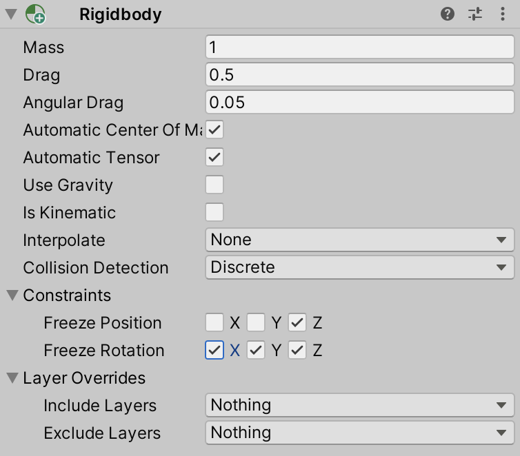
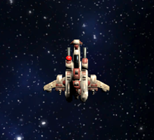
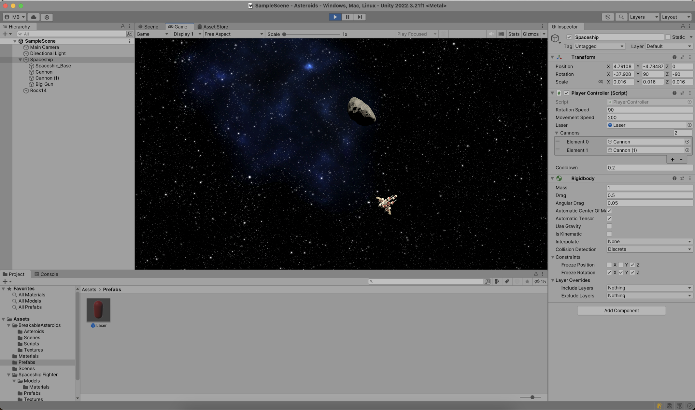
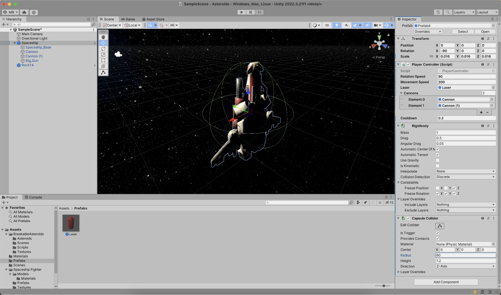
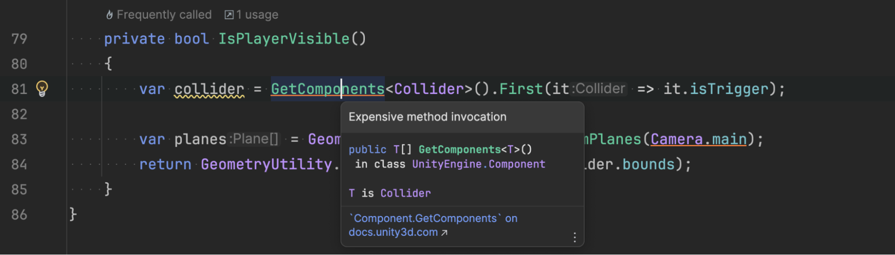
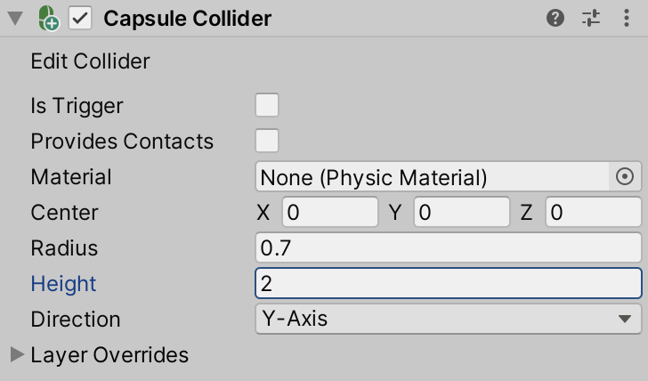

With the spaceship and an asteroid added to your game scene, it's time to add some gameplay.

Select the spaceship in the **Hierarchy** tool window, and click **Add Component**. Add a new script, and name it `PlayerController`. This creates a new Unity Script for your project and attaches it to the spaceship. You'll find the script in the **Project** tool window in the _Assets_ folder.



Double-clicking it opens JetBrains Rider, where you can start coding:

```csharp
public class PlayerController : MonoBehaviour
{
   [SerializeField] private float rotationSpeed;
   [SerializeField] private float movementSpeed;
   [SerializeField] private GameObject laser;
   [SerializeField] private GameObject[] cannons;
   [SerializeField] private float cooldown = 1f;

   private Rigidbody rigidBody;
   private int currentCannon = 0;

   private float time = 0f;

   void Start()
   {
       rigidBody = GetComponent<Rigidbody>();
   }

   void Update()
   {

   }
}
```

The `PlayerController` has several fields that can be changed in the game scene:

- Rotation speed – How fast can the spaceship rotate?
- Movement speed – How fast does the ship accelerate?
- A reference to a laser prefab, so you can shoot those from the spaceship
- A reference to the spaceship's cannon(s), so the laser can be shot from the right location. The spaceship prefab has 2 cannons, so making this field an array will let shots originate from each cannon alternately.
- Cooldown – How fast can a new shot be fired after the previous shot?

Fields that you want to make editable in the Unity Editor **Inspector** tool window can be made `public`, or `private` with the `[SerializeField]` attribute. Both approaches result in making the fields editable in the Unity Editor, but keep in mind `public` fields can be accessed by other classes in your game code, which may not be intended.

From the list of fields, there's one GameObject we have not designed yet in the Unity Editor: the laser! Before we continue working on the `PlayerController`, let's first create a laser prefab.

## Creating a laser prefab

In the Unity Editor, use the context menu in the **Hierarchy** tool window and create a new **3D Object | Capsule**. Name it "Laser", and set its position, rotation, and scale:

- Position: `X: 0`, `Y: 0`, `Z: 0` – The position is not very relevant for the laser, as we'll set it programmatically
- Rotation: `X: 90`, `Y: 90`, `Z: 90` – Rotates the laser so it's aligned with the spaceship
- Scale: `X: 0.2`, `Y: 0.2`, `Z: 0.2` – The laser should not be too big, and 0.2 looks good compared to the size of the spaceship

The laser will need to signal when it collides with other objects in the game, which means you'll need to add a _Collider_. Since the shape of the laser is a capsule, you can click the **Add Component** button and a _Capsule Collider_.

To make the laser more visible, you can give it a color. To do so, use the **Create | Material** context menu in the **Project** tool window. Keep all the defaults, and change the _Albedo_ to a color of choice. I went with red for this tutorial.



Find the _Laser_ in your scene, and set the _Mesh Renderer_ material to the color material you just created.

The Laser shouldn't be on the scene all the time. It will be created when the player fires it at an asteroid, so you can convert it to a _prefab_, a template for a GameObject. To do this, you can drag the _Laser_ into the **Project** tool window, and then remove it from the scene.

## Setting up the spaceship

Return to the scene, and select the spaceship. The `PlayerController` you created earlier isn't completely wired up yet. In the **Inspector** tool window, you can set its rotation speed to "90", movement speed to "200", set the laser to the _Laser_ prefab you just created, and add the spaceship's cannons.



> **Tip:** After setting field values in the Unity Editor, you can see usages and values in the JetBrains Rider editor. You can click usages to jump to the usage in the Unity Editor, helping you navigate back and forth between your scene or prefab, and the script editor.
>
> 

Before switching back into code, click the **Add Component** button again and add a new _Rigidbody_. Adding a Rigidbody component to an object will put its motion under the control of Unity's physics engine, which is great! Set the mass to "1", drag to "0.5" (so the spaceship doesn't immediately slow down if you stop accelerating), and the angular drag to "0.05".

Since we're building a game in space, make sure to disable "Use Gravity", otherwise the spaceship will always fall to the bottom of the scene. Finally, set the constraints of the Rigidbody:



Freezing some of the coordinates will make sure the spaceship doesn't go into uncontrollable spins when hit by an asteroid later. You can unfreeze these coordinates to make the gameplay more interesting, but let's not do that now.

Switch back to JetBrains Rider, and add the following `Update` method in the `PlayerController`:

```csharp
void Update()
{
   // Laser
   if (time > 0f)
   {
       time -= Time.deltaTime;
   }
   else if (Input.GetKey(KeyCode.Space))
   {
       // Make laser originate from alternate canon on each shot
       var laserOriginTransform = transform;
       if (cannons.Length > 0)
       {
           laserOriginTransform = cannons[currentCannon++].transform;
           if (currentCannon >= cannons.Length)
           {
               currentCannon = 0;
           }
       }

       Instantiate(laser, laserOriginTransform
           .TransformPoint(Vector3.forward * 2), transform.rotation);
       time = cooldown;
   }
}
```

In every frame Unity renders, this `Update` method will check if the _Space_ key is pressed. If it is, it iterates the cannon GameObjects and uses the current cannon's transform (position, rotation, and scale) as the origin for instantiating a new laser. The laser's rotation is set to the current GameObject's rotation, so the direction of the laser is the same as the spaceship's.

When you switch back to the Unity Editor and start **Play** mode, you'll see the space key now fires lasers! Except... the lasers remain attached to the spaceship.



## Adding laser movement

The _Laser_ prefab needs a script to control the movement of the laser. In the **Project** tool window, find and open the*Laser* prefab, and in the **Inspector**tool window, click **Add Component**, and add a script named `LaserController`. Open it in JetBrains Rider, and add the following code:

```csharp
public class LaserController : MonoBehaviour
{
   [SerializeField] private float speed;

   private void Update()
   {
       transform.Translate(Vector3.forward * (speed * Time.deltaTime));
   }

   private void OnBecameInvisible() => Destroy(gameObject);
}
```

The `LaserController` moves the current GameObject (the laser) forward, multiplying speed with the time elapsed between calls to `Update`, so that the movement aligns with frames being rendered. The `OnBecameInvisible` Unity event function is also implemented, and calls `Destroy`. In other words, when the laser is outside the camera view, it will be removed from the scene altogether.

Back in the Unity Editor, make sure to set the speed of the `LaserController`.

If you switch to **Play** mode, you'll see that pressing the _Space_ key now fires the laser, which will also move forward.

## Spaceship movements

One more thing to add to the `PlayerController`: some logic to accelerate and rotate the spaceship. In the `Update` method, add the following code:

```csharp
// Player movements
if (Input.GetKey(KeyCode.UpArrow) || Input.GetKey(KeyCode.W))
{
    rigidBody.AddForce(transform.forward * (movementSpeed * Time.deltaTime));
}

if (Input.GetKey(KeyCode.DownArrow) || Input.GetKey(KeyCode.S))
{
    rigidBody.AddForce(transform.forward * (-movementSpeed * Time.deltaTime));
}

if (Input.GetKey(KeyCode.LeftArrow) || Input.GetKey(KeyCode.A))
{
    transform.Rotate(Vector3.down * (rotationSpeed * Time.deltaTime));
}

if (Input.GetKey(KeyCode.RightArrow) || Input.GetKey(KeyCode.D))
{
    transform.Rotate(Vector3.up * (rotationSpeed * Time.deltaTime));
}
```

When the up arrow (or _W_ key) is pressed, a forward force is added to the Rigidbody that's attached to the spaceship. Unity's physics engine applies this force and momentum when rendering. The down arrow (or _S_ key) reduces this forward force. The left and right arrows (or _A_ and _D_ keys) rotate the spaceship.

After switching into **Play** mode again, you can now control the spaceship and shoot lasers!



## Making the spaceship reappear when no longer in view

When you fly the spaceship outside the current view, you will find there are no guard rails. Like [Voyager 1 and 2](https://science.nasa.gov/mission/voyager/mission-overview/), your spaceship will continue into deep space. Very cool science, but not as exciting in a game like the one you are building here...

A solution to this would be to add a collider to the spaceship, which can be used to determine if the spaceship is outside the camera viewport. Exit **Play** mode, select the spaceship in the **Hierarchy** tool window, click **Add Component** in the **Inspector** tool window, and add a _Capsule Collider_. Make the collider a trigger, set its radius to "60" and height to "1.2". You'll see the collider radius as a green capsule around the spaceship:



Note that there are colliders that consider the shape of the spaceship, but since you want to check collisions for every rendered frame, the capsule collider will be more performant as its shape is less complex to calculate.

With this collider in place, you can jump back into code and make one more addition to the `PlayerController`'s `Update` method:

```csharp
// Move through screen borders
if (!IsPlayerVisible())
{
    var playerTransformPosition = transform.position;
    var screenCenter = Camera.main.ScreenToWorldPoint(new Vector3(Screen.width / 2, Screen.height / 2, 0));
    transform.position = new Vector3(screenCenter.x - playerTransformPosition.x, screenCenter.y - playerTransformPosition.y, 0);
}
```

You'll need to add the `IsPlayerVisible` method as well:

```csharp
private bool IsPlayerVisible()
{
    var collider = GetComponents<Collider>().First(it => it.isTrigger)
    var planes = GeometryUtility.CalculateFrustumPlanes(Camera.main);
    return GeometryUtility.TestPlanesAABB(planes, collider.bounds);
}
```

> **Tip:** In JetBrains Rider, some method calls are underlined, such as the call to `GetComponents`. Rider determines the `IsPlayerVisible` method is called for every frame (in the `Update` method), where calling `GetComponents` may impact game performance.
>
> 
>
> Using <kbd>Alt+Enter</kbd>, you can invoke the **Introduce field and initialise in ‘Start'** quick fix to cache the `Collider` component. The same inspection (and quick fix) is shown for usages of `Camera.main`.

When the player is outside the camera's view, the spaceship's position is set so it can fly through screen borders and reappear on the other side.

The `GeometryUtility.CalculateFrustumPlanes` method is interesting. It calculates the visible plane through the eye of the camera. Comparing that plane with the spaceship's collider makes for a straightforward way of determining whether the spaceship is inside or outside visible boundaries.

If you switch to **Play** mode, you'll see the spaceship no longer flies into deep space, and instead reappears on screen.

The final component (I promise!) to add to the spaceship is another capsule collider. From the spaceship's **Inspector** tool window, click **Add Component** and add a _Capsule Collider_. Disable its trigger, disable _Provides Contacts_, set the radius to "0.7" and the height to "2". This collider will be used to detect when an asteroid later bumps into the spaceship.



We're finished! At least with the spaceship. And at least, for now. In the next step, let's work on the asteroids!
