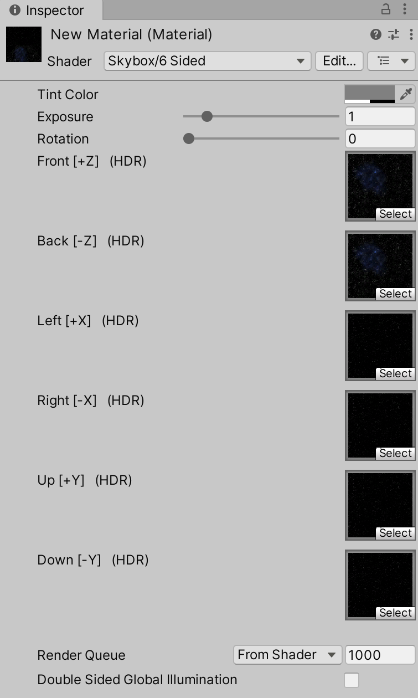
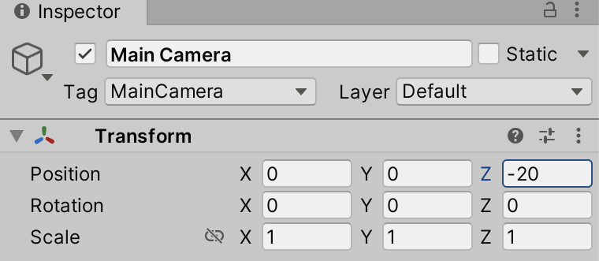

The default skybox in Unity is a bit dull. The scene has a blue sky, brown terrain, and a horizon. This is not what space looks like! Let's start with creating a starfield skybox.

_Wait, skybox? What is a skybox???_ A skybox is a cube with a different texture on each face. Unity places your scene inside this cube, so no matter the game camera's direction, you'll see one or more textures rendered in the background.

In the Unity Editor **Project** tool window, create a new folder named "Materials", and then use the **Create | Material** context menu to create a new material. For **Shader**, select **Skybox | 6 Sided**. You'll see you now have 6 textures you must set, one for every face of the skybox cube.

You can drag and drop some of the textures in the _Assets > StarfieldMaterials > Textures > Plain Starfields_ folder, and add a nebula from the _Assets > StarfieldMaterials > Textures > SingleNeb_ folder.

Give your newly created material a name (you can do this in the **Project** tool window) so it's easier to find in your project.

This skybox material can now be used in the game scene. Use the **Window | Rendering | Lighting** menu to bring up the lighting settings, switch to the **Environment** tab, and set the **Skybox Material** to the starfield skybox you created. This should take effect immediately, already making the game scene look more interesting!

Now is also a good time to make two more changes to the scene. First, select the _Main Camera_ in the **Hierarchy** tool window and set the _Z_ value to "-20". This moves the camera to the back, showing more of the scene.

Next, select the _Directional Light_ and set its _Intensity_ to "2." This will give the scene a little more light and, later, nicer shadows on the asteroids.

With a space starfield in your game, you can add game elements such as the spaceship and asteroids. We'll cover that next.
