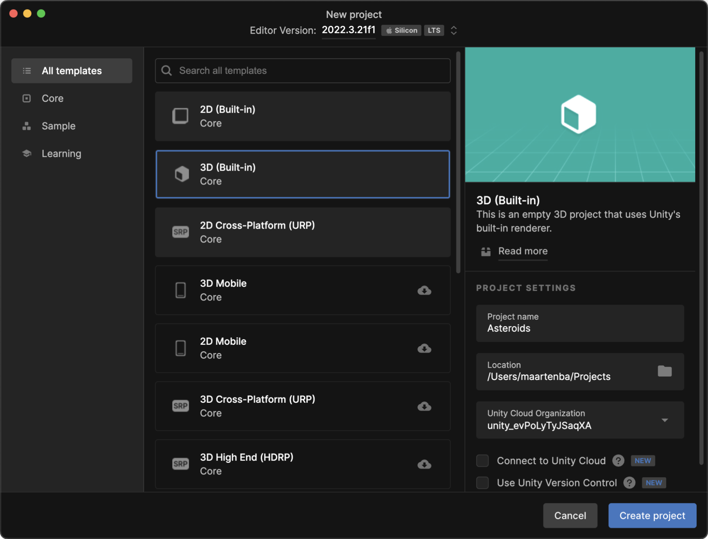
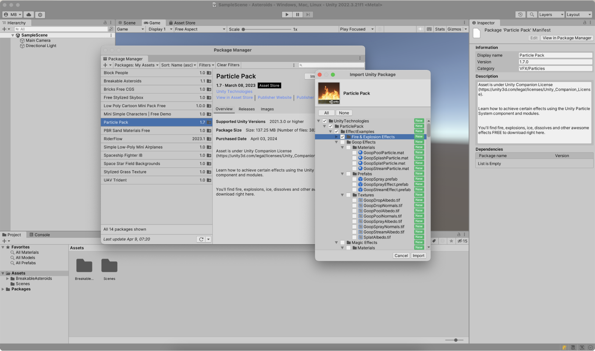

In this small Asteroids-inspired game, you'll create a scene in which a spaceship is visible and can be controlled with the keyboard. The spaceship can shoot lasers at randomly spawned asteroids. When an asteroid explodes, the player score increases.

It would be nice to have graphical assets for our game: a spaceship, an asteroid, an explosion, and a space background. You can search the [Unity Asset Store](https://assetstore.unity.com/) for free or commercial assets. For this tutorial, I'll be using the following assets:

- [Breakable Asteroids 1.1](https://assetstore.unity.com/packages/3d/props/breakable-asteroids-167825)
- [Particle Pack 1.7](https://assetstore.unity.com/packages/vfx/particles/particle-pack-127325)
- [Spaceship Fighter IB 1.0](https://assetstore.unity.com/packages/3d/vehicles/space/spaceship-fighter-ib-93246)
- [Space Star Field Backgrounds 1.0](https://assetstore.unity.com/packages/2d/textures-materials/space-star-field-backgrounds-109689)

After adding them to the asset library of your Unity account, let's create a new Unity project! In the Unity Hub, create a new project using the **3D (Built-in)** template, give the project a name, and click **Create project**.

When the Unity Editor is started, you can import the assets from your asset library. Use the **Window | Package Manager** menu to open the Package Manager, switch the **Packages** dropdown to **My Assets**, and download and import the assets you just added in the Unity Asset Store.

> **Tip:** when importing the Particle Pack, only import the "Fire & Explosion Effects". You won't need other effects from this package in this tutorial.

You can start working on the game when all assets have been added to your project. We'll do this in the next step of this tutorial!
