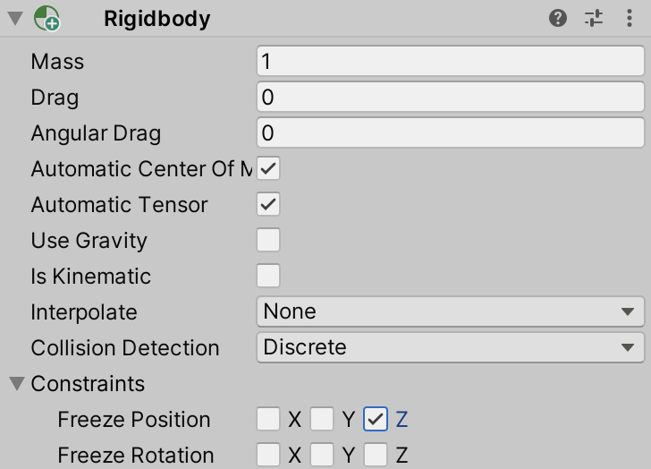
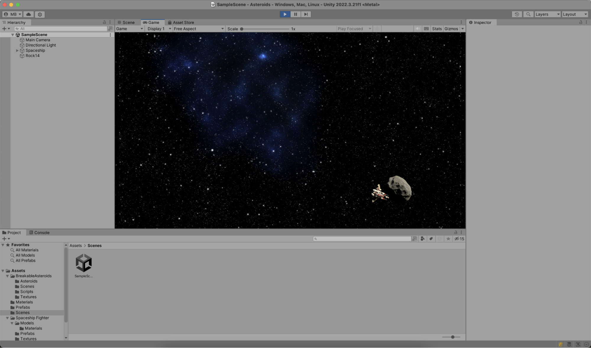
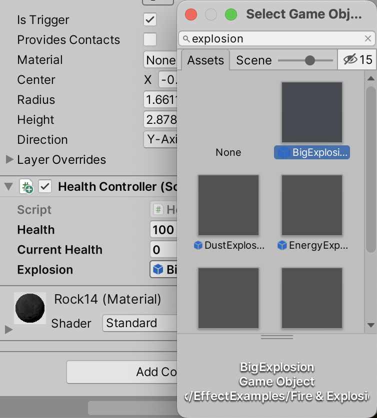
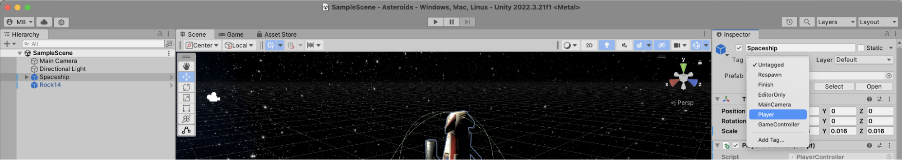

While the spaceship can move around and shoot lasers, the sole asteroid on the game scene is quite static. Let's change that!

As the first step, let's add a Rigidbody to the asteroid. This will bind the asteroid to the Unity physics engine, which makes it easier to add floating behaviour. By now I hope you know where to click, but just in case, let's walk you through. In the **Hierarchy** tool window, select the asteroid. In the **Inspector** tool window, click **Add Component** and add a new _Rigidbody_.

Set the mass to "1", drag and angular drag to "0", and disable "Use Gravity". Under constraints, freeze the "Z" position, so that the asteroid is always at the same Z-axis the spaceship and laser is, even when physics starts interfering with the asteroid's position and rotation.



While in the **Inspector** tool window, add a new script component and name it `AsteroidController`. Find it in the **Project** tool window and double-click to open in JetBrains Rider, and add the following code:

```csharp
public class AsteroidController : MonoBehaviour
{
   void Start()
   {
       GetComponent<Rigidbody>().AddForce(transform.forward * 100f);
   }

   void OnBecameInvisible() => Destroy(gameObject);
}
```

When the `AsteroidController` script is enabled and `Start` is called by the Unity engine, a forward force is added to the asteroid. This will cause it to float around the scene thanks to the Unity physics engine. As with the Laser before, the `OnBecameInvisible` event function destroys the asteroid when it is no longer visible.

Back in the Unity Editor, select the asteroid and in the **Inspector** tool window, click **Add Component** and add a _Capsule Collider_. Make the collider a trigger, so that it signals Unity when a collision with an asteroid occurs.

When you switch into **Play** mode, you will see the asteroid float around. And because both the spaceship and asteroid have collider components, you can use the ship to push the asteroid around.



## Adding explosions to the asteroid

Now let's add explosions! Exit **Play** mode, select the asteroid, and in the **Inspector** tool window once more, click **Add Component**. Create a new script and name it `HealthController`, then open it in JetBrains Rider. You can add the following code:

```csharp
public class HealthController : MonoBehaviour
{
   public int health = 100;
   public int currentHealth;
   [SerializeField] private GameObject explosion;

   private bool isExploding = false;

   void Start()
   {
       currentHealth = health;
   }

   public void DealDamage(int damage)
   {
       currentHealth = Math.Max(0, currentHealth - damage);

       if (currentHealth <= 0 && !isExploding)
       {
           isExploding = true;

           var explosionGameObject = Instantiate(explosion, transform.position,
               Quaternion.Euler(0, 0, 0));

           Destroy(gameObject, 0.5f);
           Destroy(explosionGameObject, 1f);
       }
   }
}
```

Let's unwrap this snippet. The `HealthController` allows setting the health, current health, and a `GameObject` that represents an explosion. You can wire these up in the **Inspector** tool window in the Unity Editor. The _BigExplosion_ from the Particle Pack asset is quite nice:



The `DealDamage` method is where the `HealthController` contains most of its logic. When called, the current health is reduced. When below zero, a new explosion is instantiated at the GameObject's current position, and the GameObject is destroyed after 0.5 seconds, while the newly created explosion itself is destroyed after 1 second.

But where _is_ that `DealDamage` method called? Nowhere yet, so let's fix that.

A good place to deal damage is in `LaserController`. The _Laser_ prefab you created earlier has a collider component attached, which is a trigger. Unity has an event function (`OnTriggerEnter`) which is called when the current collider intersects with another. In this event function, you'll want to make sure the other gameobject is not the player, by comparing the tag. When a `HealthController` component exists on the other collider's GameObject, its `DealDamage` method can be called.

```csharp
private void OnTriggerEnter(Collider other)
{
   if (other.gameObject.CompareTag("Player")) return;

   if (other.gameObject.TryGetComponent<HealthController>(out var healthController))
   {
       healthController.DealDamage(25);
   }

   Destroy(gameObject);
}
```

That "Player" tag, though... What is it, and where does it come from?

In the Unity Editor, you can [attach tags to one or more objects](https://docs.unity3d.com/Manual/Tags.html) to make finding those objects in scripts easier. For the tag comparison to work, you'll have to tag the spaceship with the "Player" tag, which you can do in the **Inspector** tool window:



Enter **Play** mode, and try shooting some lasers at the asteroid. Boom!


> **Tip:** You can use [JetBrains Rider's Pausepoints for Unity](https://blog.jetbrains.com/dotnet/2020/06/11/introducing-unity-pausepoints-for-rider/) to pause **Play** mode when the explosion is instantiated.

Your asteroids game is starting to shape up! In the next step, let's look at how to spawn more asteroids...
