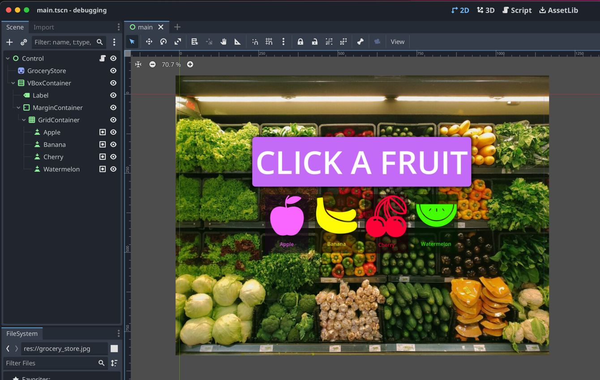

<video src="godot_grid_button.webm" autoplay controls loop>
</video>



If you have worked with Godot signals, you likely find yourself repeating code that might be simple to refactor if only
the caller was passed as an argument. This is the situation I found myself in when creating the demo you see above. The layout of
the demo is a `GridContainer` with multiple `Button` nodes, that when clicked, the button updates the label with the
information stored on the button.

```text
GridContainer
|- Apple
|- Banana
|- Cherry
|- Watermelon
```

Or for context, here is a screenshot of the demo project. For clarity, each button has been added to a `Buttons` group.



Straightforward, right? But we have an issue when it comes to reusing GDScript. The `pressed` signal, does not pass the triggering node to the callback function. That means we do not know which button the player pressed when using a single event handler.

In a grid container with four buttons, we would have to tie all different buttons to a unique method or potentially find another solution for code reuse.

Luckily for us, the dynamic nature of GDScript allows us to construct methods, also known as `Callable`, with arguments and connect them to any signal.

Add a script to your top-most parent control. In this case, I am adding the scene tree root node, but anywhere up the tree should work. In this new script file, add the following GDScript.

```gdscript
extends Control

@onready var label: Label = $VBoxContainer/Label

func _ready() -> void:
	var buttons = get_tree().get_nodes_in_group("Buttons")
	for b:Button in buttons:
		var pressed = Callable(self, "_on_pressed").bind(b)
		b.pressed.connect(pressed)

func _on_pressed(which: Button) -> void:
	print(which)
	label.text = which.text
	pass # Replace with function body.
```

The important part of this code is the use of the `bind` method, which after creating a `Callable`, allows us to prime our even handler with known arguments. In a sense, we are programmatically creating a unique handler for each button in our scene.

Now when we click each button, the argument of `which`, will be passed to our handler and allow us to perform actions unique to each button.

It is as easy as that. Now you can reuse handlers for similar nodes and signals without the need to repeat yourself. That is a win in my book.


