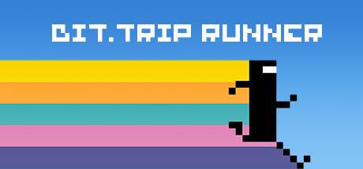
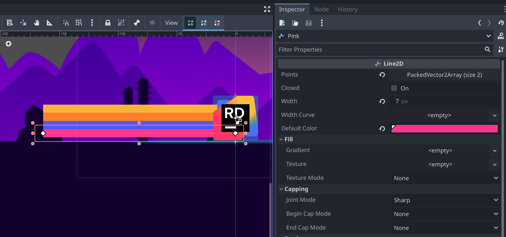
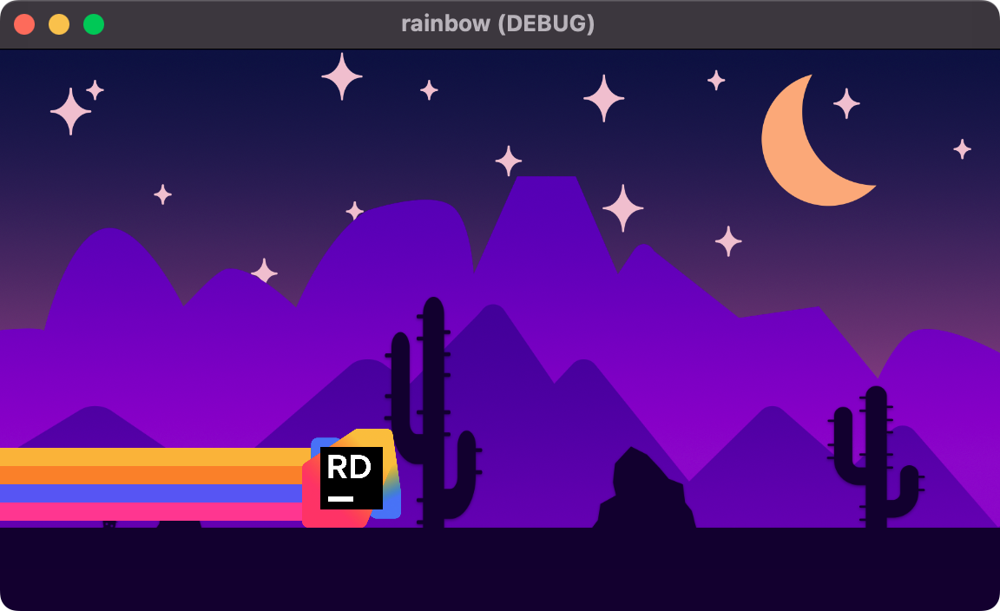

The Endless Runner genre is jam-packed with classics, and one of my favorites is [BIT.TRIP Runner](https://bittrip.fandom.com/wiki/BIT.TRIP_RUNNER/). Released on May 14th, 2011, the game is visual retro-inspired splendor mixed with a hypnotic original soundtrack guaranteed to keep you entertained. CommanderVideo, the game's protagonist, has an iconic visual rainbow trail that follows the character's movement.





In this short tutorial, we'll explore how to add the same rainbow trail effect to your 2D games with just a few Line2D nodes and a single script. We'll focus on the technique's critical elements, but you can [download the sample project here to see a complete version](https://github.com/khalidabuhakmeh/godot-rainbow-trails).

## Setting up the Nodes

We'll start with a `CharacterPlayer2D` as our parent node. The character will move across the screen, leaving our rainbow trail behind. The character is only essential in that we'll need its position, but otherwise, you can use any script to control it. Here is the script I used in my sample project.

```gdscript
extends CharacterBody2D

const SPEED = 200.0
const JUMP_VELOCITY = -400.0

var initial_logo_scale: Vector2

@onready var logo := $Logo
@onready var sparks := $Sparks
@onready var jump_sound := $Jump

func _ready() -> void:
	initial_logo_scale = $Logo.scale

func _physics_process(delta: float) -> void:
	# Add the gravity.
	if not is_on_floor():
		velocity += get_gravity() * delta
		logo.scale.y = move_toward(logo.scale.y, initial_logo_scale.y,  0.01)
		logo.scale.x = move_toward(logo.scale.x, initial_logo_scale.x,  0.01)

	# Handle jump.
	if Input.is_action_just_pressed("ui_accept") and is_on_floor():
		sparks.emitting = true
		jump_sound.play()
		velocity.y = JUMP_VELOCITY
		logo.scale.y = initial_logo_scale.y * 1.5
		logo.scale.x = initial_logo_scale.x * 0.65

	# Get the input direction and handle the movement/deceleration.
	# As good practice, you should replace UI actions with custom gameplay actions.
	velocity.x = SPEED

	move_and_slide()
```

The node structure in the scene tree looks like the following:

```
Player
- Collision (CollisionShape2D)
- Logo (Sprite2D)
- Sparks (CPUParticles2D)
- Camera (Camera2D)
- Jump (AudioStreamPlayer2D)
```

Let's get to the critical part, adding our line collection.

We'll add a new Node2D element between the `Collision` and `Logo` nodes. This will hold four new `Line2D` nodes: Pink, Blue, Orange, and Yellow. Our latest scene tree looks like this now.

```
Player
- Collision (CollisionShape2D)
- Lines (Node2D)
	- Pink (Line2D)
	- Blue (Line2D)
	- Orange (Line2D)
	- Yellow (Line2D)
- Logo (Sprite2D)
- Sparks (CPUParticles2D)
- Camera (Camera2D)
- Jump (AudioStreamPlayer2D)
```

In the `2D` tab, we'll now position and space each `Line2D` node to create a rainbow effect. Use "Move Mode (W)" to toggle the X and Y handles to make moving elements easier. To create the rainbow effect, each line should be horizontally centered on your Player element but vertically spread across the height. Creating points using the "Create Points" button toggled is not necessary, but it helps visualize the stripes and position the lines more efficiently; you'll soon see why.



For my `Sprite2D`, I honed in a width of `7px`, which helped me position four lines equally across the height of my logo element.

Now, let's create the rainbow effect.

## Placing points on each line

On the `Lines` node, we will want to add a new script named `lines.gd`. In this script, we'll find all child lines and then add new points based on the location of our parent node.

```gdscript
extends Node2D

var lines: Array[Line2D]

@export var max_points := 100

func _ready() -> void:
	for node in get_children():
		if node is Line2D:
			# allow each line to set position based in scene
			node.top_level = true
			# ignore the initial points because
			# things are about to get really weird :)
			node.clear_points()
			lines.append(node)

func _physics_process(_delta: float) -> void:
	var point = global_position
	for line in lines:
		line.add_point(point)
		if line.points.size() > max_points:
			line.remove_point(0)
```

The `_ready` function includes two significant field settings: `top_level` and `clear_points`.

The `top_level` field tells Godot that this element behaves like a top-level element, so any translation and positioning will happen outside the element's relationship to its direct parent. This allows us to draw points outside the scope of our character.

The next is the method called `clear_points`. Since we immediately mark the lines as `top_level`, any original points you had drawn in the editor will exist relative to the parent. This will create a jarring visual experience, and it's easier to delete the original points and start fresh.

In the `_physics_process` method, as our character moves from left to right, we use the `Lines` node's `global_position` to add new points for each line in our `Lines` node. Since we positioned our lines, Godot automatically added the offsets to each new point. No need for math! As we reach our `max_points` limit, we remove the first point, limiting the overall complexity of our lines. In our example, these lines eventually fall out of the viewport so that it will feel like an endless rainbow to the player.



You can now run the game. There you have it. A rainbow effect that now follows our character, whether they're running on the ground or jumping over potential hurdles.

If you'd like to see this demo in action, head over to the [GitHub repository](https://github.com/khalidabuhakmeh/godot-rainbow-trails) to see it all in its parallax glory.


