Code is an essential part of any game. While you’ve seen that we can achieve a lot by working with the Godot Editor, at some point, you need to start writing some code to make your game come alive. In this section, we’ll add scripts to many of the elements in our Scene Tree and add some interactivity that should make for some fun.

## Setting JetBrains Rider as the default script editor

Before we start typing any code, we’ll need to change the settings in Godot to ensure that JetBrains Rider is our default code editor. If you haven’t already, now would be a good time to download JetBrains Rider and the Godot plugin.

Open the **Editor Settings** from the Godot Editor and scroll down to **DotNet | Editor**. Change the External Editor to **JetBrains Rider and Fleet** on the right-hand pane.

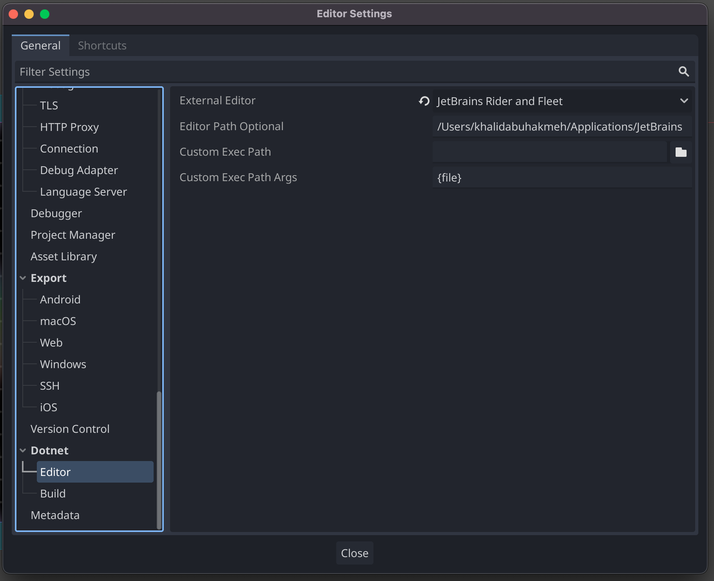

Now, whenever we edit a C# file, a JetBrains Rider instance will handle the file contents. Changes will automatically synchronize between the game engine and the IDE.

## The Game Loop

Unlike other forms of programming, the driving force behind many games is **time**, which is implemented in what is commonly referred to as **the Game Loop**. Understanding this mechanic can help us apply logic to elements to get the desired results. Let’s look at an example of imperative programming and how the same example might look in a game.

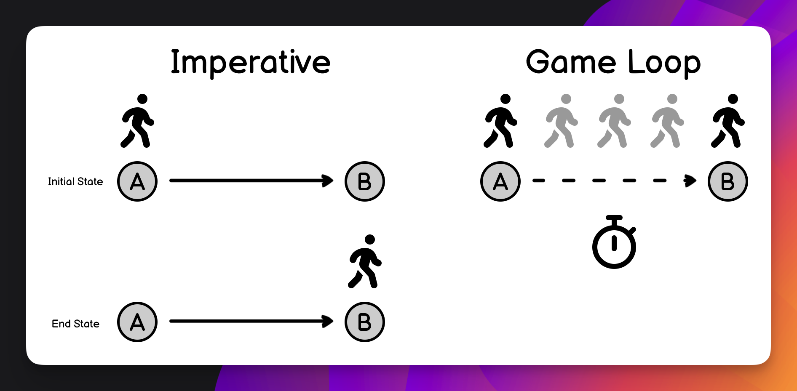

Imperative programming, at its core, is about simplicity. It's about moving from a starting state to an end state in a single line of code. Let's take a simple example: moving a character from point A to point B. How would you write this code in an imperative style?

```text
player.Position = B;
```

The issue with a game is that our avatar would instantly appear at position B. This may be the effect we’re after, but it might also be jarring to the player.

Our code is called on every frame drawn to the screen within the game loop, allowing us to gradually move our avatar from point A to point B.

```python
moveSpeed = 100;
if (player.Position < B)
    player.Position += 100;
```

Time is an essential element, and many game engines provide mechanisms to understand your game in concert with the game world’s progression. As we look at the code in the following sections, you’ll notice a common word, delta, being passed into several methods. What is **delta**?

We mentioned that time is vital in games, but computers cannot keep consistent time over long periods. Your CPU and GPU may have bursts and lags in performance, so keeping consistent pacing is almost impossible for any machine. The **delta** is the difference in time since the last frame was drawn. This value can help you move elements consistently across a playfield, even though you may be experiencing peaks and valleys in performance.

Now that we understand time, we must also understand how our elements interact within our timeline. All nodes in Godot have a standard set of methods that allow us to make calculations, account for input, and change the state of our game. Here’s a sneak peek of some of them.

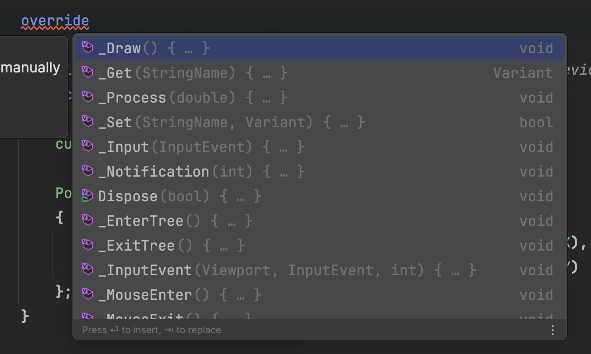

Using an IDE can help you discover these points in Nodes and more easily determine where to put logic, another benefit of using C#, JetBrains Rider, and a strongly typed language.

Now that we have a basic understanding of game loops, let’s start adding some code.

## Create a Scripts Folder

We’ve been splendid at staying organized throughout this tutorial, so why stop now? In the FileSystem window, right-click the root folder and create a new folder called “scripts”. Here, we’ll place all of our C# code moving forward.

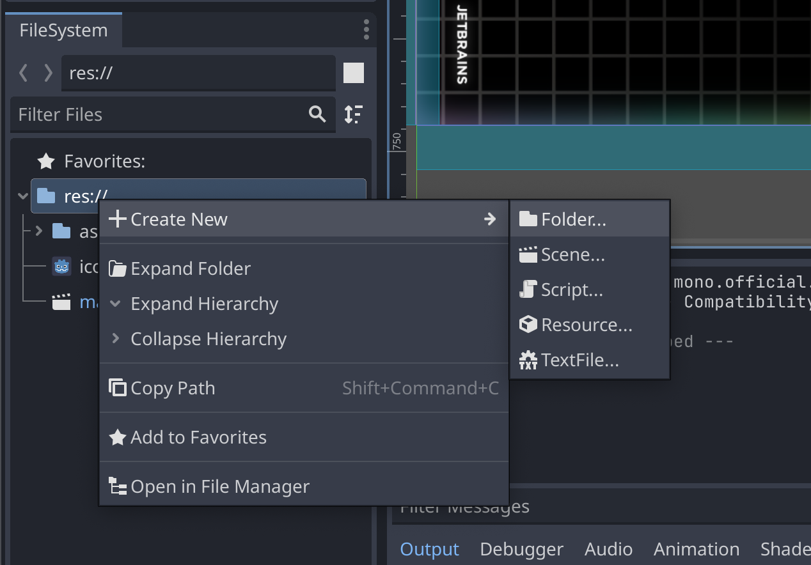

## Bouncing The Ball

Let’s start with the focal point of our game: the **Ball**. We need it to move around the playing field and bounce off things.

In the **FileSystem** view, right-click the scripts folder and add a `Ball.cs` script file. Remember to select C# as the language option in the first dropdown.

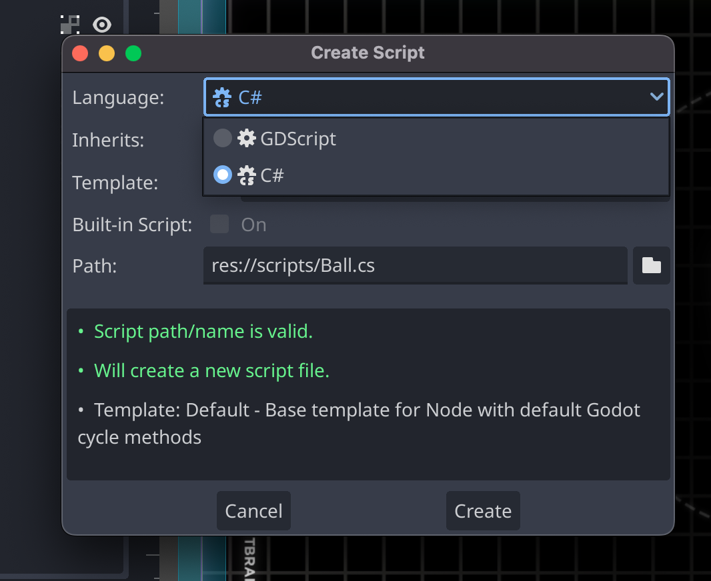

Now, let's move on to the next step. It's as simple as right-clicking the **Ball** node and choosing the **Attach Script** option, followed by selecting our `Ball.cs` file. You're doing great!

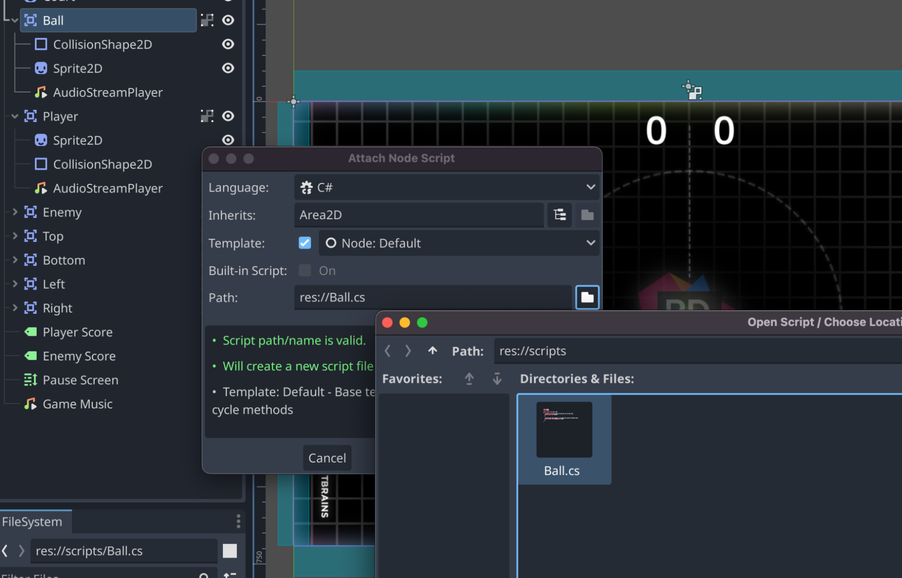

Double-click the `Ball.cs` file in the **FileSystem** to launch JetBrains Rider. Now, we can start editing our script file.

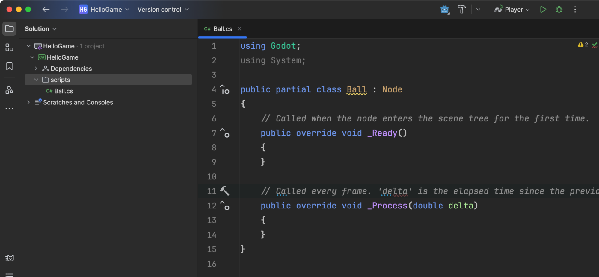

Replace the contents of this file with the following code.

```csharp
using Godot;

public partial class Ball : Area2D
{
    [Export] public double MoveSpeed = 1000;
    [Export] public Vector2 Direction = Vector2.Left;

    private AudioStreamPlayer bounceSound;

    private static readonly Vector2 StartingPoint = new() { X = 640, Y = 360 };

    public override void _Ready()
    {
        bounceSound = GetNode<AudioStreamPlayer>("AudioStreamPlayer");
    }

    public override void _PhysicsProcess(double delta)
    {
        Position = Position with
        {
            X = (float)(Position.X + MoveSpeed * delta * Direction.X),
            Y = (float)(Position.Y + MoveSpeed * delta * Direction.Y)
        };
    }

    public void Reset(Vector2 direction)
    {
        Direction = direction;
        Position = StartingPoint;
    }

    public void Bounce(Vector2 direction)
    {
        Direction = direction;
        bounceSound.Play();
    }
}
```

Let’s break down some highlights of this code.

### Partial Classes

All Godot scripts use the `partial` keyword, since Godot is generating the other parts of our classes for us. Without the keyword, these scripts would not have access to necessary properties, fields, and constants generated from the current game.

### The \_Ready Function and Child Nodes

When our node enters the scene, we can ask for elements found in the game. In this case, we get the bounce sound we nested under our **Ball** node. We’ll play this every time the ball bounces off another element, which you can see in the `Bounce` method.

JetBrains Rider’s Godot Plugin can even show you want elements you can access in calls to `GetNode`.

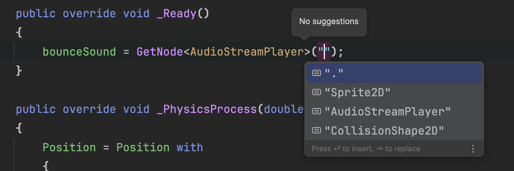

### Exported Values and Configurability

The `Export` attribute allows us to make our scripts configurable at design time, in the code, we export `MoveSpeed` and `Direction` so you can change them in the Godot Editor.

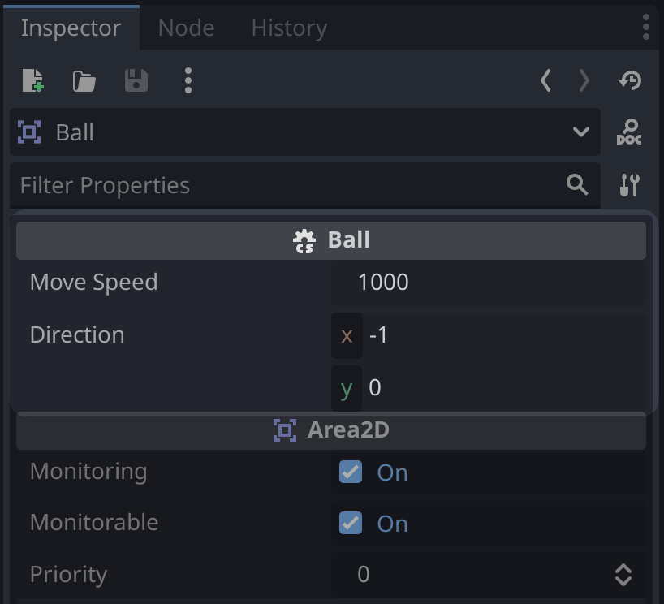

This is a nice feature of Godot game development, as it allows you to find the correct values for fields without constantly recompiling your code. You can `Export` any element Godot is aware of, including Node types, as we’ll see later.

### \_PhysicsProcess and Bouncing

If you think back to our game loop explanation, we must move the ball in a particular direction over time. We propel the ball through space according to our `MoveSpeed` and `Direction` values. We need to use the with keyword since the `Position` is a `record` type in C# and uses immutable fields, but the `Position` itself can change.

```csharp
public override void _PhysicsProcess(double delta)
{
    Position = Position with
    {
        X = (float)(Position.X + MoveSpeed * delta * Direction.X),
        Y = (float)(Position.Y + MoveSpeed * delta * Direction.Y)
    };
}
```

Running your game, you’ll see the ball move to the left and off-screen. We need some collision on our walls.

## Colliding with the Ball

We need to add scripts for our rails and goal areas to start incorporating gameplay into our version of Pong.

Create the following script files in the `scripts` folder as we did previously: `Rail.cs`, `Wall.cs`, and `IHasScore.cs`.

Let’s start with `Rail.cs`. Open the file in JetBrains Rider and paste the following code.

```csharp
using Godot;

public partial class Rail : Area2D
{
    [Export]
    private int bounceDirection = 1;

    public void OnAreaEntered(Area2D area)
    {
        if (area is Ball ball)
        {
            var direction = (ball.Direction + new Vector2(0, bounceDirection)).Normalized();
            ball.Bounce(direction);
        }
    }
}
```

If the ball bounces off our rail, we want to direct it back into the playfield. We can do that using the `bounceDirection` value. We want to push the ball down or in the positive direction for the top rail. If the ball bounces into the bottom rail, we want to push the ball up or in the negative direction (towards zero). Attach this script to both the **Top** and **Bottom** nodes in the editor.

Change the “Bounce Direction” value to `-1` for the **Bottom** rail. If you don’t see the field in the editor, be sure to rebuild your game using the hammer icon.

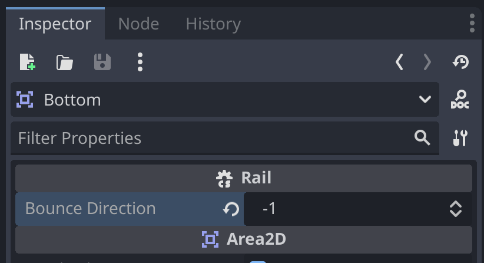

Finally, we must wire our `OnAreaEntered` method to the corresponding **Signal** of our **Top** and **Bottom** nodes.

Signals are Godot’s event system and allow you to subscribe to a node’s event from any other part of the code. There is a set of built-in signals for every node, and you also can define custom signals that match the game element you’re building.

Back in the editor, switch from the **Inspector** tab over to the **Nodes** tab. Click the `area_entered` signal in the Nodes tab, click **Go to Source**, then select our `OnAreaEntered` method found in the script file. Do this for both elements.

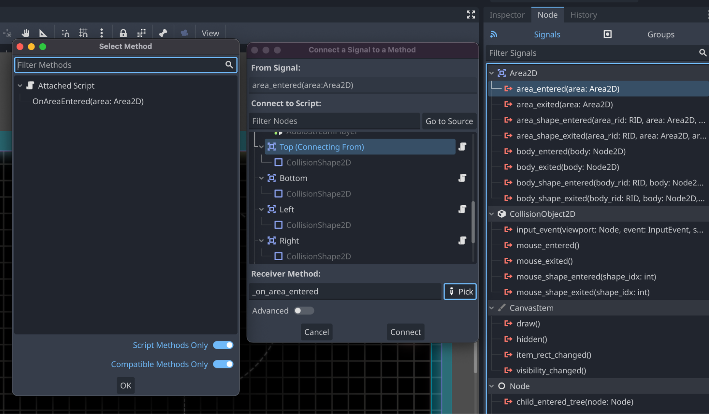

Once connected, your **Node** window should look like the following.


Now, let’s do the walls. First, let’s write the `IHasScore` interface so that we can apply the score to the correct player.

```csharp
using Godot;

public interface IHasScore
{
    StringName Name { get; }
    int Score { get; set; }
    Label ScoreDisplay { get; set; }
    AudioStreamPlayer ScoreSound { get; }
    void IncrementScore()
    {
        Score++;
        if (ScoreDisplay is not null)
        {
            ScoreDisplay.Text = $"{Score}";
            GD.Print($"{Name} scored. Currently at {Score}.");
        }

        ScoreSound?.Play();
    }
}
```

Any node that implements `IHasScore` must provide its name, the current score, a sound, and a target for the score's display. If you think about how we set up the **Scene Tree** earlier, we already have all these elements for **Player** and **Enemy**. We’ll set these up later, but now we have an interface for our `Wall.cs` script. Let’s modify `Wall.cs` with the code necessary to score a goal.

```csharp
using Godot;

public partial class Wall : Area2D
{
	[Export]
	public Vector2 BallResetDirection = Vector2.Left;

	[Export]
	public Node2D Scorer { get; set; }

	public void OnAreaEntered(Area2D area)
	{
		if (area is Ball ball)
		{
			ball.Reset(BallResetDirection);
			if (Scorer is IHasScore scoring)
			{
				scoring.IncrementScore();
			}
		}
	}
}
```

Nice. Every time our ball collides with a wall, we know the Scorer has scored, and we need to reset the ball. We also want the ball to go in the direction of the opponent, so that they get an opportunity to rebound after a loss. We can do that by making `BallResetDirection` and exporting a value.

Let’s set the `Export` values in the Godot editor. Again, build your game to see these elements in the editor.

For the **Left** node, set the **Ball Reset Direction** to `1` and the **Scorer** to `Enemy`.

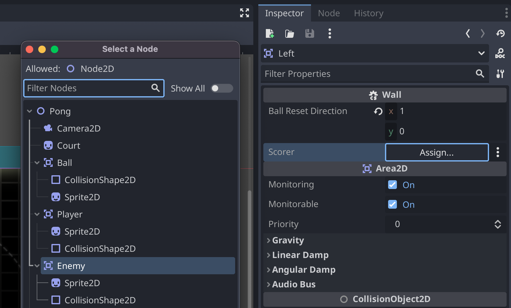

For the **Right** node, only set the **Scorer** to `Player`.

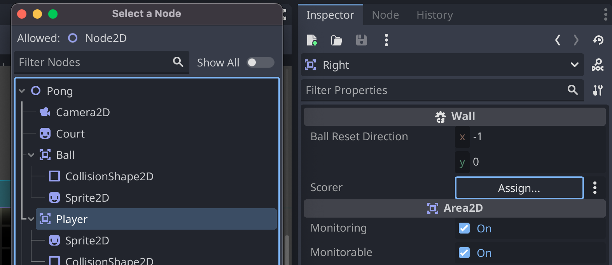

Now, you’ll need to connect the **Signal** for both nodes as we did previously.

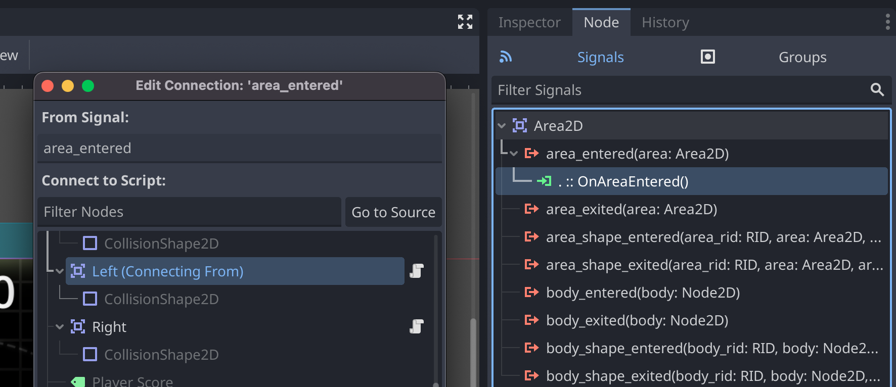

If you start your game now, you’ll see the ball move left and then right as it collides with each opposing node.

Next, we’ll get the paddles involved.

## Playing against the Enemy

In this section, we’ll create two new scripts: `Player.cs` and `Enemy.cs`. These will control the paddles and give us a way to hit the ball back and forth. We’ll also be able to keep score.

Let’s start with the `Enemy.cs` file. Create it under the `scripts` folder, and open it in JetBrains Rider. Be sure to attach the script to our **Enemy** node like we did previously with other nodes. Paste the following code into the file.

```csharp
using System;
using Godot;

public partial class Enemy : Area2D, IHasScore
{
    [Export]
    private Area2D follow;

    [Export]
    private float difficulty = 0.3f;

    public int Score { get; set; }

    [Export]
    public Label ScoreDisplay { get; set; }

    public AudioStreamPlayer ScoreSound { get; set; }

    public override void _Ready()
    {
        ScoreSound = GetNode<AudioStreamPlayer>("AudioStreamPlayer");
    }

    public override void _PhysicsProcess(double delta)
    {
        Position = Position with
        {
            // don't leave the play field
            Y = Math.Clamp(Position.Lerp(follow.Position, difficulty / 10).Y, 16, GetViewportRect().Size.Y - 16)
        };
    }

    private void OnAreaEntered(Area2D area)
    {
        if (area is Ball ball)
        {
            var direction = new Vector2(Vector2.Left.X, (float)Random.Shared.NextDouble() * 2 - 1).Normalized();
            ball.Bounce(direction);
        }
    }
}
```

Here, we’ve implemented the IHasScore interface and some basic AI logic. You’ll also notice a signal method of OnAreaEntered. The code structure of this file should look very similar to the scripts we’ve written so far.

For folks curious about the AI logic, the `Position.Lerp` function is a built-in Godot method that allows smooth position interpolation from a starting point to an endpoint. Since our paddle only moves on the y-axis to catch the ball, we only interpolate the `Y` position of the enemy paddle. We use `Lerp` here because it provides movement smoothing, which has a ramp-up time, making the enemy feel like they are reacting as a human player might.

Read more about [position interpolation in the official Godot documents](https://docs.godotengine.org/en/stable/tutorials/math/interpolation.html).

Let’s build and connect the necessary elements to our **Enemy** node in the Godot editor.

- **Follow**: `Ball`
- **Score Display**: `Enemy Score`
- **Signals | area_entered** : `OnAreaEntered`

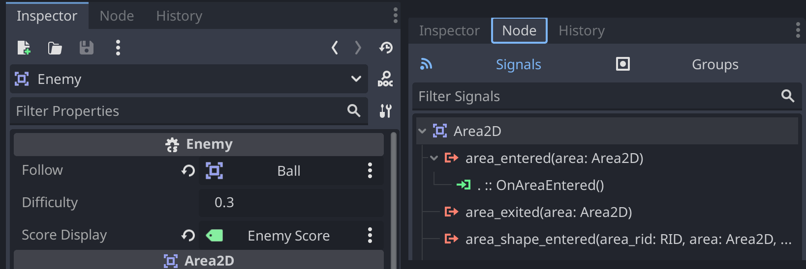

Run the game, and you’ll notice that the **Enemy** is starting to play the game… Wait! He’s absolutely dunking on us with no way to fight back.

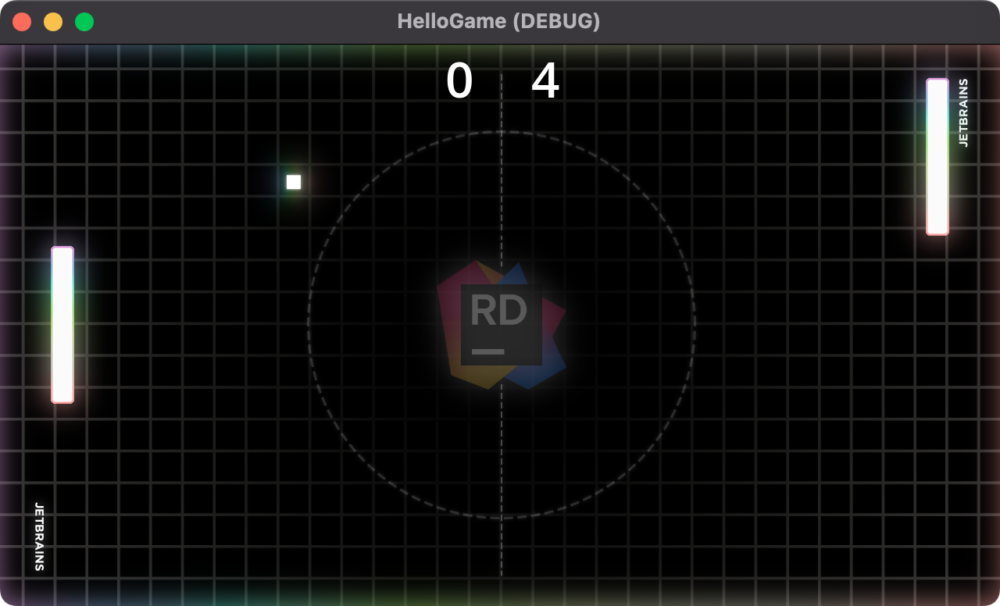

Let’s make sure we can move the **Player**. In the `Player.cs` file, paste the following code.

```csharp
using System;
using Godot;

public partial class Player : Area2D, IHasScore
{
    [Export]
    private int moveSpeed = 200;
    public AudioStreamPlayer ScoreSound { get; set; }
    [Export]
    public Label ScoreDisplay { get; set; }
    public int Score { get; set; }

    public override void _Ready()
    {
        ScoreSound = GetNode<AudioStreamPlayer>("AudioStreamPlayer");
    }

    public override void _PhysicsProcess(double delta)
    {
        // Move up and down based on input.
        var input = Input.GetActionStrength("ui_down") - Input.GetActionStrength("ui_up");
        var position = Position;
        position += new Vector2(0, (float)(input * moveSpeed * delta));
        position.Y = Mathf.Clamp(position.Y, 16, GetViewportRect().Size.Y - 16);
        Position = position;
    }

    private void OnAreaEntered(Area2D area)
    {
        if (area is Ball ball)
        {
            var direction = new Vector2(Vector2.Right.X, (float)Random.Shared.NextDouble() * 2 - 1).Normalized();
            ball.Bounce(direction);
        }
    }
}
```

You’ll notice we use the `Input` API to see when the user is pressing their controller's up and down directions. These inputs are configurable, but for brevity, we’ll leave that for you to discover.

Now, let’s finally wire up the script to our **Player** node by attaching and setting the values in the **Inspector** window.


Starting the game again, we can now control the **Player** and score!

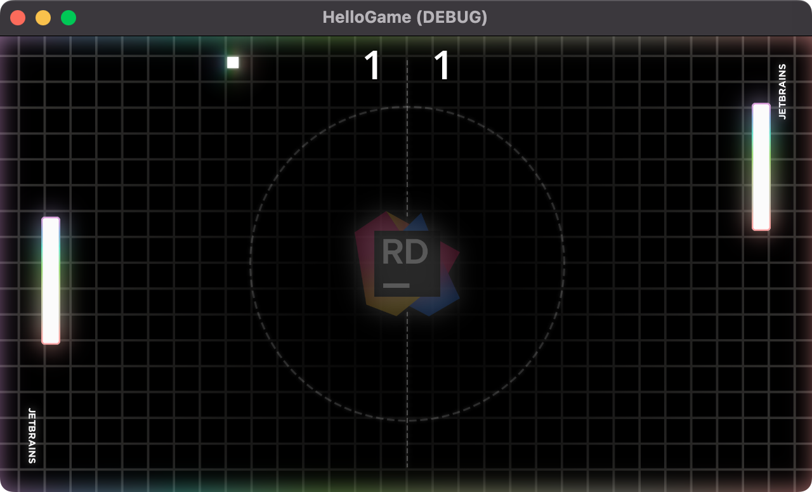

This Pong action is intense, and we want to be able to take a break from it. Let’s program the pause screen next.

## Pausing the action

In our **Scene Tree**, we added a **Pause Screen** node in the early stages of this tutorial. Now it’s time to use it. Before we add a script, we need to change one small value on our node. With the **Pause Screen** selected in the **Inspector**, find and change the value of **Node | Process | Mode** to `Always`.

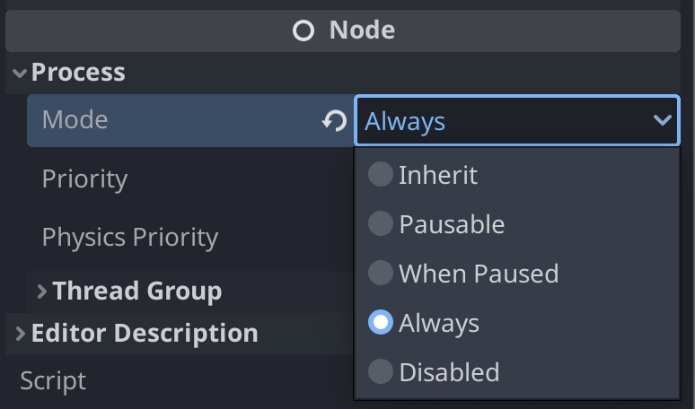

This tells Godot, that no matter what happens to our game, we always want to call the `_Process` method of this node and execute its code. In the case of pausing the game, it will allow us to also unpause the game.

Now, let’s add a `Pause.cs` script and attach it to our Pause Screen node. The code for this script is as follows.

```csharp
using Godot;

public partial class Pause : RichTextLabel
{
	public override void _Process(double delta)
	{
		if (Input.IsActionJustPressed("ui_cancel"))
		{
			GD.Print("Pausing Game");

			if (Visible)
			{
				Hide();
				GetTree().Paused = false;
			}
			else
			{
				Show();
				GetTree().Paused = true;
			}
		}
	}
}
```

All nodes have access to the **Scene Tree** using the `GetTree` method. It’s also a nice feature of Godot that the pause state is inherited from the parent node. Setting the pause value of a parent can pause its children depending on the **Process** mode setting.

With the script attached to our **Pause Screen** node, we can pause and unpause the game by hitting the “escape” key.


You’ll notice the **Pause Screen** animation is the only thing that still processes when the game is paused. All other nodes are paused, including the audio elements.

The game is now complete, but what's the next step from here? Well, let's see what the community has to offer.
