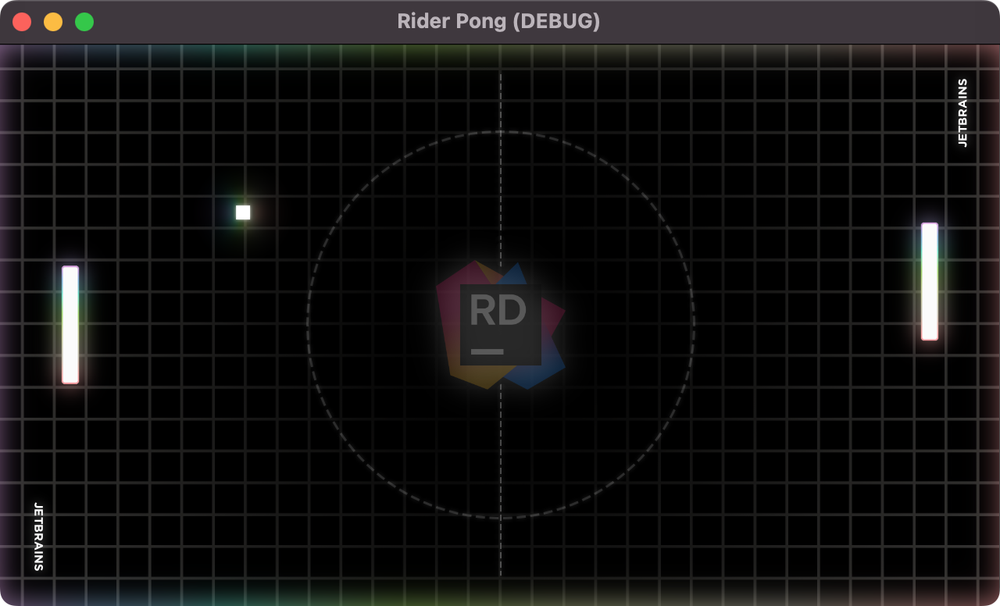
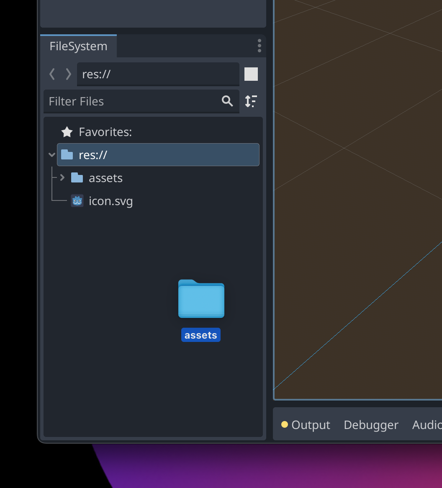

I'll provide you with assets for this tutorial, so you won't have to worry about image editing. The assets are in the zip file below. The archive contains the paddles, the ball, sound files, and the playing field background. Feel free to substitute your assets and adapt this tutorial to your needs.

**[Download Assets Here](../assets/assets.zip)**

Once you've downloaded and unarchived the directory, you can drag and drop the folder into the Godot Editor's **FileSystem** window in the bottom left.

Godot can automatically import many file formats, so you don't need to perform any complex conversions. Expanding the **assets** folder in the file window should show all the assets currently in that directory.

We're ready to start building out our game now. It's all Godot and JetBrains Rider from here, so get ready.
