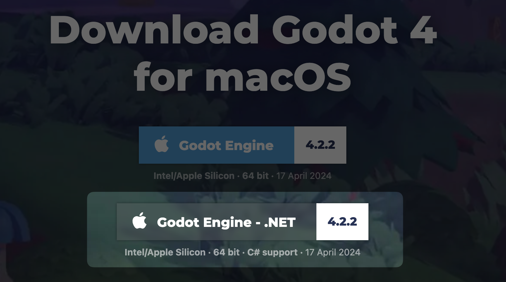
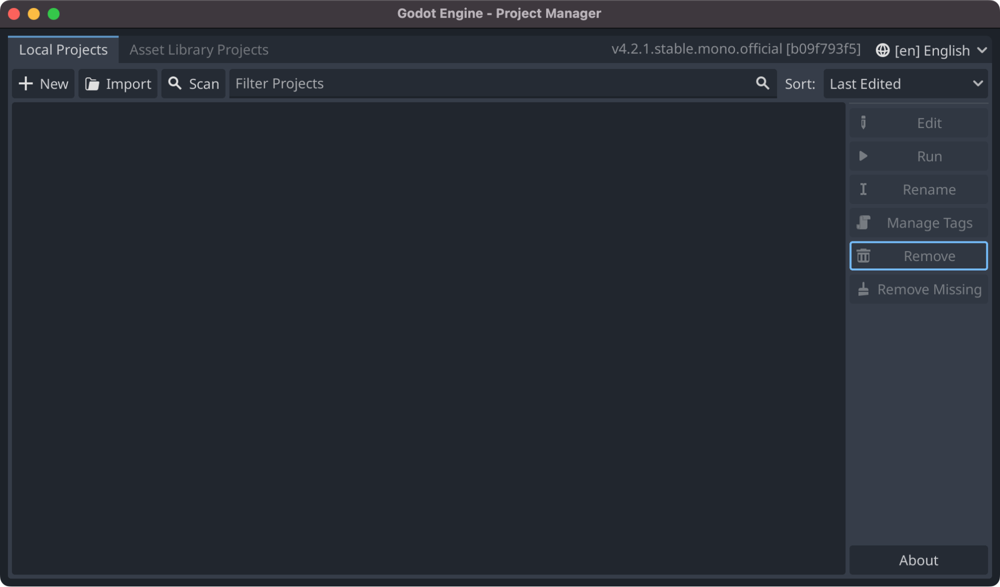
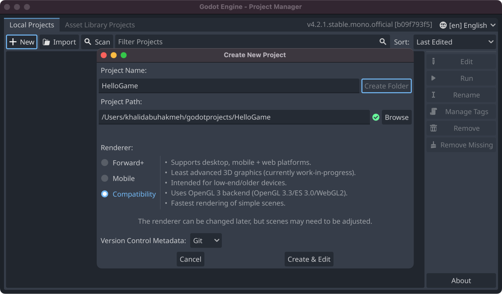
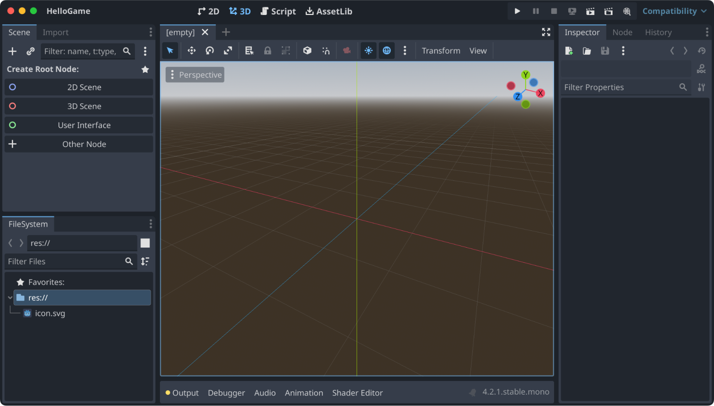
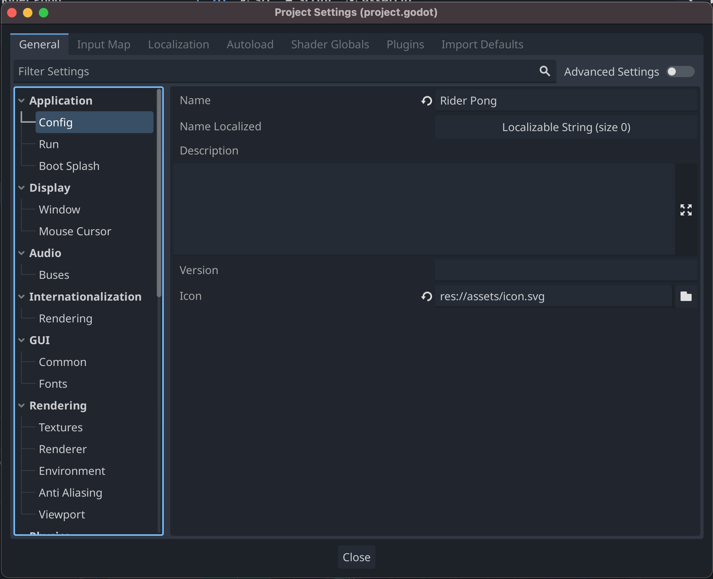
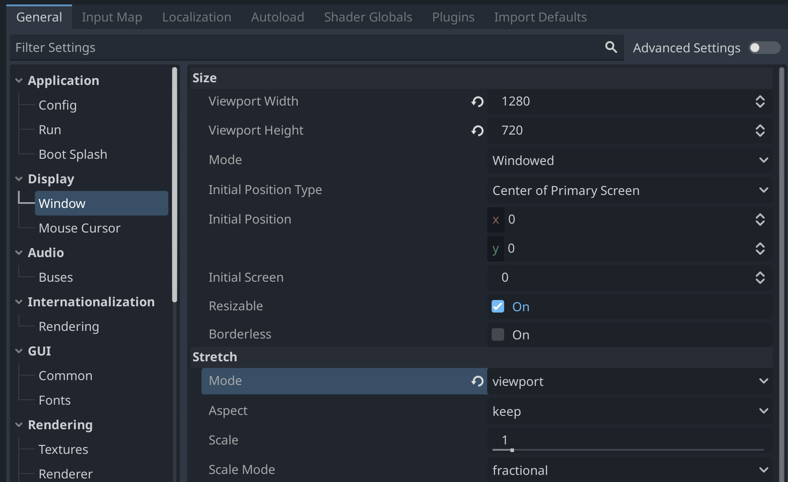

As the first step in this tutorial, we'll [download the current version of Godot Game Engine](https://godotengine.org/download/) with .NET support. Godot currently has two versions, one without C# support and one with it. This might change in future versions.

As of this tutorial, you must download the correct version; otherwise, you won't be able to create, compile, and run C# scripts.

The next step is downloading [the latest .NET SDK from the official .NET website](https://dot.net). Godot Engine has .NET support, but compilation requires a .NET SDK of 6+ installed to create your assemblies for the Godot game engine. For reference, I used the .NET 8 SDK during this tutorial.

You'll also want to download and install the latest version of [JetBrains Rider](https://jetbrains.com/rider) which now bundles the Godot plugin since version 2024.2 of Rider. The Godot plugin will allow you to edit, run, and debug your C# code throughout this tutorial process.

Once your development environment is set up, you're ready to start your first Godot Game Engine project.

Starting the game engine for the first time, you'll be presented with the **Project Manager** dialog. Here, you'll be able to perform a set of actions, one of which is creating a brand-new project.

Clicking new will allow you to create a new folder, select the **Renderer**, and enable source control for the solution. Then, click the **Create & Edit** button to finalize your project.

The following window you will see drops you into the Godot Editor.

### Project Settings

Before we write any code or add assets to our project, we'll want to consider how our game is presented to the user. We can accomplish this by changing values in the **Project Settings**.

The most crucial project settings for our project are under **Display | Window**. We'll want to set the following settings to the following values.

- **Size | Viewport Width**: `1280`
- **Size | Viewport Height**: `720`
- **Stretch | Mode**: `viewport`

The stretch mode allows us to deal with our artifacts in terms of the pixels defined but allows the user to stretch and expand the window to meet their display needs. [Check out more about stretch modes on the official Godot documentation.](https://docs.godotengine.org/en/4.2/tutorials/rendering/multiple_resolutions.html) You can revert any changes to default by clicking the undo button next to a setting. When done, your display settings should look like the following.

> **Homework**: _For an extra polished game, return to the project settings later and set the game's icon, boot splash, and executable name._

In the next step, let's start thinking about our game. We'll look at game design and gameplay.
