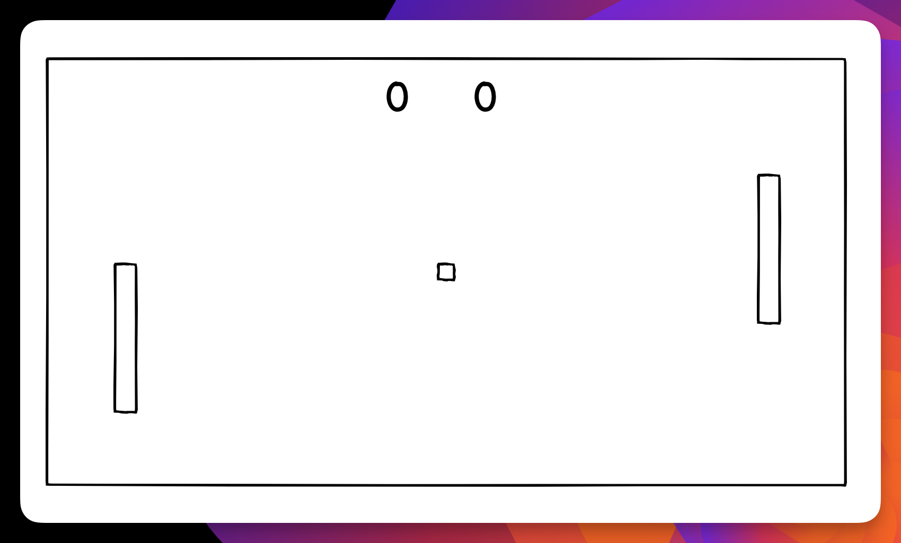
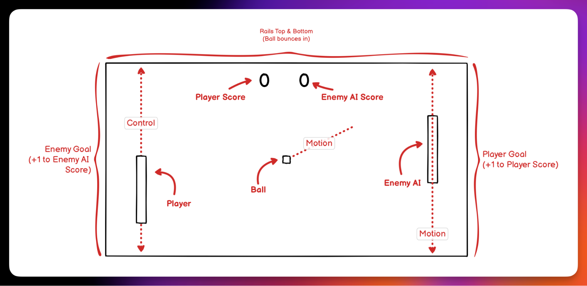

As mentioned in the introduction of this tutorial, we'll be recreating the classic game Pong. It has everything a video game typically has, including player controls, visuals, scoring, and enemy AI. But before we start throwing assets and code into the game, let's take a step back and consider the game's design.

Sketching out a game and thinking about its elements helps us avoid unnecessary work and helps us plan out our work. It's common for game designers to do sketches, create task lists of work, and schedule in time to complete each.

Let's look at Pong's "napkin sketch" and see what elements we can see and what mechanics we might want to think about.

Well, that's not exciting, is it? Let's add some notes.

That's already more interesting. Let's list some of the elements in the image and see if we can create a list of items to account for in our game.

- **Playing Field**: The visible playfield where the game occurs.
- **Paddles**: This includes the player and enemy.
- **Ball**: The element that bounces around the field.
- **Goals**: The left and right of the screen are our scoring areas.
- **Rails**: The top and bottom of the screen are rails, keeping our ball in the playfield.
- **Score UI**: The current score of the game.
- **Music**: While not visible, let's add some sound effects and music.
- **Pause Screen**: We should let the player pause the game, too.

We have a game plan. Now let's start building our game. In the next step, we'll have a quick look at source control for Godot projects.
