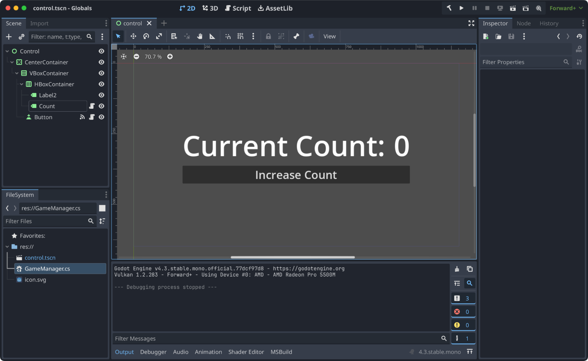
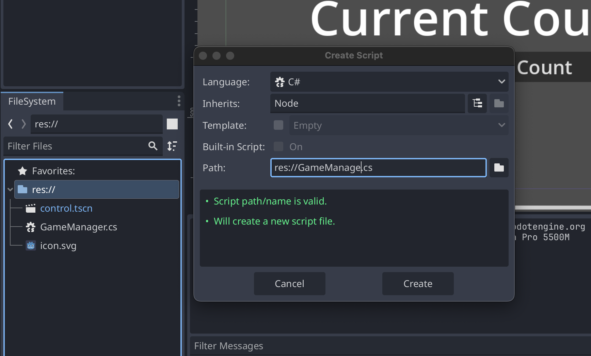
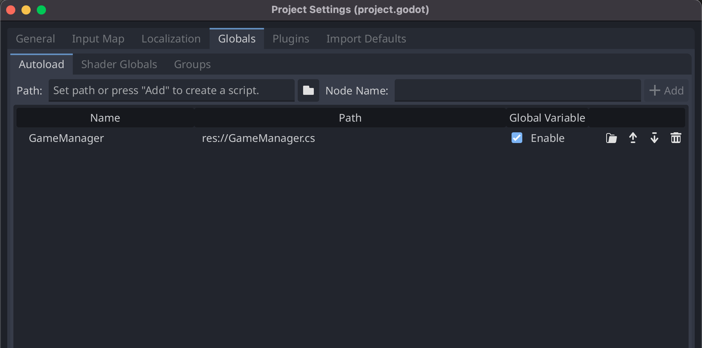
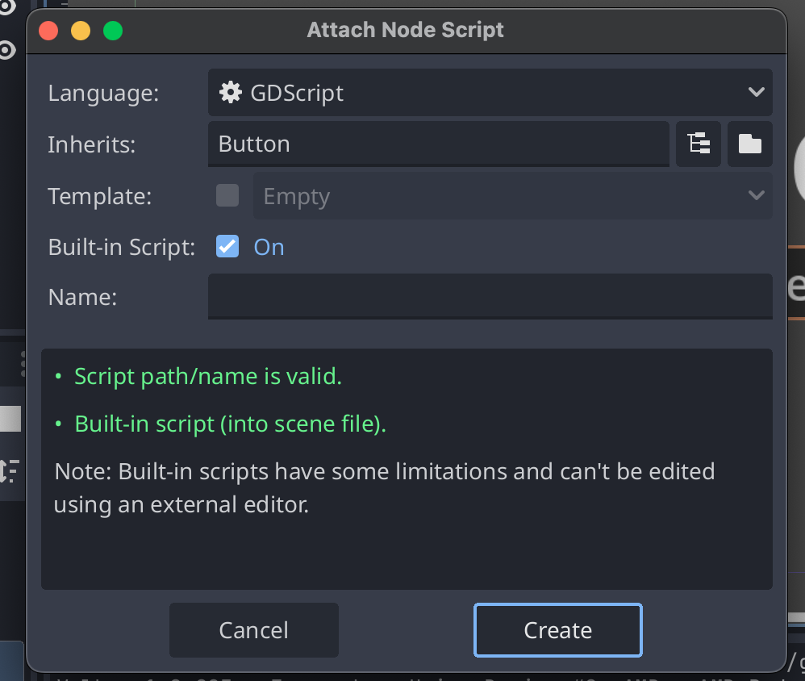
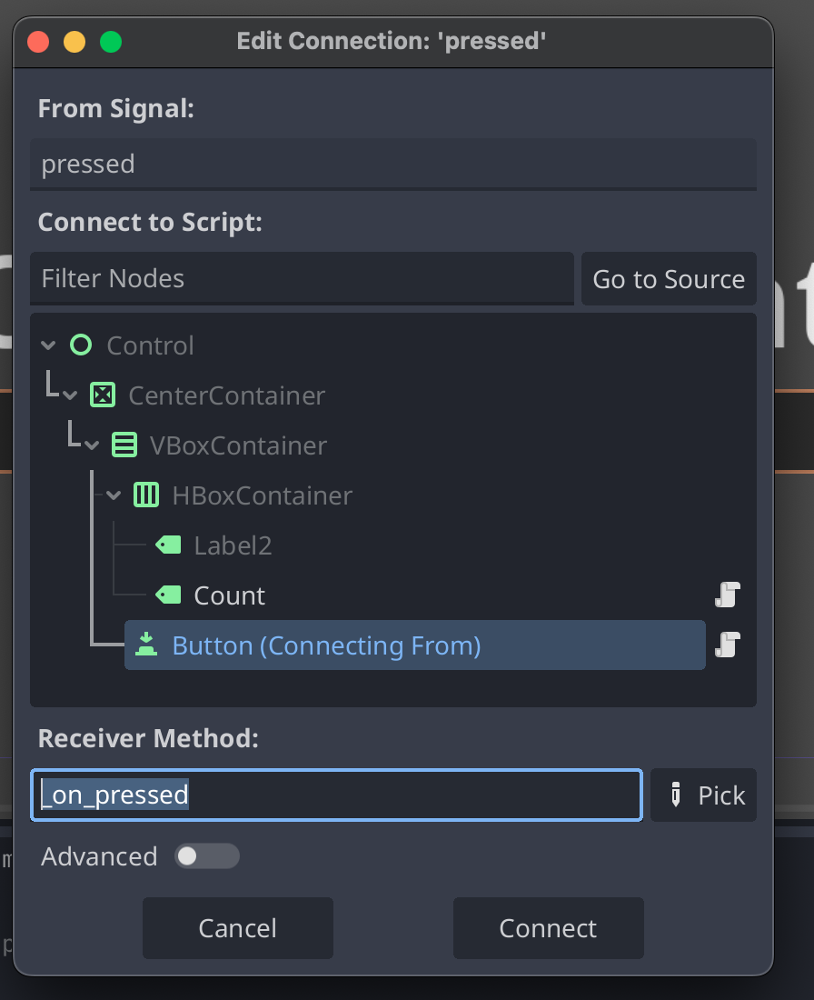
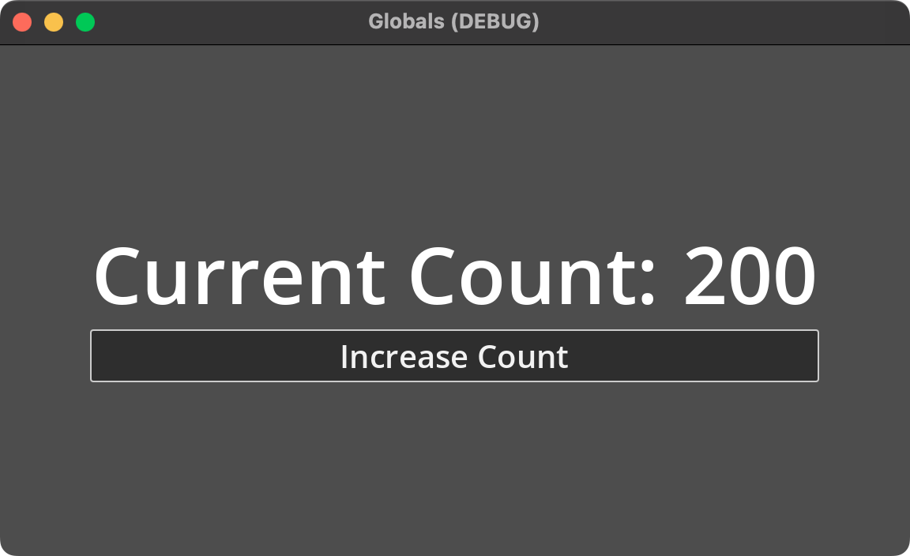
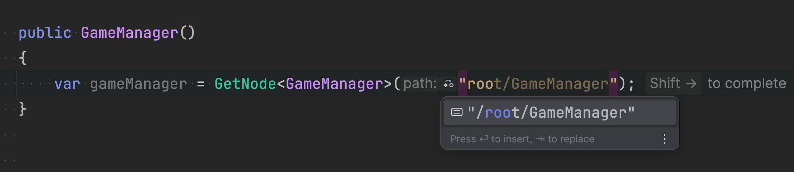

Every game has some shared state, whether high scores, time left in a round, or events to which multiple game elements may subscribe. While you could pass these values up and down Godot's scene tree through `@export`, the practice can become cumbersome and hurt code readability. However, using a Singleton in Godot, you can efficiently manage shared states, improving code readability and reducing complexity.

In this short tutorial, we'll explore Godot's Singleton functionality, how to write a singleton script, register it with your game, and then use it across multiple nodes.

This tutorial is designed to be adaptable for both GDScript and C\#. Whether you're a GDScript enthusiast or a C \# user, this tutorial has got you covered. However, C\# users will need the Mono build of Godot to use the .NET runtime. Also, you'll need a .NET IDE like JetBrains Rider.



**Note: You can download the sample code found in this tutorial at [this GitHub Repository](https://github.com/khalidabuhakmeh/godot-globals).**

[Also, remember to support Godot by donating to the community fund.](https://fund.godotengine.org/)

## What is a Singleton?

If you have a programming background, you may have heard the term **singleton** before. A singleton is an instance of an object that exists once and only once in the scope of a running application. A singleton can contain shared values and functionality that, when altered, affects every consumer of that information. After all, it's one instance.

Godot applies the Singleton concept to game development through Autoload scripts. These Autoloads are instantiated and held in Godot's memory for the duration of a game. That means these instances exist globally and can exist across scene transitions.

From the [Godot documentation](https://docs.godotengine.org/en/stable/tutorials/scripting/singletons_autoload.html), here are the characteristics you can expect when using Autoloads:

- Are always loaded, no matter which scene is currently running.
- Can store global variables such as player information.
- Can handle switching scenes and between-scene transitions.
- _Act_ like a singleton, since GDScript does not support global variables by design.

Note that Godot's implementation is not a _"true"_ singleton, as any script you define may be instantiated by you any number of times. For simplicity, though, when you register scripts in Godot's infrastructure, they can be considered single instances.

In the next section, we'll write a script to register to Autoload and then wire up several controls to take advantage of the shared state.

I also highly recommend you [read the Godot documentation](https://docs.godotengine.org/en/stable/tutorials/scripting/singletons_autoload.html), as it is superb.

## The Shared GameManager

For this tutorial, we'll wire up this `Control` scene, which has two nodes that will utilize a `GameManager` instance: `Count` and `Button`.



When we press the button, our global score will increase, and the label will display that new value.

Let's start by creating a new C\# script named `GameManager`. Right-click the `FileSystem` window and add a new script.



When JetBrains Rider starts, paste the following C\# code into the newly created file.

```csharp
using Godot;

public partial class GameManager : Node
{
    private readonly object @lock = new();

    public int Score { get; private set; } = 0;

    [Signal]
    public delegate void ScoreChangedEventHandler(int score);

    public int IncrementScore(int amount = 100)
    {
        lock (@lock)
        {
            Score += amount;
            EmitSignal(SignalName.ScoreChanged, Score);
            return Score;
        }
    }
}
```

Our `GameManager` class has a shared `Score` property and a signal for `ScoreChanged`. To be safe, when we increment the score, we lock the ability to write to the value to avoid race conditions.

In the Godot Editor, choose **Project Settings** and the **Globals** tab. Select the `GameManager.cs` file for the Path value and give the singleton the name `GameManager`. The node name is how other scripts will reference this instance. Be sure to check the `Enable` box if it still needs to be checked.



Now, let's use this singleton in our game. Right-click the `Button` and attach a new script. For this tutorial, choose `Built-in Script` to reduce the number of files in your project.



Once created, let's attach the `pressed` signal to our new script. Connecting the signal will allow us to use `GameManager.IncrementScore` method every time we press the button.



In the script, use the following `GDScript` code.

```gdscript
extends Button

@export var score_value := 100

func _on_pressed() -> void:
	GameManager.IncrementScore(score_value)
```

You'll notice we can access our `GameManager.IncrementScore` method.

Next, let's add another script to our `Count` label as a built-in script, but this time, we only need to implement the `_ready` function.

```gdscript
extends Label

func _ready() -> void:
	GameManager.ScoreChanged.connect(update_score)

func update_score(score: int) -> void:
	text = str(score)
```

Starting our game, we can now see that we can increment the score by pressing the button and seeing the label update in real time.



Awesome\!

## Accessing Autoloads in C\# Code

Unlike GDScript, accessing Autoloads in a C\# codebase requires more work. Thankfully, there are two straightforward ways to access these game elements. Let's start with a call to `GetNode` with a generic argument of the type and then the path to the autoload, which, in our case, is at the root.

```csharp
var gameManager = GetNode<GameManager>("root/GameManager");
gameManager.IncrementScore(100);
```

You can see that the LSP support in JetBrains Rider helps find Autoloads easily.



You can also create a new `static` property named `Instance` on any potential singletons, and Godot will use this property instead of creating a new instance. You’ll need to set the `Instance` in the `_Ready` method, which should only occur once. A static property is recommended if you're sure a class will be used as an Autoload, as it allows you to access these types from C\# code more idiomatically.

```csharp
using Godot;

public partial class GameManager : Node
{
    public static GameManager Instance { get; private set; }

    public override void _Ready()
    {
        Instance = this;
    }

    private readonly object @lock = new();

    public int Score { get; private set; } = 0;

    [Signal]
    public delegate void ScoreChangedEventHandler(int score);

    public int IncrementScore(int amount = 100)
    {
        lock (@lock)
        {
            Score += amount;
            EmitSignal(SignalName.ScoreChanged, Score);
            return Score;
        }
    }
}
```

Note that the previous C\# code depends on Godot first calling the `_Ready` function. If you were to use the `Instance` property before that method is invoked, you would likely run into a `NullReferenceException`. Additionally, if you were to instantiate this class multiple times, you may overwrite the original instance. As always, adapt the code to your specific needs.

There you go. Now, you can access any autoload in any C\# script.

## Conclusion



We connected disparate game elements in our scene tree using Godot's Autoload feature to work with singletons. Remember, you can have multiple of these in your game to manage elements such as score, scene transitions, sounds, and dialogs. The sky is the limit to what you can do. I hope you've found this tutorial helpful. Good luck with building your game.

<sub>_image credit: [Javier Miranda](https://unsplash.com/photos/an-artists-rendering-of-a-planet-in-space-TdmqPVDjJkc)_</sub>
