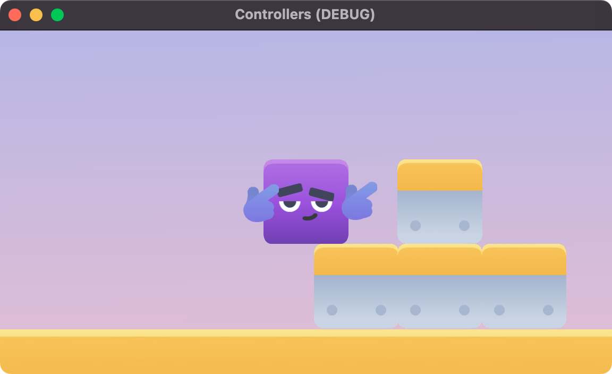
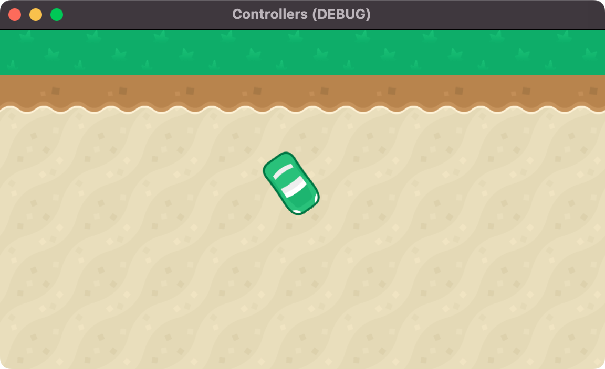
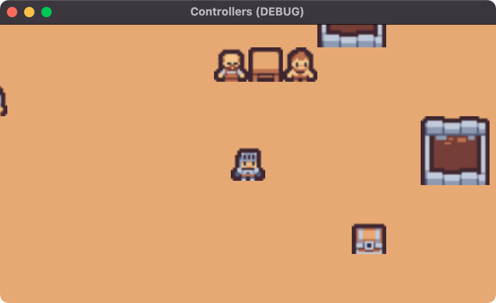
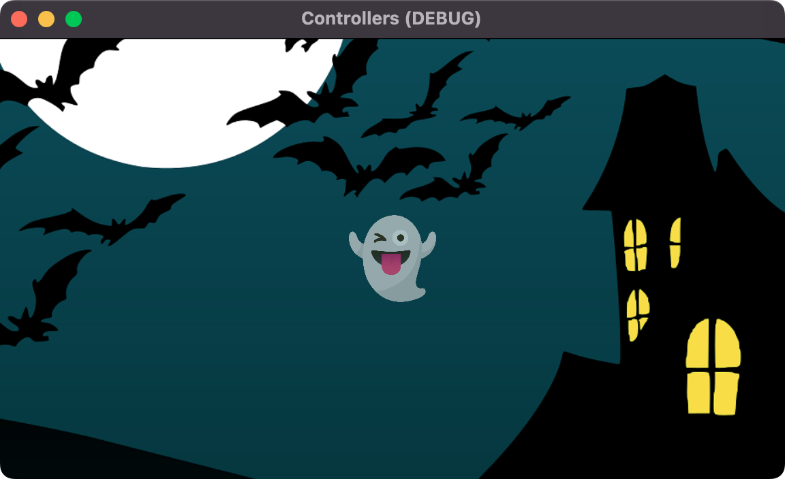
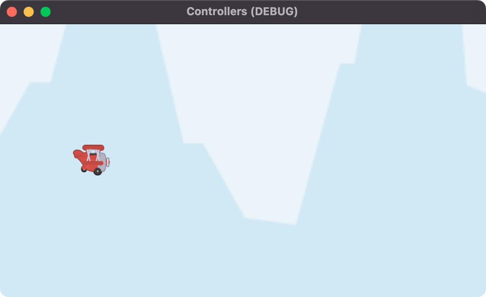

Not to state the obvious, but games are an interactive medium where a player can affect the character on the screen. It's **_the_** defining characteristic of video games, [whether you're stomping Goombas](https://en.wikipedia.org/wiki/Goomba), charging your [Mega Buster](<https://en.wikipedia.org/wiki/Mega_Man_(character)>), [whipping Dracula](https://www.konami.com/games/castlevania/us/en-us/) and his undead minions, or [planting some Powdermelons](https://stardewvalleywiki.com/Powdermelon).

Getting your first interaction in Godot can feel daunting, but hopefully, this post will show you that it takes very little code to bring your characters to life. Here are five scripts to start building your game. As you'll see, these control schemes overlap, so feel free to mix and match styles to find a unique feel.



This post will show GDScript and C\# implementations, so you can choose which works best for you. The APIs will also target [**Godot 4.3**](https://godotengine.org), so you may need to adapt the code using an older engine version. All scripts will also extend the `CharacterBody2D` node for consistency. Note that you’ll need the Mono version of Godot to execute the C\# implementations.

The assets are primarily from the excellent [**Kenney.nl**](http://Kenney.nl) asset library. If you use them in your projects, please consider donating to this fantastic resource.

The project described in this post can be found in this [**GitHub Repository**](https://github.com/khalidabuhakmeh/godot-2d-controllers)**.** You’ll need to set the **Main Scene** for each control scheme you want to try out. In the **FileSystem** window, right-click the appropriate `.tscn` file, then choose “Set as Main Scene.” Running the project will load you into the option you selected.

## 2D Platformer



Godot's built-in template for platformers, when used to create a `CharacterBody2D`, is a powerful tool. It's an excellent starting point for those aiming to develop games similar to Super Mario, Sonic, or Castlevania. The script, which factors in gravity and the deceleration of the moving character, is a great asset.

```gdscript
extends CharacterBody2D

@export var speed = 500.0
@export var jump_velocity = -400.0

func _physics_process(delta: float) -> void:
	# Add the gravity.
	if not is_on_floor():
		velocity += get_gravity() * delta

	# Handle jump.
	if Input.is_action_just_pressed("ui_accept") and is_on_floor():
		velocity.y = jump_velocity

	var direction := Input.get_axis("ui_left", "ui_right")
	if direction:
		velocity.x = direction * speed
	else:
		velocity.x = move_toward(velocity.x, 0, speed)

	move_and_slide()
```

Here is the equivalent script implemented using C\#. You'll notice the C\# API requires more code to work with the .NET type system.

```csharp
using Godot;

public partial class Platformer: CharacterBody2D
{
    [Export]
    public int Speed { get; set; } = 500;

    [Export]
    public int JumpVelocity { get; set; } = -400;

    public override void _PhysicsProcess(double delta)
    {
        if (!IsOnFloor())
        {
            var gravity = GetGravity() * (float)delta;
            Velocity += gravity;
        }

        var velocity = new Vector2(Velocity.X, Velocity.Y);
        if (Input.IsActionPressed("ui_accept") && IsOnFloor())
        {
            velocity.Y = JumpVelocity;
        }

        var direction = Input.GetAxis("ui_left", "ui_right");
        if (direction != 0)
        {
            velocity.X =  direction * Speed;
        }
        else
        {
            velocity.X = Mathf.MoveToward(velocity.X, 0, Speed);
        }

        Velocity = velocity;
        MoveAndSlide();
    }
}
```

Applying this code to your character lets you run left, right, and jump when the `ui_accept` key is pressed.

## Vehicle Games



If you've ever wanted to be a rebel space fighter or the drift king of Tokyo, this control scheme is for you. The control uses thrust to move in the local forward of your character, allowing you to have a vehicle-like experience.

```gdscript
extends CharacterBody2D

@export var rotation_speed: float = 3.0
@export var acceleration: float = 500.0  # Acceleration rate
@export var deceleration: float = 500.0  # Deceleration rate
@export var max_speed: float = 500.0 # Maximum speed

func _physics_process(delta: float) -> void:
	process_movement(delta)
	process_rotation(delta)
	move_and_slide()

func process_movement(delta: float) -> void:
	var target_velocity: Vector2 = Vector2.ZERO

	if Input.is_action_pressed("ui_up"):
		target_velocity = up_direction.rotated(rotation) * max_speed
	elif Input.is_action_pressed("ui_down"):
		target_velocity = up_direction.rotated(rotation + PI) * max_speed

	if target_velocity:
		velocity = velocity.move_toward(target_velocity, acceleration * delta)
	else:
		velocity = velocity.move_toward(Vector2.ZERO, deceleration * delta)

func process_rotation(delta: float) -> void:
	# only rotate when velocity is not zero
	# Normalizing the rotation speed based on forward momentum
	var normalized_speed = velocity.length() / max_speed

	if Input.is_action_pressed("ui_left"):
		rotation -= delta * rotation_speed * normalized_speed
	elif Input.is_action_pressed("ui_right"):
		rotation += delta * rotation_speed * normalized_speed
```

And here is the same implementation in C\# for folks working with .NET.

```csharp
using System;
using Godot;

namespace Controllers.Scripts;

public partial class Vehicle: CharacterBody2d
{
    [Export] public float RotationSpeed { get; set; } = 3.0f;

    [Export] public float Acceleration { get; set; } = 500.0f;

    [Export] public float Deceleration { get; set; } = 500.0f;

    [Export] public float MaxSpeed { get; set; } = 500.0f;

    public override void _PhysicsProcess(double delta)
    {
        ProcessMovement(delta);
        ProcessRotation(delta);
        MoveAndSlide();
    }

    private void ProcessMovement(double delta)
    {
        var targetVelocity = Vector2.Zero;

        if (Input.IsActionPressed("ui_up"))
        {
            targetVelocity = UpDirection.Rotated(Rotation) * MaxSpeed;
        }
        else if (Input.IsActionPressed("ui_down"))
        {
            targetVelocity = UpDirection.Rotated(Rotation + (float)Math.PI) * MaxSpeed;
        }

        Velocity = targetVelocity != Vector2.Zero
            ? Velocity.MoveToward(targetVelocity, Acceleration * (float)delta)
            : Velocity.MoveToward(Vector2.Zero, Deceleration * (float)delta);
    }

    private void ProcessRotation(double delta)
    {
        var normalizeSpeed = Velocity.Length() / MaxSpeed;

        if (Input.IsActionPressed("ui_left"))
        {
            Rotation -= (float)delta * RotationSpeed * normalizeSpeed;
        }
        else if (Input.IsActionPressed("ui_right"))
        {
            Rotation += (float)delta * RotationSpeed * normalizeSpeed;
        }
    }
}
```

## Top-Down Adventure



If you're building an epic 2D Role-Playing Game, a top-down perspective might be the control scheme you're looking for. Lucky for you, it's also the simplest of all control schemes to implement, with a total of 3 lines of GDScript.

```gdscript
extends CharacterBody2D

@export var speed := 100

func _physics_process(delta: float) -> void:
	var direction := Input.get_vector("ui_left", "ui_right", "ui_up", "ui_down")
	velocity = speed * direction
	move_and_slide()
```

As expected, the exact C\# implementation is just as straightforward.

```csharp
using Godot;

namespace Controllers.Scripts;

public partial class Adventurer: CharacterBody2d
{
    [Export] public int Speed { get; set; } = 100;

    public override void _PhysicsProcess(double delta)
    {
        var direction = Input.GetVector("ui_left", "ui_right",  "ui_up", "ui_down");
        Velocity = direction * Speed;
        MoveAndSlide();
    }
}
```

What makes this code work is the ability to get a user's input and determine a general direction based on the combination of keys applied.

## Floaty / Ice Level Controls



If you're looking for floaty controls for your character, this is the control scheme for you. Any action you take will linger in the character, maintaining their velocity in the previous direction. If you've ever played an ice level in a game, you're probably familiar with these slippery controls.

This is similar to the previous control scheme but uses Godot's linear interpolation functionality, or `lerp`, to ease towards a final value. In this sample, we also have a `Sprite2D` node as a child node and flip it based on the direction the character moves.

```gdscript
extends CharacterBody2D

@export var speed := 500.0
@export_range(0, 1) var floatiness := 0.025
@onready var sprite := $Sprite2D

func _physics_process(delta: float) -> void:
	var direction := Input.get_vector("ui_left", "ui_right", "ui_up", "ui_down")
	velocity = velocity.lerp(speed * direction, floatiness)

	# flip children to face
	# the correct direction
	if direction.x < 0:
		sprite.flip_h = false
	elif direction.x > 0:
		sprite.flip_h = true

	move_and_slide()
```

You can achieve the same effect in C\#.

```csharp
using Godot;

public partial class Ghost: CharacterBody2D
{
	private Sprite2D sprite;
	[Export] public float Speed { get; set; } = 500.0f;
	[Export(PropertyHint.Range, "0,1")]
	public float Floatiness { get; set; } = 0.025f;

	public override void _Ready()
	{
		sprite = GetNode<Sprite2D>("Sprite2D");
	}

	public override void _PhysicsProcess(double delta)
	{
		var direction = Input.GetVector("ui_left", "ui_right", "ui_up", "ui_down");
		Velocity = Velocity.Lerp(Speed * direction, Floatiness);

		sprite.FlipH = direction.X switch
		{
			< 0 => false,
			> 0 => true,
			_ => sprite.FlipH
		};

		MoveAndSlide();
	}
}
```

## Endless Runner Controls



This control scheme is a simple and effective mechanic, made famous by games like Jetpack Joyride, Flappy Bird, and Punch Quest. It gives the player the least control, forcing them to rely on timing and precision. The character's forward motion is typically set to a constant or determined by the player's progress. Let's see what this control scheme is like when implemented in GDScript.

```gdscript
extends CharacterBody2D

@export var speed := 100.0
@export var force := 500.0
@export var cooldown_milliseconds := 500.0

var previous_jump := -10_000.0

func _physics_process(delta: float) -> void:

	# always falling
	velocity += get_gravity() * delta
	#always moving forward
	velocity = Vector2(speed, velocity.y)

	var now = Time.get_ticks_msec()
	var difference = now - previous_jump
	var can_jump = difference >= cooldown_milliseconds

	if can_jump and Input.is_action_just_pressed("ui_accept"):
		velocity.y = -force
		previous_jump = now

	move_and_slide()
```

We keep track of the last time a player has jumped to ensure they don't spam the jump button. We used Godot's built-in time tracking mechanism, which is typically more precise than the `Timer` node and less resource-intensive. The exact implementation can be seen in C\#.

```csharp
using Godot;

namespace Controllers.Scripts;

public partial class Runner: CharacterBody2D
{
    [Export] public float Speed { get; set; } = 100f;
    [Export] public float Force { get; set; } = 500f;
    [Export] public float CooldownMilliseconds { get; set; } = 500f;

    // start with a big value to allow immediate jump
    private float previousJump = -10_000f;

    public override void _PhysicsProcess(double delta)
    {
        // always falling
        Velocity += GetGravity() * (float)delta;
        // always moving forward
        Velocity = new Vector2(Speed, Velocity.Y);

        var now = Time.GetTicksMsec();
        var difference = now - previousJump;
        var canJump = difference >= CooldownMilliseconds;

        if (canJump && Input.IsActionJustPressed("ui_accept"))
        {
            Velocity = Velocity with { Y = -Force };
            previousJump = now;
        }

        MoveAndSlide();
    }
}
```

You can now use this controller as a starting point to build your reflex-based games.

## Conclusion



Like all programming, there are many ways to implement these same control schemes, and I hope you explore them. If you're starting in Godot development, I hope these scripts help you get a jump start. As you've likely noticed, there are a lot of numeric values in these scripts. These values can be arbitrary, as scale and motion depend on your game's resolution and assets. Be bold and tweak the scripts and export fields so you can experiment. Additionally, if you have a `CharacterBody2D` script you'd like to share with us and the community, please feel free to share it in the comments below. Good luck, and have fun building games with JetBrains Rider and Godot.

<div style="padding-bottom: 30px"></div>
