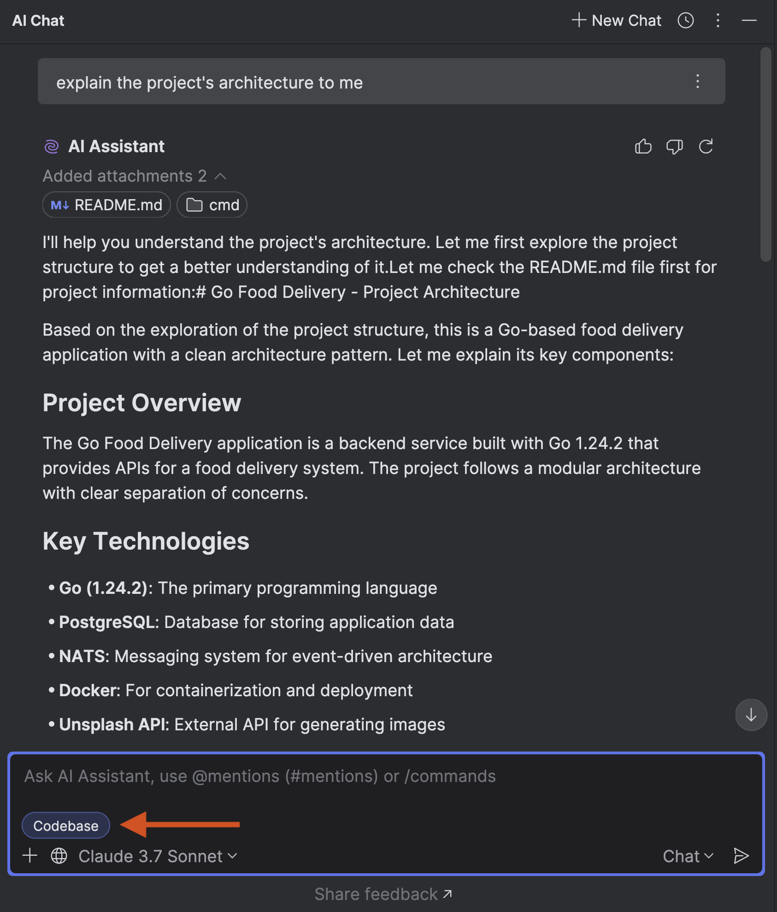

The difference between **Ask** Mode and **Code** mode:

- Use **Code** mode to execute tasks with Junie writing and testing the code for you.
- Use **Ask** to ask questions, work together on plans, and generate ideas for features and enhancements.

### How is the Ask mode different from AI Assistant Codebase being ON?

AIA and Junie differ primarily in their context collection methods, which are implemented differently.

AIA offers the advantage of speed, as it sends a single request to the LLM. In contrast, Junie iterates on the task, making multiple LLM calls. This iterative approach in Junie leads to a higher overall quality that often outweighs its slower speed compared to AIA.
