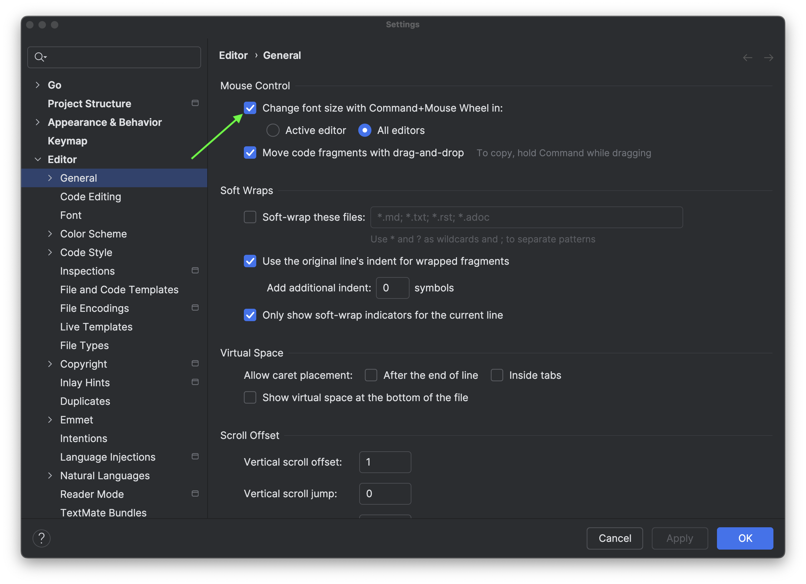

Invoke **Settings**, then select **GoLand | Settings** for macOS or **File | Settings** for Windows and Linux. Alternatively, press <kbd> ⌘ Cmd ,</kbd>.

Then navigate to `Editor > General > Change font size with Ctrl+Mouse Wheel`. You can then increase or decrease the font size of your editor using the mouse wheel.

To increase the font size with your keyboard, use <kbd>⌃⇧.</kbd> (macOS) / <kbd>Alt+Shift+Period</kbd> (Windows/Linux). To decrease it, press <kbd>⌃⇧,</kbd> (macOS) / <kbd>Alt+Shift+Comma</kbd> (Windows/Linux).
