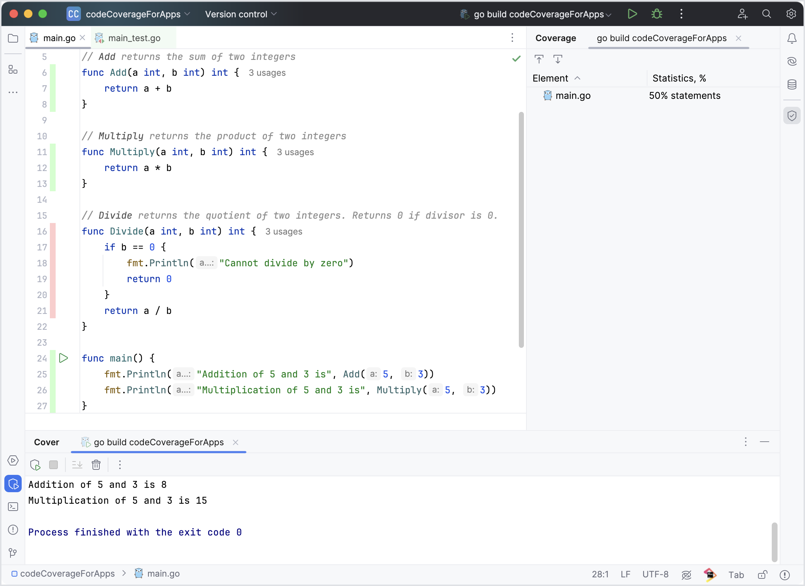

Code coverage enables you to see exactly what parts of your code are executed during single or multiple runs. It's an invaluable asset for detecting dead code, ensuring that every line of your code serves a purpose.

- Detailed Execution Insights: track which parts of your code are being used and which are not during execution.
- Dead Code Detection: easily identify and remove code that is never executed, streamlining your application.

Click the run icon in the gutter and select **Run <run/debug configuration name> with Coverage**. For additional options to run code coverage, refer to <a href = "https://www.jetbrains.com/help/go/2023.3/running-test-with-coverage.html#run-with-coverage">Running with coverage</a>.

New in 2023.3
