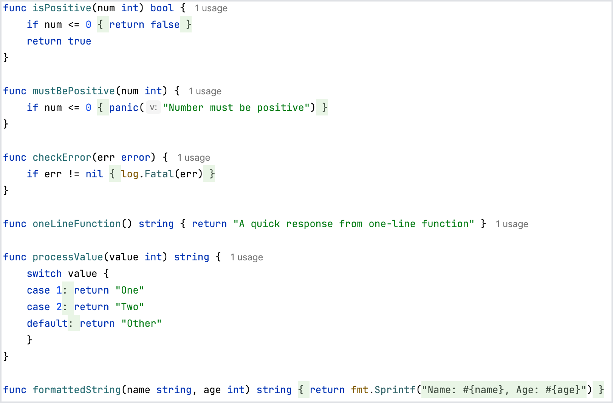

Try a code folding feature to enhance the readability and navigability of your Go code. This feature is especially useful for managing large codebases and focusing on the overall structure of your code.

**Target Code Blocks for Folding:**

- One-line `if` blocks with a single `return`
- One-line `if` blocks with a single `panic`
- One-line `if` blocks for error handling
- One-line functions with a single `return`
- One-line `case` clauses
- Formatted strings

To fold or unfold a code block, simply click on the fold marker next to the line number or use a keyboard shortcut. You can also use <kbd>⌘-</kbd> (macOS) / <kbd>Ctrl+Minus</kbd> (Windows/Linux) to fold and <kbd>⌘+</kbd> (macOS) / <kbd>Ctrl+Plus</kbd> (Windows/Linux) to unfold. Hovering over a folded code block will display a tooltip with a preview of the hidden content. This feature can be customized in settings to choose which types of blocks are foldable according to user preference.

