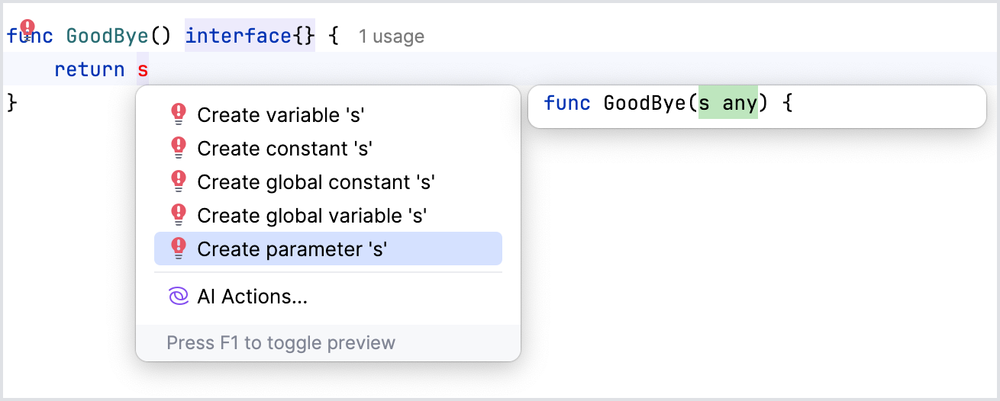

The **Create Parameter** quick-fix for unresolved references allows you to create parameters directly from unresolved references in your code.

**How it Works:**

Locate a reference in your code that is currently unresolved (indicated by red code). Click a light bulb icon that will appear near the unresolved reference or use the keyboard shortcut <kbd>⌥⏎</kbd> (macOS) / <kbd>Alt+Enter</kbd> (Windows/Linux) to open the quick-fix options. Select the **Create Parameter** quick-fix. Modify the automatically suggested settings for the parameters in the **Change Signature** dialog and click **Refactor**. The IDE will add new parameters to a function or method signature.

