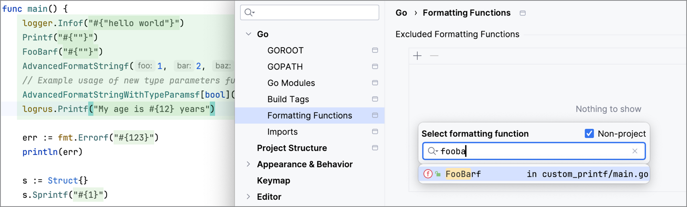

This feature automatically identifies `Printf`-like functions and offers comprehensive coding assistance, including inspections, quick-fixes, spellchecking, highlighting, and code folding. If you want to exclude a function from the list of `Printf`-like functions, navigate to **Settings | Go | Formatting Functions**, and add it to the list of exceptions. For more information, refer to <a href = "https://www.jetbrains.com/help/go/2023.3/formatting-strings.html">Formatting strings</a>.

