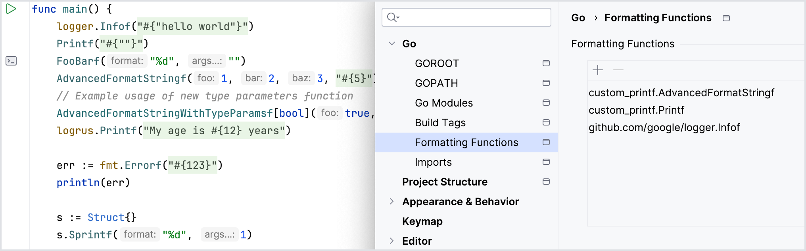

This feature automatically identifies `Printf`-like functions and offers comprehensive coding assistance, including inspections, quick-fixes, spellchecking, highlighting, and code folding. If your function was not identified as a `Printf` function, you can add it manually in the settings. For more information, refer to <a href = "https://www.jetbrains.com/help/go/2023.3/formatting-strings.html">Formatting strings</a>.

New in 2023.3
